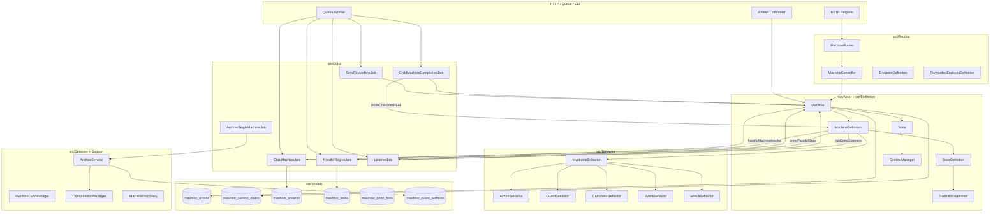
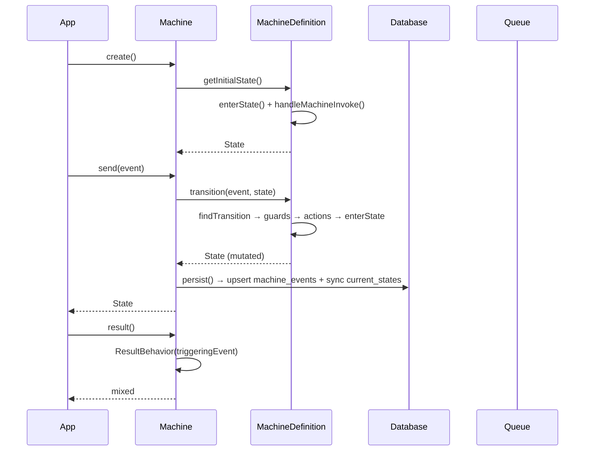
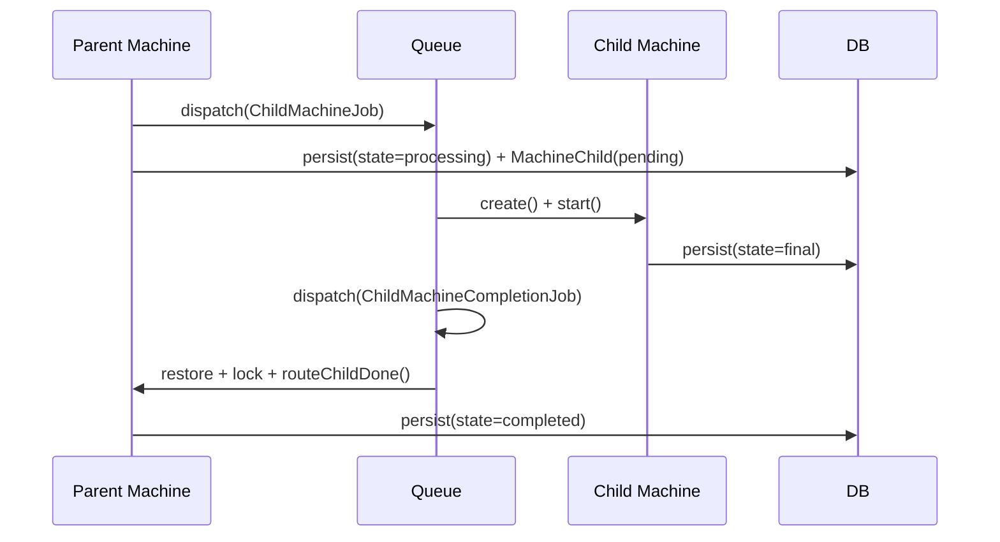

# Codebase Map

> Auto-generated by Cartographer. Last mapped: 2026-03-23T12:02:39Z

## System Overview



## Directory Structure

```
src/
  Actor/              Machine (runtime), State (snapshot)
  Behavior/           InvokableBehavior, Action, Guard, Calculator, Event, Result
  Casts/              MachineCast (Eloquent attribute)
  Commands/           9 artisan commands (timers, schedules, archive, xstate, cache, validate)
  Contracts/          ScheduleResolver, ReturnsResult, ProvidesFailureContext
  Definition/         MachineDefinition, StateDefinition, TransitionDefinition, TimerDefinition
  Enums/              BehaviorType, InternalEvent, SourceType, StateDefinitionType, TimerResolution
  Exceptions/         16 domain exceptions with static factory methods
  Facades/            EventMachine facade
  Jobs/               10 queue jobs (child machine, parallel, sendTo, listener, archive)
  Locks/              MachineLockManager + MachineLockHandle (DB-backed mutex)
  Models/             MachineEvent, MachineChild, MachineCurrentState, MachineTimerFire, MachineEventArchive, MachineStateLock
  Routing/            MachineRouter, MachineController, EndpointDefinition, ForwardedEndpointDefinition, ForwardContext
  Scheduling/         MachineScheduler (cron registration)
  Services/           ArchiveService (archive/restore/batch)
  Support/            Timer (VO), CompressionManager, MachineDiscovery, ArrayUtils
  Testing/            TestMachine, InteractsWithMachines, CommunicationRecorder, InlineBehaviorFake, EventBuilder
  Traits/             Fakeable, HasMachines, ResolvesBehaviors
  Transformers/       ModelTransformer (Spatie Data)

tests/
  Actor/              Machine + State runtime tests (3)
  Architecture/       Strict types + no debug calls (1)
  Behavior/           Behavior unit tests (10)
  Commands/           Artisan command tests (4)
  Definition/         Definition parsing tests (8)
  E2E/                Full pipeline tests with artisan commands (8)
  Examples/           End-user example test (1)
  Features/           Feature tests: core (54), ParallelStates (47), Testability (7), Testing (3)
  Integration/        Archive + persistence + context tests (11)
  Jobs/               Archive job tests (1)
  LocalQA/            Real MySQL + Redis + Horizon tests (18) — excluded from composer test
  Models/             Archive model tests (1)
  Routing/            HTTP endpoint tests (11)
  Services/           ArchiveService tests (1)
  Stubs/              231 test fixtures (machines, actions, guards, calculators, contexts, events)
  Support/            CompressionManager tests (1)

docs/                 VitePress documentation site (eventmachine.dev)
spec/                 Implementation specs with version prefixes
config/               machine.php (archival, parallel_dispatch, timers, max_transition_depth)
database/             7 migration stubs
```

## Module Guide

### Core Engine (`src/Definition/` + `src/Actor/`)

**Purpose:** The state machine runtime — definition parsing, state tree construction, transition execution, and persistence.

| File | Purpose | Tokens |
|------|---------|--------|
| `MachineDefinition.php` | Blueprint + ALL execution logic (transition, entry, delegation, parallel, listeners) | ~25,000 |
| `StateDefinition.php` | State node in hierarchy — type, actions, transitions, delegation config | ~5,000 |
| `TransitionDefinition.php` | Event-to-branches mapping with guard/calculator evaluation | ~3,000 |
| `TransitionBranch.php` | One conditional path: target, guards, calculators, actions | ~1,500 |
| `MachineInvokeDefinition.php` | Delegation config (machine/job/forward/with/queue) | ~1,500 |
| `Machine.php` | Runtime executor — create/send/persist/restore/result/fake | ~8,000 |
| `State.php` | Snapshot — value array, context, triggeringEvent, history | ~4,000 |
| `ContextManager.php` | Key-value store with validation, computed methods, machine identity | ~3,000 |

**Key data flow:**
```
Machine::create() → MachineDefinition::getInitialState() → State
Machine::send()   → MachineDefinition::transition()       → State (mutated)
Machine::persist() → MachineEvent::upsert() + syncCurrentStates()
Machine::result()  → ResultBehavior via triggeringEvent
```

**Gotchas:**
- `MachineDefinition` is a God Object by design (XState-inspired co-location of all execution logic)
- `transition()` is recursive via `processPostEntryTransitions` → `transition()`, capped at `max_transition_depth`
- `triggeringEvent` preserves original event across `@always` chains but IS overwritten by `raise()` events
- `persist()` uses incremental context diffs — only changed keys stored per event after index 0

### Behavior System (`src/Behavior/`)

**Purpose:** Executable units injected into the state machine lifecycle.

| Class | Extends | Role |
|-------|---------|------|
| `InvokableBehavior` | — | Abstract base; parameter injection, raise(), sendTo(), faking |
| `ActionBehavior` | `InvokableBehavior` | Side effects (entry/exit/transition) |
| `GuardBehavior` | `InvokableBehavior` | Boolean gate on transitions |
| `ValidationGuardBehavior` | `GuardBehavior` | Guard with error message |
| `CalculatorBehavior` | `InvokableBehavior` | Pre-compute before guards/actions |
| `ResultBehavior` | `InvokableBehavior` | Final machine output |
| `EventBehavior` | `Spatie\LaravelData\Data` | Event DTO (NOT in InvokableBehavior tree) |

**Parameter injection** (`InvokableBehavior::injectInvokableBehaviorParameters`):

| Type-hint | Injected |
|-----------|----------|
| `ContextManager` (or subclass) | `$state->context` |
| `EventBehavior` (or subclass) | Original event (uses `triggeringEvent` for `@always`) |
| `State` | `$state` |
| `EventCollection` | `$state->history` |
| `ForwardContext` | Child context (forwarded endpoints only) |
| `array` | Behavior arguments |

### Queue Jobs (`src/Jobs/`)

**Purpose:** Async operations dispatched to Laravel queues.

| Job | Dispatched By | Does |
|-----|--------------|------|
| `ChildMachineJob` | `handleAsyncMachineInvoke` | Creates + starts child machine |
| `ChildMachineCompletionJob` | `ChildMachineJob` / `MachineController` | Routes @done/@fail to parent |
| `ChildMachineTimeoutJob` | `handleAsyncMachineInvoke` | Fires @timeout if child didn't complete |
| `ChildJobJob` | `handleJobInvoke` | Runs a Laravel job as machine actor |
| `ParallelRegionJob` | `enterParallelState` (dispatch mode) | Runs region entry actions concurrently |
| `ParallelRegionTimeoutJob` | `dispatchPendingParallelJobs` | Detects stuck parallel regions |
| `SendToMachineJob` | `dispatchTo()` / timer sweep | Delivers event to target machine |
| `ListenerJob` | `runEntryListeners` (queued) | Executes queued lifecycle listener |
| `ArchiveSingleMachineJob` | `machine:archive-events` | Archives one machine's events |

**Common pattern:** All state-mutating jobs use double-guard locking: pre-lock check → acquire lock → re-check under lock → mutate in `DB::transaction()`.

### HTTP Routing (`src/Routing/`)

**Purpose:** Auto-generated HTTP API from machine endpoint definitions.

**Flow:**
```
MachineRouter::register(MyMachine::class, [...])
  → creates routes for each EndpointDefinition
  → binds route defaults (_machine_class, _event_type, etc.)

Request → MachineController::handleModelBound/MachineIdBound/Stateless/Create
  → resolveEvent() → EventBehavior::validateAndCreate()
  → executeEndpoint() → action.before() → machine.send() → action.after()
  → buildResponse() → { machine_id, value, context, available_events }
```

### Testing (`src/Testing/`)

**Purpose:** Fluent test API and fake infrastructure.

| Class | Role |
|-------|------|
| `TestMachine` | Fluent wrapper: `Machine::test()`, `startingAt()`, 60+ assertion methods |
| `InteractsWithMachines` | Trait: auto-resets all fakes in tearDown |
| `CommunicationRecorder` | Records `sendTo()`/`raise()` calls without side effects |
| `InlineBehaviorFake` | Spy/fake for inline closure behaviors |
| `EventBuilder` | Test factory for EventBehavior instances |

### Database Schema

```
machine_events          — Event-sourced log (ULID PK, root_event_id groups instance)
machine_current_states  — Normalized state tracker (composite PK: root_event_id + state_id)
machine_children        — Async child tracking (status: pending→running→completed/failed/cancelled/timed_out)
machine_locks           — DB-backed mutex (unique root_event_id = the lock)
machine_timer_fires     — Timer dedup (composite PK: root_event_id + timer_key, status: active/fired/exhausted)
machine_event_archives  — Compressed archives (gzip LONGBLOB, auto-restore on new events)
```

### Configuration (`config/machine.php`)

| Section | Key Settings |
|---------|-------------|
| `archival` | `enabled`, `level` (0-9), `days_inactive`, `restore_cooldown_hours` |
| `parallel_dispatch` | `enabled`, `queue`, `lock_timeout/ttl`, `job_timeout/tries/backoff`, `region_timeout` |
| `timers` | `resolution` (everyMinute etc.), `batch_size`, `backpressure_threshold` |
| `max_transition_depth` | Default 100, env `MACHINE_MAX_TRANSITION_DEPTH` |

## Data Flow

### Machine Lifecycle



### Async Child Delegation



## Navigation Guide

**To add a new behavior type:** Create class extending `ActionBehavior`/`GuardBehavior`/etc., register in `behavior` array of `MachineDefinition::define()`

**To add a new artisan command:** Create in `src/Commands/`, register in `MachineServiceProvider::configurePackage()`

**To add a new HTTP endpoint:** Add to `endpoints` parameter in `MachineDefinition::define()`, register routes via `MachineRouter::register()`

**To add a new queue job:** Create in `src/Jobs/`, follow the double-guard locking pattern

**To add a new model/table:** Create migration in `database/migrations/`, model in `src/Models/`, register migration in `MachineServiceProvider`

**To modify the transition engine:** All logic is in `MachineDefinition.php` — `transition()`, `enterState()`, `processPostEntryTransitions()`

**To add a new test:** Feature tests in `tests/Features/`, stubs in `tests/Stubs/`, LocalQA in `tests/LocalQA/` (requires real infra)
