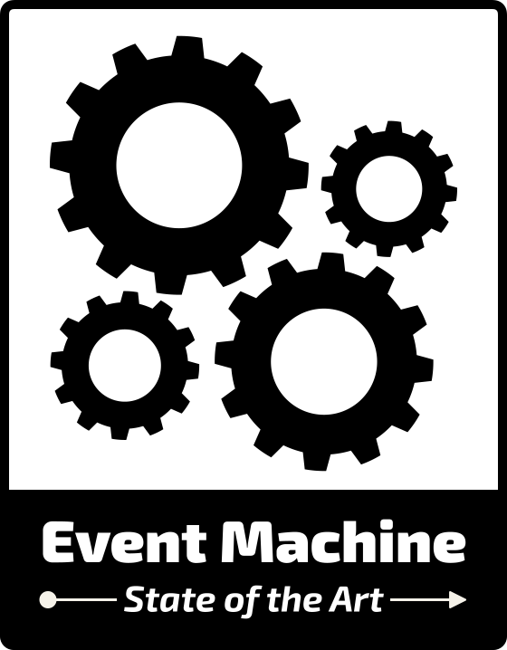

<div align="center">

<picture>
  <source media="(prefers-color-scheme: dark)" srcset="./art/event-machine-logo-dark.svg">
  
</picture>

[](https://packagist.org/packages/tarfin-labs/event-machine)
[](https://github.com/tarfin-labs/event-machine/actions?query=workflow%3Arun-tests+branch%3Amain)
[](https://github.com/tarfin-labs/event-machine/actions?query=workflow%3A"Fix+PHP+code+style+issues"+branch%3Amain)
[](https://packagist.org/packages/tarfin-labs/event-machine)

</div>

EventMachine is a PHP library for creating and managing event-driven state machines. It is designed to be simple and easy to use, while providing powerful functionality for managing complex state transitions. This library is heavily influenced by XState, a popular JavaScript state machine library.

## Installation

You can install the package via composer:

```bash
composer require tarfin-labs/event-machine
```

You can publish and run the migrations with:

```bash
php artisan vendor:publish --tag="event-machine-migrations"
php artisan migrate
```

You can publish the config file with:

```bash
php artisan vendor:publish --tag="event-machine-config"
```

This is the contents of the published config file:

```php
return [
];
```

## Usage

```php
$machine = MachineDefinition::define(
        config: [
            'initial' => 'green',
            'context' => [
                'value' => 1,
            ],
            'states' => [
                'green' => [
                    'on' => [
                        'TIMER' => [
                            [
                                'target'     => 'yellow',
                                'guards' => 'isOneGuard',
                            ],
                            [
                                'target'     => 'red',
                                'guards' => 'isTwoGuard',
                            ],
                            [
                                'target' => 'pedestrian',
                            ],
                        ],
                    ],
                ],
                'yellow'     => [],
                'red'        => [],
                'pedestrian' => [],
            ],
        ],
        behavior: [
            'guards' => [
                'isOneGuard' => function (ContextManager $context, array $event): bool {
                    return $context->get('value') === 1;
                },
                'isTwoGuard' => function (ContextManager $context, array $event): bool {
                    return $context->get('value') === 2;
                },
            ],
        ],
    );
```

## Testing

```bash
composer test
```

## Changelog

Please see [CHANGELOG](CHANGELOG.md) for more information on what has changed recently.

## Contributing

Please see [CONTRIBUTING](CONTRIBUTING.md) for details.

## Security Vulnerabilities

Please review [our security policy](../../security/policy) on how to report security vulnerabilities.

## Credits

- [Yunus Emre Deligöz](https://github.com/deligoez)
- [Fatih Aydın](https://github.com/aydinfatih)
- [All Contributors](../../contributors)

## License

The MIT License (MIT). Please see [License File](LICENSE.md) for more information.
