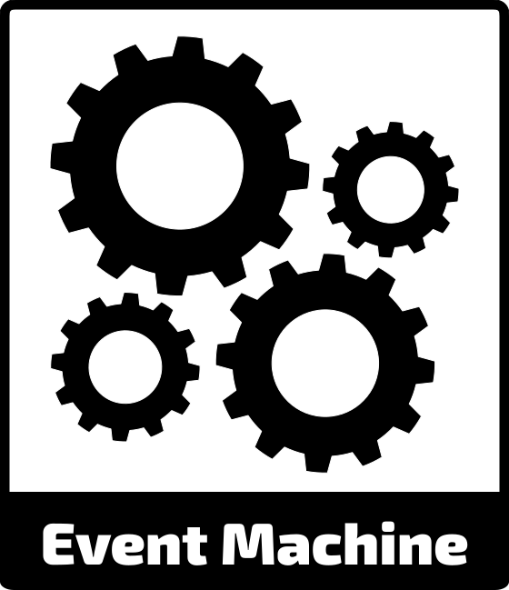

<div align="center">

<picture>
  <source media="(prefers-color-scheme: dark)" srcset="./art/event-machine-logo-dark.svg">
  
</picture>

[](https://packagist.org/packages/tarfin-labs/event-machine)
[](https://github.com/tarfin-labs/event-machine/actions?query=workflow%3ACI+branch%3Amain)
[](https://packagist.org/packages/tarfin-labs/event-machine)

**Event-driven state machines for Laravel**

[Documentation](https://eventmachine.dev) · [Installation](#installation) · [Why EventMachine?](#why-eventmachine)

</div>

---

## Why EventMachine?

**Your business logic deserves better than nested if-statements.**

EventMachine brings the power of finite state machines to Laravel, inspired by [XState](https://xstate.js.org). Define your states, transitions, and behaviors declaratively - and let the machine handle the complexity.

### The Problem

```php
// Without state machines: scattered conditionals, hidden rules, impossible to test
if ($order->status === 'pending' && $user->can('approve') && !$order->isExpired()) {
    if ($order->total > 10000 && !$order->hasSecondApproval()) {
        // More nested logic...
    }
}
```

### The Solution

```php
// With EventMachine: clear states, explicit transitions, testable behaviors
MachineDefinition::define(
    config: [
        'initial' => 'pending',
        'states' => [
            'pending' => [
                'on' => [
                    'APPROVE' => [
                        'target' => 'approved',
                        'guards' => [CanApproveGuard::class, NotExpiredGuard::class],
                    ],
                ],
            ],
            'approved' => [
                'entry' => NotifyCustomerAction::class,
            ],
        ],
    ],
);
```

### Key Benefits

| Feature | Description |
|---------|-------------|
| **Event Sourced** | Every transition persisted. Full audit trail. Replay history. |
| **Behaviors** | Guards validate, calculators compute, actions execute. |
| **Parallel Dispatch** | True parallel execution via Laravel queues. 5s + 2s = 5s, not 7s. |
| **Testable** | Fake any behavior. Assert states. Verify transitions. |
| **Type-Safe Context** | Spatie Data powered. Validated. IDE autocompletion. |
| **Archival** | Compress millions of events. Restore any machine instantly. |
| **Laravel Native** | Eloquent, DI, Artisan commands. Built for Laravel. |

## Installation

```bash
composer require tarfin-labs/event-machine
```

```bash
php artisan vendor:publish --tag="event-machine-migrations"
php artisan migrate
```

## AI Agent Skill

EventMachine ships with an official [Agent Skill](https://agentskills.io) so AI coding agents can write correct, idiomatic EventMachine code — it loads naming conventions, best practices, testing patterns, and the full VitePress documentation on demand.

Install via [`npx skills`](https://github.com/vercel-labs/skills) — works with **45+ agents** including Claude Code, Cursor, GitHub Copilot, Cline, Codex, OpenCode, Gemini CLI, Warp, Amp, and many others:

```bash
npx skills add tarfin-labs/event-machine#plugin-dist
```

The CLI detects your installed agents and wires the skill into the right location. The `plugin-dist` branch is a self-contained, materialized snapshot published automatically on every release tag.

What the skill loads:

- **Immediately** (when the skill triggers): naming conventions, 13 best-practice summaries, core concepts, quick-start snippets, testing API cheat-sheet, Laravel integration map, delegation/parallel gotcha tables.
- **On demand** (when the agent needs deeper detail): curated cheat-sheets under `references/` and the full 87-page documentation under `docs/`.

Read the full skill guide at [eventmachine.dev/getting-started/agent-skill](https://eventmachine.dev/getting-started/agent-skill).


## Support Policy

Only the **latest major version** (currently v7) receives bug fixes and security patches. All previous versions are end of life. See the [Upgrading Guide](https://eventmachine.dev/getting-started/upgrading) for step-by-step migration from any version.

## Eloquent Integration

```php
class Order extends Model
{
    use HasMachines;

    protected $casts = [
        'machine' => MachineCast::class.':'.OrderMachine::class,
    ];
}

// Use it naturally
$order = Order::create();
$order->machine->send(['type' => 'SUBMIT']);
$order->machine->send(['type' => 'APPROVE']);

$order->machine->state->matches('approved'); // true
$order->machine->state->history->count();    // 3 events tracked
```

## Documentation

For guards, actions, calculators, hierarchical states, parallel dispatch, validation, testing, and more:

**[Read the Documentation →](https://event-machine.tarfin.com)**

## Credits

- [Yunus Emre Deligöz](https://github.com/deligoez)
- [Fatih Aydın](https://github.com/aydinfatih)
- [Yunus Emre Nalbant](https://github.com/YunusEmreNalbant)
- [Faruk Can](https://github.com/frkcn)
- [Turan Karatuğ](https://github.com/tkaratug)
- [Yılmaz Demir](https://github.com/yidemir)
- Maybe you? [Contribute →](../../contributing)

## License

MIT License. See [LICENSE](LICENSE.md) for details.
