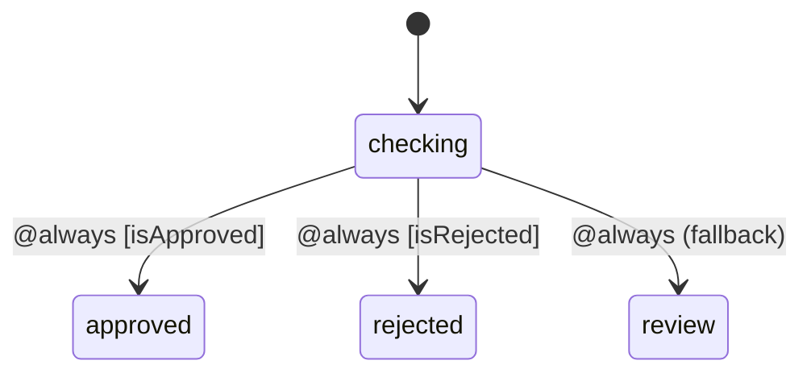
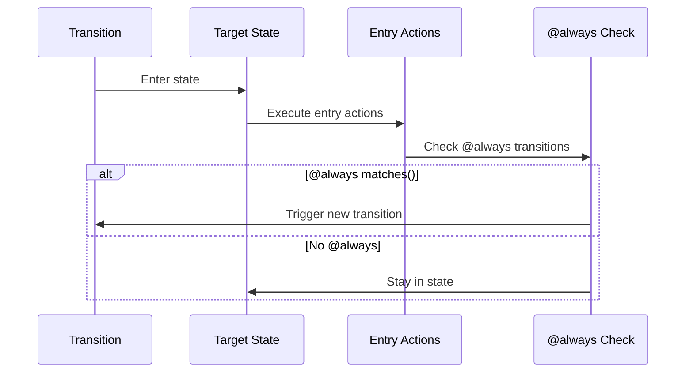

# @always Transitions

`@always` transitions (also called eventless or transient transitions) execute immediately after entering a state, without waiting for an event. They're useful for conditional routing and state normalization.

## Basic Syntax

<!-- doctest-attr: ignore -->
```php
'states' => [
    'checking' => [
        'on' => [
            '@always' => 'nextState',
        ],
    ],
    'nextState' => [],
],
```

When the machine enters `checking`, it immediately transitions to `nextState`.

::: warning Infinite Loop Risk
`@always` transitions can create infinite loops if two states always transition to each other. Always ensure at least one path leads to a state without `@always`, or use guards that will eventually fail. See [Avoiding Infinite Loops](#avoiding-infinite-loops) for details.
:::

## Guarded @always Transitions

Use guards to conditionally route:

<!-- doctest-attr: ignore -->
```php
'states' => [
    'checking' => [
        'on' => [
            '@always' => [
                ['target' => 'approved', 'guards' => 'isApproved'],
                ['target' => 'rejected', 'guards' => 'isRejected'],
                ['target' => 'review'],  // Fallback
            ],
        ],
    ],
    'approved' => [],
    'rejected' => [],
    'review' => [],
],
```



## Execution Order



1. Enter target state
2. Execute entry actions
3. Check for `@always` transitions
4. If found, trigger transition immediately

## Use Cases

### Conditional Routing

Route based on context without requiring an event:

<!-- doctest-attr: ignore -->
```php
'states' => [
    'processing' => [
        'entry' => 'processOrder',
        'on' => [
            '@always' => [
                ['target' => 'express', 'guards' => 'isExpressShipping'],
                ['target' => 'standard'],
            ],
        ],
    ],
    'express' => [...],
    'standard' => [...],
],
```

### Validation Routing

<!-- doctest-attr: ignore -->
```php
'states' => [
    'validating' => [
        'entry' => 'runValidation',
        'on' => [
            '@always' => [
                ['target' => 'valid', 'guards' => 'isValid'],
                ['target' => 'invalid'],
            ],
        ],
    ],
],
```

### Breaking Out of Nested States

<!-- doctest-attr: ignore -->
```php
'review' => [
    'states' => [
        'pending' => [
            'on' => ['APPROVE' => 'approved'],
        ],
        'approved' => [
            'on' => [
                '@always' => '#processing',  // Jump to root-level state
            ],
        ],
    ],
],
'processing' => [...],
```

### State Normalization

Ensure consistent state entry:

<!-- doctest-attr: ignore -->
```php
'states' => [
    'init' => [
        'entry' => 'loadConfiguration',
        'on' => [
            '@always' => 'ready',
        ],
    ],
    'ready' => [...],
],
```

### Computed Transitions

<!-- doctest-attr: ignore -->
```php
'states' => [
    'scoring' => [
        'entry' => 'calculateScore',
        'on' => [
            '@always' => [
                ['target' => 'excellent', 'guards' => 'scoreAbove90'],
                ['target' => 'good', 'guards' => 'scoreAbove70'],
                ['target' => 'passing', 'guards' => 'scoreAbove50'],
                ['target' => 'failing'],
            ],
        ],
    ],
],
```

## With Actions

<!-- doctest-attr: ignore -->
```php
'states' => [
    'checking' => [
        'on' => [
            '@always' => [
                [
                    'target' => 'approved',
                    'guards' => 'isAutoApprovable',
                    'actions' => 'logAutoApproval',
                ],
                [
                    'target' => 'review',
                    'actions' => 'notifyReviewer',
                ],
            ],
        ],
    ],
],
```

## With Calculators

<!-- doctest-attr: ignore -->
```php
'states' => [
    'evaluating' => [
        'on' => [
            '@always' => [
                [
                    'target' => 'approved',
                    'calculators' => 'calculateRiskScore',
                    'guards' => 'isLowRisk',
                ],
                ['target' => 'manualReview'],
            ],
        ],
    ],
],
```

## Practical Examples

### Order Routing

<!-- doctest-attr: ignore -->
```php
MachineDefinition::define(
    config: [
        'id' => 'order',
        'initial' => 'received',
        'context' => [
            'items' => [],
            'total' => 0,
            'membershipLevel' => 'standard',
        ],
        'states' => [
            'received' => [
                'entry' => 'calculateTotal',
                'on' => [
                    '@always' => [
                        [
                            'target' => 'vipProcessing',
                            'guards' => 'isVipMember',
                        ],
                        [
                            'target' => 'priorityProcessing',
                            'guards' => 'isLargeOrder',
                        ],
                        ['target' => 'standardProcessing'],
                    ],
                ],
            ],
            'vipProcessing' => [
                'entry' => 'assignVipHandler',
            ],
            'priorityProcessing' => [
                'entry' => 'assignPriorityHandler',
            ],
            'standardProcessing' => [],
        ],
    ],
    behavior: [
        'guards' => [
            'isVipMember' => fn($ctx) => $ctx->membershipLevel === 'vip',
            'isLargeOrder' => fn($ctx) => $ctx->total > 1000,
        ],
    ],
);
```

### Approval Workflow

<!-- doctest-attr: ignore -->
```php
'states' => [
    'submitted' => [
        'entry' => ['validateSubmission', 'checkEligibility'],
        'on' => [
            '@always' => [
                [
                    'target' => 'autoApproved',
                    'guards' => ['isUnderAutoApprovalLimit', 'hasNoRiskFlags'],
                    'actions' => 'logAutoApproval',
                ],
                [
                    'target' => 'pendingFirstApproval',
                    'guards' => 'requiresSingleApproval',
                ],
                [
                    'target' => 'pendingDualApproval',
                ],
            ],
        ],
    ],
    'autoApproved' => [
        'on' => ['@always' => '#processing'],
    ],
    'pendingFirstApproval' => [...],
    'pendingDualApproval' => [...],
],
```

### Quiz Scoring

<!-- doctest-attr: ignore -->
```php
'states' => [
    'calculating' => [
        'entry' => 'computeFinalScore',
        'on' => [
            '@always' => [
                ['target' => 'passed.withHonors', 'guards' => 'scoreAbove95'],
                ['target' => 'passed.standard', 'guards' => 'scoreAbove70'],
                ['target' => 'failed.canRetry', 'guards' => 'hasRetriesLeft'],
                ['target' => 'failed.final'],
            ],
        ],
    ],
],
```

## Avoiding Infinite Loops

::: danger
Be careful not to create infinite loops:
:::

<!-- doctest-attr: ignore -->
```php
// DON'T DO THIS - infinite loop!
'stateA' => [
    'on' => ['@always' => 'stateB'],
],
'stateB' => [
    'on' => ['@always' => 'stateA'],
],
```

::: tip
Always ensure at least one branch leads to a state without `@always`, or use guards that will eventually fail.
:::

<!-- doctest-attr: ignore -->
```php
// Safe - guards prevent infinite loop
'retry' => [
    'entry' => 'incrementAttempts',
    'on' => [
        '@always' => [
            ['target' => 'processing', 'guards' => 'canRetry'],
            ['target' => 'failed'],  // Exit when can't retry
        ],
    ],
],
```

## Testing @always Transitions

<!-- doctest-attr: ignore -->
```php
it('automatically routes based on condition', function () {
    $machine = MachineDefinition::define(
        config: [
            'initial' => 'checking',
            'context' => ['score' => 85],
            'states' => [
                'checking' => [
                    'on' => [
                        '@always' => [
                            ['target' => 'passed', 'guards' => 'isPassing'],
                            ['target' => 'failed'],
                        ],
                    ],
                ],
                'passed' => [],
                'failed' => [],
            ],
        ],
        behavior: [
            'guards' => [
                'isPassing' => fn($ctx) => $ctx->score >= 70,
            ],
        ],
    );

    $state = $machine->getInitialState();

    // Automatically transitioned to 'passed'
    expect($state->matches('passed'))->toBeTrue();
});
```

## Best Practices

### 1. Always Include a Fallback

<!-- doctest-attr: ignore -->
```php
'@always' => [
    ['target' => 'a', 'guards' => 'guardA'],
    ['target' => 'b', 'guards' => 'guardB'],
    ['target' => 'default'],  // Always have a fallback
],
```

### 2. Use for Routing, Not Logic

<!-- doctest-attr: ignore -->
```php
// Good - routing based on existing data
'@always' => [
    ['target' => 'express', 'guards' => 'isExpress'],
    ['target' => 'standard'],
],

// Avoid - complex logic in @always
// Use entry actions + explicit events instead
```

### 3. Keep Guards Simple

<!-- doctest-attr: ignore -->
```php
// Good - simple condition
'guards' => fn($ctx) => $ctx->total > 1000,

// Avoid - complex logic
'guards' => fn($ctx) => $this->complexCalculation($ctx) && $this->anotherCheck($ctx),
```

### 4. Document the Routing Logic

<!-- doctest-attr: ignore -->
```php
'checking' => [
    'description' => 'Routes orders based on value and membership',
    'on' => [
        '@always' => [
            [
                'target' => 'vip',
                'guards' => 'isVip',
                'description' => 'VIP members get priority',
            ],
            ['target' => 'standard'],
        ],
    ],
],
```
