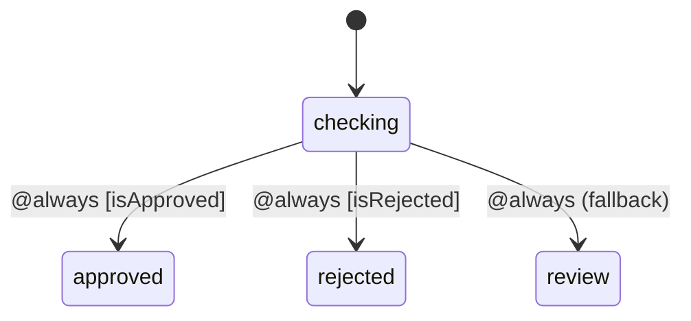
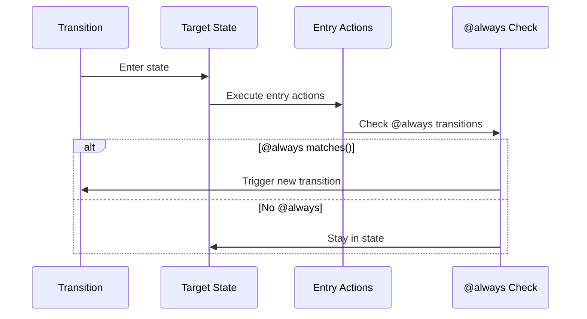
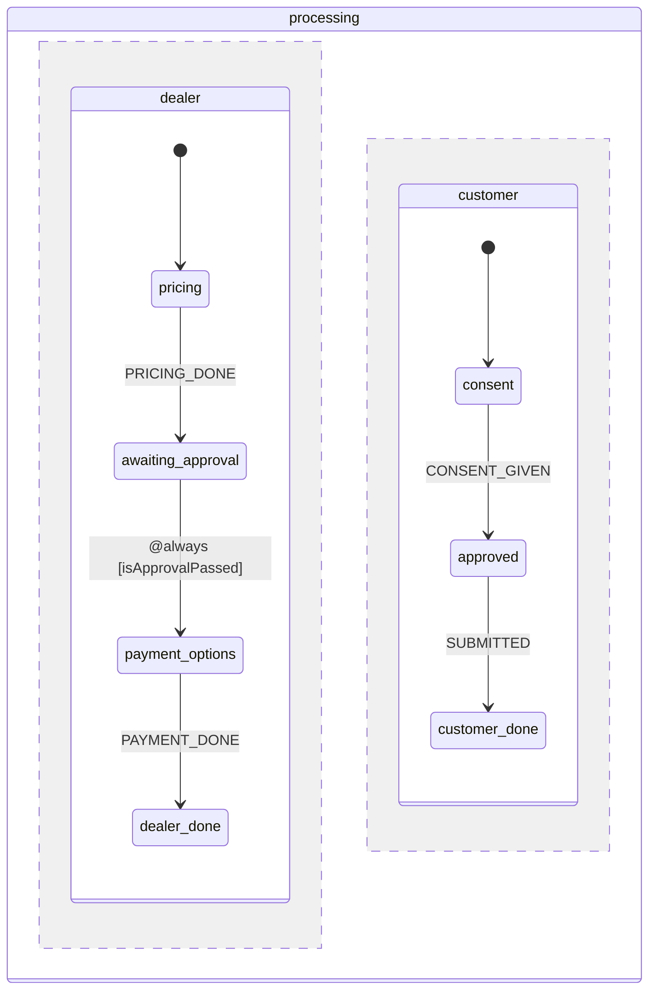

# @always Transitions

`@always` transitions (also called eventless or transient transitions) execute immediately after entering a state, without waiting for an event. They're useful for conditional routing and state normalization.

## Basic Syntax

<!-- doctest-attr: ignore -->
```php
'states' => [
    'checking' => [
        'on' => [
            '@always' => 'next_state',
        ],
    ],
    'next_state' => [],
],
```

When the machine enters `checking`, it immediately transitions to `next_state`.

::: warning Infinite Loop Risk
`@always` transitions can create infinite loops if two states always transition to each other. Always ensure at least one path leads to a state without `@always`, or use guards that will eventually fail. See [Avoiding Infinite Loops](#avoiding-infinite-loops) for details.
:::

## Guarded @always Transitions

Use guards to conditionally route:

<!-- doctest-attr: ignore -->
```php
'states' => [
    'checking' => [
        'on' => [
            '@always' => [
                ['target' => 'approved', 'guards' => 'isApprovedGuard'],
                ['target' => 'rejected', 'guards' => 'isRejectedGuard'],
                ['target' => 'review'],  // Fallback
            ],
        ],
    ],
    'approved' => [],
    'rejected' => [],
    'review' => [],
],
```


```mermaid
stateDiagram-v2
    [*] --> checking
    checking --> approved : @always [isApproved]
    checking --> rejected : @always [isRejected]
    checking --> review : @always (fallback)
```

## Execution Order


```mermaid
sequenceDiagram
    participant Transition
    participant Target as Target State
    participant Entry as Entry Actions
    participant Always as @always Check

    Transition->>Target: Enter state
    Target->>Entry: Execute entry actions
    Entry->>Always: Check @always transitions
    alt @always matches()
        Always->>Transition: Trigger new transition
    else No @always
        Always->>Target: Stay in state
    end
```

1. Enter target state
2. Execute entry actions
3. Check for `@always` transitions
4. If found, trigger transition immediately

## Use Cases

### Conditional Routing

Route based on context without requiring an event:

<!-- doctest-attr: ignore -->
```php
'states' => [
    'processing' => [
        'entry' => 'processOrderAction',
        'on' => [
            '@always' => [
                ['target' => 'express', 'guards' => 'isExpressShippingGuard'],
                ['target' => 'standard'],
            ],
        ],
    ],
    'express' => [...],
    'standard' => [...],
],
```

### Validation Routing

<!-- doctest-attr: ignore -->
```php
'states' => [
    'validating' => [
        'entry' => 'runValidationAction',
        'on' => [
            '@always' => [
                ['target' => 'valid', 'guards' => 'isValidGuard'],
                ['target' => 'invalid'],
            ],
        ],
    ],
],
```

### Breaking Out of Nested States

<!-- doctest-attr: ignore -->
```php
'review' => [
    'states' => [
        'pending' => [
            'on' => ['APPROVE' => 'approved'],
        ],
        'approved' => [
            'on' => [
                '@always' => '#processing',  // Jump to root-level state
            ],
        ],
    ],
],
'processing' => [...],
```

### State Normalization

Ensure consistent state entry:

<!-- doctest-attr: ignore -->
```php
'states' => [
    'init' => [
        'entry' => 'loadConfigurationAction',
        'on' => [
            '@always' => 'ready',
        ],
    ],
    'ready' => [...],
],
```

### Computed Transitions

<!-- doctest-attr: ignore -->
```php
'states' => [
    'scoring' => [
        'entry' => 'calculateScoreAction',
        'on' => [
            '@always' => [
                ['target' => 'excellent', 'guards' => 'scoreAbove90Guard'],
                ['target' => 'good', 'guards' => 'scoreAbove70Guard'],
                ['target' => 'passing', 'guards' => 'scoreAbove50Guard'],
                ['target' => 'failing'],
            ],
        ],
    ],
],
```

## With Actions

<!-- doctest-attr: ignore -->
```php
'states' => [
    'checking' => [
        'on' => [
            '@always' => [
                [
                    'target' => 'approved',
                    'guards' => 'isAutoApprovableGuard',
                    'actions' => 'logAutoApprovalAction',
                ],
                [
                    'target' => 'review',
                    'actions' => 'notifyReviewerAction',
                ],
            ],
        ],
    ],
],
```

## With Calculators

<!-- doctest-attr: ignore -->
```php
'states' => [
    'evaluating' => [
        'on' => [
            '@always' => [
                [
                    'target' => 'approved',
                    'calculators' => 'calculateRiskScoreCalculator',
                    'guards' => 'isLowRiskGuard',
                ],
                ['target' => 'manual_review'],
            ],
        ],
    ],
],
```

## Practical Examples

### Order Routing

```php
use Tarfinlabs\EventMachine\Definition\MachineDefinition; // [!code hide]

MachineDefinition::define(
    config: [
        'id' => 'order',
        'initial' => 'received',
        'context' => [
            'items' => [],
            'total' => 0,
            'membershipLevel' => 'standard',
        ],
        'states' => [
            'received' => [
                'entry' => 'calculateTotalAction',
                'on' => [
                    '@always' => [
                        [
                            'target' => 'vip_processing',
                            'guards' => 'isVipMemberGuard',
                        ],
                        [
                            'target' => 'priority_processing',
                            'guards' => 'isLargeOrderGuard',
                        ],
                        ['target' => 'standard_processing'],
                    ],
                ],
            ],
            'vip_processing' => [
                'entry' => 'assignVipHandlerAction',
            ],
            'priority_processing' => [
                'entry' => 'assignPriorityHandlerAction',
            ],
            'standard_processing' => [],
        ],
    ],
    behavior: [
        'guards' => [
            'isVipMemberGuard' => fn($ctx) => $ctx->membershipLevel === 'vip',
            'isLargeOrderGuard' => fn($ctx) => $ctx->total > 1000,
        ],
    ],
);
```

### Approval Workflow

<!-- doctest-attr: ignore -->
```php
'states' => [
    'submitted' => [
        'entry' => ['validateSubmissionAction', 'checkEligibilityAction'],
        'on' => [
            '@always' => [
                [
                    'target' => 'auto_approved',
                    'guards' => ['isUnderAutoApprovalLimitGuard', 'hasNoRiskFlagsGuard'],
                    'actions' => 'logAutoApprovalAction',
                ],
                [
                    'target' => 'pending_first_approval',
                    'guards' => 'requiresSingleApprovalGuard',
                ],
                [
                    'target' => 'pending_dual_approval',
                ],
            ],
        ],
    ],
    'auto_approved' => [
        'on' => ['@always' => '#processing'],
    ],
    'pending_first_approval' => [...],
    'pending_dual_approval' => [...],
],
```

### Quiz Scoring

<!-- doctest-attr: ignore -->
```php
'states' => [
    'calculating' => [
        'entry' => 'computeFinalScoreAction',
        'on' => [
            '@always' => [
                ['target' => 'passed.withHonors', 'guards' => 'scoreAbove95Guard'],
                ['target' => 'passed.standard', 'guards' => 'scoreAbove70Guard'],
                ['target' => 'failed.canRetry', 'guards' => 'hasRetriesLeftGuard'],
                ['target' => 'failed.final'],
            ],
        ],
    ],
],
```

## Cross-Region Synchronization in Parallel States

`@always` transitions can be used to synchronize regions in parallel states. A region can wait for a sibling region to reach a certain state using a guard that checks the sibling's state:

<!-- doctest-attr: ignore -->
```php
use Tarfinlabs\EventMachine\Actor\State;
use Tarfinlabs\EventMachine\ContextManager;
use Tarfinlabs\EventMachine\Behavior\EventBehavior;
use Tarfinlabs\EventMachine\Definition\MachineDefinition;

MachineDefinition::define(
    config: [
        'id' => 'workflow',
        'initial' => 'processing',
        'states' => [
            'processing' => [
                'type' => 'parallel',
                '@done' => 'completed',
                'states' => [
                    'dealer' => [
                        'initial' => 'pricing',
                        'states' => [
                            'pricing' => [
                                'on' => ['PRICING_DONE' => 'awaiting_approval'],
                            ],
                            'awaiting_approval' => [
                                'on' => [
                                    // Region waits for sibling to pass policy check
                                    '@always' => [
                                        ['target' => 'payment_options', 'guards' => 'isApprovalPassedGuard'],
                                    ],
                                ],
                            ],
                            'payment_options' => [
                                'on' => ['PAYMENT_DONE' => 'dealer_done'],
                            ],
                            'dealer_done' => ['type' => 'final'],
                        ],
                    ],
                    'customer' => [
                        'initial' => 'consent',
                        'states' => [
                            'consent' => [
                                'on' => ['CONSENT_GIVEN' => 'approved'],
                            ],
                            'approved' => [
                                'on' => ['SUBMITTED' => 'customer_done'],
                            ],
                            'customer_done' => ['type' => 'final'],
                        ],
                    ],
                ],
            ],
            'completed' => ['type' => 'final'],
        ],
    ],
    behavior: [
        'guards' => [
            'isApprovalPassedGuard' => fn (ContextManager $ctx, EventBehavior $event, State $state)
                => $state->matches('processing.customer.approved')
                || $state->matches('processing.customer.customer_done'),
        ],
    ]
);
```


```mermaid
stateDiagram-v2
    state processing {
        state dealer {
            [*] --> pricing
            pricing --> awaiting_approval : PRICING_DONE
            awaiting_approval --> payment_options : @always [isApprovalPassed]
            payment_options --> dealer_done : PAYMENT_DONE
        }
        --
        state customer {
            [*] --> consent
            consent --> approved : CONSENT_GIVEN
            approved --> customer_done : SUBMITTED
        }
    }
```

### How It Works

1. When a region transitions, `@always` guards in **all active regions** are re-evaluated
2. If the guard passes, the waiting region transitions automatically
3. If the guard fails, the region stays in its current state (no exception thrown)

This follows the SCXML specification: *"By using `in` guards it is possible to coordinate the different regions."*

### Alternative: Context Flags

Instead of checking sibling state, you can use context flags:

<!-- doctest-attr: ignore -->
```php
'guards' => [
    'isApprovedGuard' => fn (ContextManager $ctx) => $ctx->get('approved') === true,
],
'actions' => [
    'setApprovedAction' => fn (ContextManager $ctx) => $ctx->set('approved', true),
],
```

Both approaches work. State checking is more declarative; context flags are simpler.

## Infinite Loop Protection

EventMachine includes built-in protection against infinite loops caused by `@always` transitions or [raised events](/advanced/raised-events). If the recursive transition depth within a single macrostep exceeds **100**, a `MaxTransitionDepthExceededException` is thrown.

::: info What is a macrostep?
A **macrostep** is everything that happens from a single external `transition()` call (or `getInitialState()`) until the machine settles. This includes `@always` chains and raised event processing — all handled within one call stack. Normal event-driven transitions (where each event is sent externally) are separate macrosteps and are **not** affected by this limit.
:::

### How It Works

<!-- doctest-attr: ignore -->
```php
// This will throw MaxTransitionDepthExceededException
'state_a' => [
    'on' => ['@always' => 'state_b'],
],
'state_b' => [
    'on' => ['@always' => 'state_a'],  // Infinite loop!
],
```

```php no_run
use Tarfinlabs\EventMachine\Definition\MachineDefinition;
use Tarfinlabs\EventMachine\Exceptions\MaxTransitionDepthExceededException;

// The exception provides a clear message with the state route
try {
    $definition = MachineDefinition::define(
        config: [
            'id'      => 'example',
            'initial' => 'a',
            'states'  => [
                'a' => ['on' => ['@always' => 'b']],
                'b' => ['on' => ['@always' => 'a']],
            ],
        ],
    );
    $definition->getInitialState();
} catch (MaxTransitionDepthExceededException $e) {
    assert(str_contains($e->getMessage(), 'Maximum transition depth of 100 exceeded'));
}
```

### Safe Patterns

::: tip
Always ensure at least one branch leads to a state without `@always`, or use guards that will eventually fail.
:::

<!-- doctest-attr: ignore -->
```php
// Safe - guards prevent infinite loop
'retry' => [
    'entry' => 'incrementAttemptsAction',
    'on' => [
        '@always' => [
            ['target' => 'processing', 'guards' => 'canRetryGuard'],
            ['target' => 'failed'],  // Exit when can't retry
        ],
    ],
],
```

<!-- doctest-attr: ignore -->
```php
// Safe - linear chain (no cycle)
'a' => ['on' => ['@always' => 'b']],
'b' => ['on' => ['@always' => 'c']],
'c' => [],  // Terminal state
```

### What Triggers the Limit

| Scenario | Protected? |
|----------|-----------|
| `@always` transitions cycling (A → B → A) | Yes |
| `raise()` event loops (action raises event that leads back) | Yes |
| Mixed `@always` + `raise()` loops | Yes |
| Normal event-driven cycles (external `transition()` calls) | No (each is a separate macrostep) |

### Scope and Reset Rules

- **External events:** Each `send()` / `transition()` call starts a fresh counter at 0
- **Sync child machines:** Each child has its own independent depth counter — a child's deep chain does not consume the parent's budget
- **Queue-dispatched events:** Timer events, scheduled events, and `dispatchTo()` are separate macrosteps — the counter resets for each queued job
- **Configurable:** Set `max_transition_depth` in `config/machine.php` (default: 100). Override via `MACHINE_MAX_TRANSITION_DEPTH` env variable

::: details Technical Background
This protection is inspired by IBM Rhapsody's `DEFAULT_MAX_NULL_STEPS` (default: 100 for C++/C), the industry-standard approach from David Harel's own statechart implementation. The W3C SCXML specification leaves loop prevention to implementations, and the UML spec relies on the designer to ensure termination.
:::

## Testing @always Transitions

<!-- doctest-attr: ignore -->
```php
use Tarfinlabs\EventMachine\Definition\MachineDefinition; // [!code hide]
it('automatically routes based on condition', function () {
    $machine = MachineDefinition::define(
        config: [
            'initial' => 'checking',
            'context' => ['score' => 85],
            'states' => [
                'checking' => [
                    'on' => [
                        '@always' => [
                            ['target' => 'passed', 'guards' => 'isPassingGuard'],
                            ['target' => 'failed'],
                        ],
                    ],
                ],
                'passed' => [],
                'failed' => [],
            ],
        ],
        behavior: [
            'guards' => [
                'isPassingGuard' => fn($ctx) => $ctx->score >= 70,
            ],
        ],
    );

    $state = $machine->getInitialState();

    // Automatically transitioned to 'passed'
    expect($state->matches('passed'))->toBeTrue();
});
```

## Best Practices

### 1. Always Include a Fallback

<!-- doctest-attr: ignore -->
```php
'@always' => [
    ['target' => 'a', 'guards' => 'guardAGuard'],
    ['target' => 'b', 'guards' => 'guardBGuard'],
    ['target' => 'default'],  // Always have a fallback
],
```

### 2. Use for Routing, Not Logic

<!-- doctest-attr: ignore -->
```php
// Good - routing based on existing data
'@always' => [
    ['target' => 'express', 'guards' => 'isExpressGuard'],
    ['target' => 'standard'],
],

// Avoid - complex logic in @always
// Use entry actions + explicit events instead
```

### 3. Keep Guards Simple

<!-- doctest-attr: ignore -->
```php
// Good - simple condition
'guards' => fn($ctx) => $ctx->total > 1000,

// Avoid - complex logic
'guards' => fn($ctx) => $this->complexCalculation($ctx) && $this->anotherCheck($ctx),
```

### 4. Document the Routing Logic

<!-- doctest-attr: ignore -->
```php
'checking' => [
    'description' => 'Routes orders based on value and membership',
    'on' => [
        '@always' => [
            [
                'target' => 'vip',
                'guards' => 'isVipGuard',
                'description' => 'VIP members get priority',
            ],
            ['target' => 'standard'],
        ],
    ],
],
```
