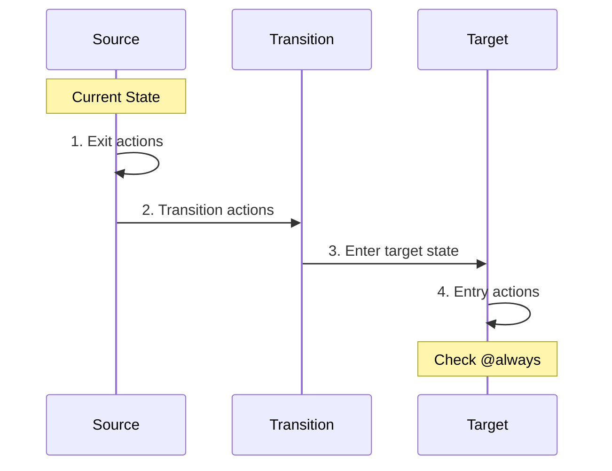

# Entry/Exit Actions

Entry and exit actions are lifecycle hooks that execute when entering or leaving a state. They're useful for setup, cleanup, logging, and side effects tied to state boundaries.

## Basic Syntax

<!-- doctest-attr: ignore -->
```php
'states' => [
    'loading' => [
        'entry' => 'startLoading',
        'exit' => 'stopLoading',
        'on' => [
            'LOADED' => 'ready',
        ],
    ],
],
```

## Multiple Actions

<!-- doctest-attr: ignore -->
```php
'loading' => [
    'entry' => ['showSpinner', 'logEntry', 'startTimer'],
    'exit' => ['hideSpinner', 'logExit', 'stopTimer'],
],
```

Actions execute in the order specified.

## Execution Order



### Complete Example

<!-- doctest-attr: ignore -->
```php
'states' => [
    'stateA' => [
        'exit' => 'exitA',
        'on' => [
            'GO' => [
                'target' => 'stateB',
                'actions' => 'transitionAction',
            ],
        ],
    ],
    'stateB' => [
        'entry' => 'enterB',
    ],
],
```

When `GO` is sent:
1. `exitA` runs (leaving stateA)
2. `transitionAction` runs (during transition)
3. `enterB` runs (entering stateB)

## Entry Actions

### Setup and Initialization

<!-- doctest-attr: ignore -->
```php
'loading' => [
    'entry' => 'initializeLoader',
    'on' => ['COMPLETE' => 'ready'],
],

'actions' => [
    'initializeLoader' => function (ContextManager $context) {
        $context->startTime = now();
        $context->attempts = 0;
        $context->isLoading = true;
    },
],
```

### Class-Based Entry Action

<!-- doctest-attr: ignore -->
```php
use Tarfinlabs\EventMachine\Behavior\ActionBehavior; // [!code hide]
use Tarfinlabs\EventMachine\ContextManager; // [!code hide]
class StartProcessingAction extends ActionBehavior
{
    public function __construct(
        private readonly ProcessingService $service,
    ) {}

    public function __invoke(ContextManager $context): void
    {
        $this->service->start($context->processId);
        $context->processingStarted = now();
    }
}

// In configuration
'processing' => [
    'entry' => StartProcessingAction::class,
],
```

### Entry Action with Raised Event

<!-- doctest-attr: ignore -->
```php
use Tarfinlabs\EventMachine\Behavior\ActionBehavior; // [!code hide]
use Tarfinlabs\EventMachine\ContextManager; // [!code hide]
class ValidateOnEntryAction extends ActionBehavior
{
    public function __invoke(ContextManager $context): void
    {
        $isValid = $this->validate($context);

        if ($isValid) {
            $this->raise(['type' => 'VALIDATION_PASSED']);
        } else {
            $this->raise(['type' => 'VALIDATION_FAILED']);
        }
    }
}

'validating' => [
    'entry' => ValidateOnEntryAction::class,
    'on' => [
        'VALIDATION_PASSED' => 'approved',
        'VALIDATION_FAILED' => 'rejected',
    ],
],
```

## Exit Actions

### Cleanup

<!-- doctest-attr: ignore -->
```php
'editing' => [
    'exit' => 'saveProgress',
    'on' => ['SUBMIT' => 'reviewing'],
],

'actions' => [
    'saveProgress' => function (ContextManager $context) {
        $context->lastSaved = now();
        // Save draft to database
    },
],
```

### Resource Release

<!-- doctest-attr: ignore -->
```php
use Tarfinlabs\EventMachine\Behavior\ActionBehavior; // [!code hide]
use Tarfinlabs\EventMachine\ContextManager; // [!code hide]
class ReleaseResourcesAction extends ActionBehavior
{
    public function __construct(
        private readonly ResourceManager $resources,
    ) {}

    public function __invoke(ContextManager $context): void
    {
        if ($context->resourceId) {
            $this->resources->release($context->resourceId);
        }
    }
}

'processing' => [
    'exit' => ReleaseResourcesAction::class,
],
```

## Hierarchical States

Entry and exit actions respect hierarchy:

<!-- doctest-attr: ignore -->
```php
'order' => [
    'entry' => 'logOrderStart',
    'exit' => 'logOrderEnd',
    'states' => [
        'processing' => [
            'entry' => 'startProcessing',
            'exit' => 'stopProcessing',
            'states' => [
                'validating' => [
                    'entry' => 'startValidation',
                    'exit' => 'stopValidation',
                ],
            ],
        ],
    ],
],
```

### Entering Nested State

When entering `order.processing.validating`:
1. `logOrderStart` (order entry)
2. `startProcessing` (processing entry)
3. `startValidation` (validating entry)

### Exiting to Sibling

When transitioning from `validating` to a sibling in `processing`:
1. `stopValidation` (validating exit)
2. Entry action of new sibling

### Exiting Hierarchy

When transitioning from `validating` to outside `order`:
1. `stopValidation` (validating exit)
2. `stopProcessing` (processing exit)
3. `logOrderEnd` (order exit)
4. Entry actions of new target

## Practical Examples

### Loading State

<!-- doctest-attr: ignore -->
```php
'states' => [
    'idle' => [
        'on' => ['LOAD' => 'loading'],
    ],
    'loading' => [
        'entry' => ['showLoadingIndicator', 'fetchData'],
        'exit' => 'hideLoadingIndicator',
        'on' => [
            'SUCCESS' => 'loaded',
            'FAILURE' => 'error',
        ],
    ],
    'loaded' => [],
    'error' => [
        'entry' => 'showErrorMessage',
    ],
],
```

### Form Wizard

<!-- doctest-attr: ignore -->
```php
'wizard' => [
    'initial' => 'step1',
    'entry' => 'initializeWizard',
    'exit' => 'cleanupWizard',
    'states' => [
        'step1' => [
            'entry' => 'loadStep1Data',
            'exit' => 'saveStep1Data',
            'on' => ['NEXT' => 'step2'],
        ],
        'step2' => [
            'entry' => 'loadStep2Data',
            'exit' => 'saveStep2Data',
            'on' => [
                'BACK' => 'step1',
                'NEXT' => 'step3',
            ],
        ],
        'step3' => [
            'entry' => 'loadStep3Data',
            'on' => [
                'BACK' => 'step2',
                'SUBMIT' => '#submitted',
            ],
        ],
    ],
],
```

### Session Management

<!-- doctest-attr: ignore -->
```php
'authenticated' => [
    'entry' => [
        'startSessionTimer',
        'logLogin',
        'loadUserPreferences',
    ],
    'exit' => [
        'stopSessionTimer',
        'logLogout',
        'clearSessionData',
    ],
    'states' => [
        'active' => [
            'on' => [
                'ACTIVITY' => ['actions' => 'resetTimer'],
                'TIMEOUT' => 'inactive',
            ],
        ],
        'inactive' => [
            'entry' => 'showTimeoutWarning',
            'on' => [
                'ACTIVITY' => 'active',
                'LOGOUT' => '#loggedOut',
            ],
        ],
    ],
],
```

### Order Processing

<!-- doctest-attr: ignore -->
```php
'processing' => [
    'entry' => ['reserveInventory', 'notifyWarehouse'],
    'exit' => 'cleanup',
    'states' => [
        'authorizing' => [
            'entry' => 'initiatePayment',
            'on' => [
                'AUTHORIZED' => 'fulfilling',
                'DECLINED' => '#declined',
            ],
        ],
        'fulfilling' => [
            'entry' => 'startFulfillment',
            'exit' => 'finalizeFulfillment',
            'on' => [
                'SHIPPED' => '#shipped',
            ],
        ],
    ],
],
```

## Entry Actions and @always

Entry actions complete before `@always` transitions check:

<!-- doctest-attr: ignore -->
```php
'checking' => [
    'entry' => 'performCheck',  // Runs first
    'on' => [
        '@always' => [          // Checked after entry
            ['target' => 'passed', 'guards' => 'checkPassed'],
            ['target' => 'failed'],
        ],
    ],
],

'actions' => [
    'performCheck' => function ($context) {
        $context->checkResult = performCheck();
    },
],

'guards' => [
    'checkPassed' => fn($ctx) => $ctx->checkResult === 'success',
],
```

## Self-Transitions

Self-transitions trigger exit and entry actions:

<!-- doctest-attr: ignore -->
```php
'counting' => [
    'entry' => 'logEntry',
    'exit' => 'logExit',
    'on' => [
        'INCREMENT' => [
            // Self-transition (no target = same state)
            'actions' => 'increment',
        ],
        'RESET' => [
            'target' => 'counting',  // Explicit self-transition
            'actions' => 'reset',
        ],
    ],
],
```

When `RESET` is sent:
1. `logExit` runs
2. `reset` runs
3. `logEntry` runs

## Testing Entry/Exit Actions

<!-- doctest-attr: ignore -->
```php
use Tarfinlabs\EventMachine\Definition\MachineDefinition; // [!code hide]
it('executes entry actions on state entry', function () {
    $executionLog = [];

    $machine = MachineDefinition::define(
        config: [
            'initial' => 'idle',
            'states' => [
                'idle' => [
                    'on' => ['START' => 'active'],
                ],
                'active' => [
                    'entry' => 'onEnter',
                ],
            ],
        ],
        behavior: [
            'actions' => [
                'onEnter' => function () use (&$executionLog) {
                    $executionLog[] = 'entered';
                },
            ],
        ],
    );

    $machine->transition(['type' => 'START']);

    expect($executionLog)->toBe(['entered']);
});
```

## Best Practices

### 1. Use Entry for Setup

<!-- doctest-attr: ignore -->
```php
'processing' => [
    'entry' => [
        'initializeResources',
        'startMonitoring',
    ],
],
```

### 2. Use Exit for Cleanup

<!-- doctest-attr: ignore -->
```php
'processing' => [
    'exit' => [
        'releaseResources',
        'stopMonitoring',
    ],
],
```

### 3. Keep Actions Focused

<!-- doctest-attr: ignore -->
```php
// Good - single responsibility
'entry' => ['logEntry', 'startTimer', 'loadData'],

// Avoid - one action doing everything
'entry' => 'doEverything',
```

### 4. Handle Errors in Entry Actions

```php
use Tarfinlabs\EventMachine\Behavior\ActionBehavior; // [!code hide]
use Tarfinlabs\EventMachine\ContextManager; // [!code hide]
class SafeEntryAction extends ActionBehavior
{
    public function __invoke(ContextManager $context): void
    {
        try {
            $this->riskyOperation();
        } catch (Exception $e) {
            $context->entryError = $e->getMessage();
            $this->raise(['type' => 'ENTRY_FAILED']);
        }
    }
}
```

### 5. Avoid Side Effects in Exit Actions That Might Fail

Exit actions should be reliable:

<!-- doctest-attr: ignore -->
```php
// Good - unlikely to fail
'exit' => 'clearLocalState',

// Risky - external API might fail
'exit' => 'notifyExternalService',
```
