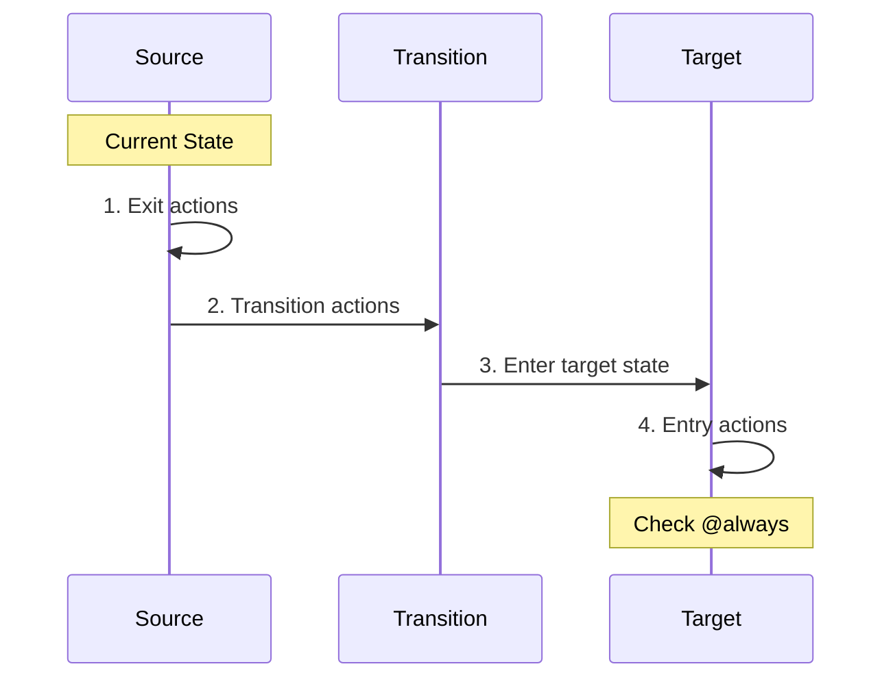

# Entry/Exit Actions

Entry and exit actions are lifecycle hooks that execute when entering or leaving a state. They're useful for setup, cleanup, logging, and side effects tied to state boundaries.

## Basic Syntax

<!-- doctest-attr: ignore -->
```php
'states' => [
    'loading' => [
        'entry' => 'startLoadingAction',
        'exit' => 'stopLoadingAction',
        'on' => [
            'LOADED' => 'ready',
        ],
    ],
],
```

## Multiple Actions

<!-- doctest-attr: ignore -->
```php
'loading' => [
    'entry' => ['showSpinnerAction', 'logEntryAction', 'startTimerAction'],
    'exit' => ['hideSpinnerAction', 'logExitAction', 'stopTimerAction'],
],
```

Actions execute in the order specified.

## Execution Order


```mermaid
sequenceDiagram
    participant Source
    participant Transition
    participant Target

    Note over Source: Current State
    Source->>Source: 1. Exit actions
    Source->>Transition: 2. Transition actions
    Transition->>Target: 3. Enter target state
    Target->>Target: 4. Entry actions
    Note over Target: Check @always
```

### Complete Example

<!-- doctest-attr: ignore -->
```php
'states' => [
    'state_a' => [
        'exit' => 'exitAAction',
        'on' => [
            'GO' => [
                'target' => 'state_b',
                'actions' => 'transitionAction',
            ],
        ],
    ],
    'state_b' => [
        'entry' => 'enterBAction',
    ],
],
```

When `GO` is sent:
1. `exitA` runs (leaving state_a)
2. `transitionAction` runs (during transition)
3. `enterB` runs (entering state_b)

## Entry Actions

### Setup and Initialization

<!-- doctest-attr: ignore -->
```php
'loading' => [
    'entry' => 'initializeLoaderAction',
    'on' => ['COMPLETE' => 'ready'],
],

'actions' => [
    'initializeLoaderAction' => function (ContextManager $context) {
        $context->startTime = now();
        $context->attempts = 0;
        $context->isLoading = true;
    },
],
```

### Class-Based Entry Action

<!-- doctest-attr: ignore -->
```php
use Tarfinlabs\EventMachine\Behavior\ActionBehavior; // [!code hide]
use Tarfinlabs\EventMachine\ContextManager; // [!code hide]
class StartProcessingAction extends ActionBehavior
{
    public function __construct(
        private readonly ProcessingService $service,
    ) {}

    public function __invoke(ContextManager $context): void
    {
        $this->service->start($context->processId);
        $context->processingStarted = now();
    }
}

// In configuration
'processing' => [
    'entry' => StartProcessingAction::class,
],
```

### Entry Action with Raised Event

<!-- doctest-attr: ignore -->
```php
use Tarfinlabs\EventMachine\Behavior\ActionBehavior; // [!code hide]
use Tarfinlabs\EventMachine\ContextManager; // [!code hide]
class ValidateOnEntryAction extends ActionBehavior
{
    public function __invoke(ContextManager $context): void
    {
        $isValid = $this->validate($context);

        if ($isValid) {
            $this->raise(['type' => 'VALIDATION_PASSED']);
        } else {
            $this->raise(['type' => 'VALIDATION_FAILED']);
        }
    }
}

'validating' => [
    'entry' => ValidateOnEntryAction::class,
    'on' => [
        'VALIDATION_PASSED' => 'approved',
        'VALIDATION_FAILED' => 'rejected',
    ],
],
```

## Exit Actions

### Cleanup

<!-- doctest-attr: ignore -->
```php
'editing' => [
    'exit' => 'saveProgressAction',
    'on' => ['SUBMIT' => 'reviewing'],
],

'actions' => [
    'saveProgressAction' => function (ContextManager $context) {
        $context->lastSaved = now();
        // Save draft to database
    },
],
```

### Resource Release

<!-- doctest-attr: ignore -->
```php
use Tarfinlabs\EventMachine\Behavior\ActionBehavior; // [!code hide]
use Tarfinlabs\EventMachine\ContextManager; // [!code hide]
class ReleaseResourcesAction extends ActionBehavior
{
    public function __construct(
        private readonly ResourceManager $resources,
    ) {}

    public function __invoke(ContextManager $context): void
    {
        if ($context->resourceId) {
            $this->resources->release($context->resourceId);
        }
    }
}

'processing' => [
    'exit' => ReleaseResourcesAction::class,
],
```

## Hierarchical States

Entry and exit actions respect hierarchy:

<!-- doctest-attr: ignore -->
```php
'order' => [
    'entry' => 'logOrderStartAction',
    'exit' => 'logOrderEndAction',
    'states' => [
        'processing' => [
            'entry' => 'startProcessingAction',
            'exit' => 'stopProcessingAction',
            'states' => [
                'validating' => [
                    'entry' => 'startValidationAction',
                    'exit' => 'stopValidationAction',
                ],
            ],
        ],
    ],
],
```

### Entering Nested State

When entering `order.processing.validating`:
1. `logOrderStart` (order entry)
2. `startProcessing` (processing entry)
3. `startValidation` (validating entry)

### Exiting to Sibling

When transitioning from `validating` to a sibling in `processing`:
1. `stopValidation` (validating exit)
2. Entry action of new sibling

### Exiting Hierarchy

When transitioning from `validating` to outside `order`:
1. `stopValidation` (validating exit)
2. `stopProcessing` (processing exit)
3. `logOrderEnd` (order exit)
4. Entry actions of new target

## Practical Examples

### Loading State

<!-- doctest-attr: ignore -->
```php
'states' => [
    'idle' => [
        'on' => ['LOAD' => 'loading'],
    ],
    'loading' => [
        'entry' => ['showLoadingIndicatorAction', 'fetchDataAction'],
        'exit' => 'hideLoadingIndicatorAction',
        'on' => [
            'SUCCESS' => 'loaded',
            'FAILURE' => 'error',
        ],
    ],
    'loaded' => [],
    'error' => [
        'entry' => 'showErrorMessageAction',
    ],
],
```

### Form Wizard

<!-- doctest-attr: ignore -->
```php
'wizard' => [
    'initial' => 'step1',
    'entry' => 'initializeWizardAction',
    'exit' => 'cleanupWizardAction',
    'states' => [
        'step1' => [
            'entry' => 'loadStep1DataAction',
            'exit' => 'saveStep1DataAction',
            'on' => ['NEXT' => 'step2'],
        ],
        'step2' => [
            'entry' => 'loadStep2DataAction',
            'exit' => 'saveStep2DataAction',
            'on' => [
                'BACK' => 'step1',
                'NEXT' => 'step3',
            ],
        ],
        'step3' => [
            'entry' => 'loadStep3DataAction',
            'on' => [
                'BACK' => 'step2',
                'SUBMIT' => '#submitted',
            ],
        ],
    ],
],
```

### Session Management

<!-- doctest-attr: ignore -->
```php
'authenticated' => [
    'entry' => [
        'startSessionTimerAction',
        'logLoginAction',
        'loadUserPreferencesAction',
    ],
    'exit' => [
        'stopSessionTimerAction',
        'logLogoutAction',
        'clearSessionDataAction',
    ],
    'states' => [
        'active' => [
            'on' => [
                'ACTIVITY' => ['actions' => 'resetTimerAction'],
                'TIMEOUT' => 'inactive',
            ],
        ],
        'inactive' => [
            'entry' => 'showTimeoutWarningAction',
            'on' => [
                'ACTIVITY' => 'active',
                'LOGOUT' => '#loggedOut',
            ],
        ],
    ],
],
```

### Order Processing

<!-- doctest-attr: ignore -->
```php
'processing' => [
    'entry' => ['reserveInventoryAction', 'notifyWarehouseAction'],
    'exit' => 'cleanupAction',
    'states' => [
        'authorizing' => [
            'entry' => 'initiatePaymentAction',
            'on' => [
                'AUTHORIZED' => 'fulfilling',
                'DECLINED' => '#declined',
            ],
        ],
        'fulfilling' => [
            'entry' => 'startFulfillmentAction',
            'exit' => 'finalizeFulfillmentAction',
            'on' => [
                'SHIPPED' => '#shipped',
            ],
        ],
    ],
],
```

## Entry Actions and @always

Entry actions complete before `@always` transitions check:

<!-- doctest-attr: ignore -->
```php
'checking' => [
    'entry' => 'performCheckAction',  // Runs first
    'on' => [
        '@always' => [          // Checked after entry
            ['target' => 'passed', 'guards' => 'checkPassedGuard'],
            ['target' => 'failed'],
        ],
    ],
],

'actions' => [
    'performCheckAction' => function ($context) {
        $context->checkData = performCheck();
    },
],

'guards' => [
    'checkPassedGuard' => fn($ctx) => $ctx->checkData === 'success',
],
```

## Self-Transitions vs Targetless Transitions

**Self-transitions** (explicit `target` pointing to the same state) trigger exit and entry actions:

<!-- doctest-attr: ignore -->
```php
'counting' => [
    'entry' => 'logEntryAction',
    'exit' => 'logExitAction',
    'on' => [
        'INCREMENT' => [
            // Targetless transition (no target key) — only transition actions run
            'actions' => 'incrementAction',
        ],
        'RESET' => [
            'target' => 'counting',  // Explicit self-transition — exit + entry fire
            'actions' => 'resetAction',
        ],
    ],
],
```

When `RESET` is sent (self-transition):
1. `logExit` runs
2. `reset` runs
3. `logEntry` runs

When `INCREMENT` is sent (targetless):
1. `increment` runs (no exit, no entry)

## Testing Entry/Exit Actions

<!-- doctest-attr: ignore -->
```php
use Tarfinlabs\EventMachine\Definition\MachineDefinition; // [!code hide]
it('executes entry actions on state entry', function () {
    $executionLog = [];

    $machine = MachineDefinition::define(
        config: [
            'initial' => 'idle',
            'states' => [
                'idle' => [
                    'on' => ['START' => 'active'],
                ],
                'active' => [
                    'entry' => 'onEnterAction',
                ],
            ],
        ],
        behavior: [
            'actions' => [
                'onEnterAction' => function () use (&$executionLog) {
                    $executionLog[] = 'entered';
                },
            ],
        ],
    );

    $machine->transition(['type' => 'START']);

    expect($executionLog)->toBe(['entered']);
});
```

::: tip Full Testing Guide
For behavior faking and spy patterns, see [Fakeable Behaviors](/testing/fakeable-behaviors).
:::

## Best Practices

### 1. Use Entry for Setup

<!-- doctest-attr: ignore -->
```php
'processing' => [
    'entry' => [
        'initializeResourcesAction',
        'startMonitoringAction',
    ],
],
```

### 2. Use Exit for Cleanup

<!-- doctest-attr: ignore -->
```php
'processing' => [
    'exit' => [
        'releaseResourcesAction',
        'stopMonitoringAction',
    ],
],
```

### 3. Keep Actions Focused

<!-- doctest-attr: ignore -->
```php
// Good - single responsibility
'entry' => ['logEntryAction', 'startTimerAction', 'loadDataAction'],

// Avoid - one action doing everything
'entry' => 'doEverythingAction',
```

### 4. Handle Errors in Entry Actions

```php
use Tarfinlabs\EventMachine\Behavior\ActionBehavior; // [!code hide]
use Tarfinlabs\EventMachine\ContextManager; // [!code hide]
class SafeEntryAction extends ActionBehavior
{
    public function __invoke(ContextManager $context): void
    {
        try {
            $this->riskyOperation();
        } catch (Exception $e) {
            $context->entryError = $e->getMessage();
            $this->raise(['type' => 'ENTRY_FAILED']);
        }
    }
}
```

### 5. Avoid Side Effects in Exit Actions That Might Fail

Exit actions should be reliable:

<!-- doctest-attr: ignore -->
```php
// Good - unlikely to fail
'exit' => 'clearLocalStateAction',

// Risky - external API might fail
'exit' => 'notifyExternalServiceAction',
```

::: tip Detailed Guide
For comprehensive design guidelines with Do/Don't examples, see [Action Design](/best-practices/action-design).
:::
