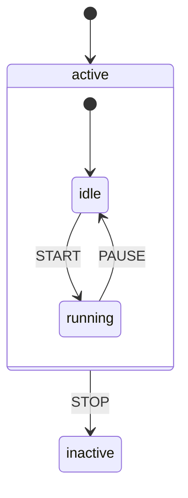
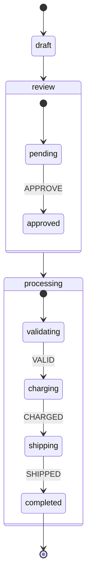

# Hierarchical States

Hierarchical (nested/compound) states allow you to organize complex state machines with parent-child relationships. Child states inherit transitions from their parents.

## Basic Structure

```php
use Tarfinlabs\EventMachine\Definition\MachineDefinition; // [!code hide]
MachineDefinition::define(
    config: [
        'initial' => 'active',
        'states' => [
            'active' => [
                'initial' => 'idle',
                'states' => [
                    'idle' => [
                        'on' => ['START' => 'running'],
                    ],
                    'running' => [
                        'on' => ['PAUSE' => 'idle'],
                    ],
                ],
                'on' => [
                    'STOP' => 'inactive',  // Available from any child
                ],
            ],
            'inactive' => [],
        ],
    ],
);
```



## State Types

### Atomic States

Leaf states with no children:

<!-- doctest-attr: ignore -->
```php
'idle' => [
    'on' => ['START' => 'running'],
],
```

### Compound States

Parent states with children:

<!-- doctest-attr: ignore -->
```php
'active' => [
    'initial' => 'idle',  // Required for compound states
    'states' => [
        'idle' => [...],
        'running' => [...],
    ],
],
```

### Final States

Terminal states:

<!-- doctest-attr: ignore -->
```php
'completed' => [
    'type' => 'final',
],
```

## Transition Inheritance

Child states inherit transitions from ancestors:

<!-- doctest-attr: ignore -->
```php
'active' => [
    'states' => [
        'loading' => [...],
        'ready' => [...],
    ],
    'on' => [
        'RESET' => 'inactive',  // Available from loading AND ready
        'ERROR' => 'error',     // Available from any child
    ],
],
```

### Order of Precedence

Child transitions take priority over parent transitions:

<!-- doctest-attr: ignore -->
```php
'active' => [
    'on' => ['SUBMIT' => 'submitted'],  // Default
    'states' => [
        'editing' => [
            'on' => ['SUBMIT' => 'validating'],  // Overrides parent
        ],
        'viewing' => [],  // Uses parent SUBMIT -> submitted
    ],
],
```

## Deep Nesting

<!-- doctest-attr: ignore -->
```php
'order' => [
    'initial' => 'draft',
    'states' => [
        'draft' => [...],
        'review' => [
            'initial' => 'pending',
            'states' => [
                'pending' => [
                    'on' => ['APPROVE' => 'approved'],
                ],
                'approved' => [
                    'on' => ['@always' => '#processing'],
                ],
            ],
        ],
        'processing' => [
            'initial' => 'validating',
            'states' => [
                'validating' => [
                    'on' => ['VALID' => 'charging'],
                ],
                'charging' => [
                    'on' => ['CHARGED' => 'shipping'],
                ],
                'shipping' => [
                    'on' => ['SHIPPED' => '#completed'],
                ],
            ],
        ],
        'completed' => ['type' => 'final'],
    ],
],
```



## State IDs and Targeting

### Automatic ID Generation

<!-- doctest-attr: ignore -->
```php
// Given this structure:
'id' => 'order',
'states' => [
    'processing' => [
        'states' => [
            'validating' => [],
        ],
    ],
],

// State IDs are:
// 'order.processing'
// 'order.processing.validating'
```

### Targeting Nested States

<!-- doctest-attr: ignore -->
```php
// Target using full path
'on' => [
    'SKIP_VALIDATION' => 'processing.charging',
],

// Target using ID selector (#)
'on' => [
    'SKIP_VALIDATION' => '#processing.charging',
],
```

### Breaking Out of Nesting

Use `#` to target any state by ID:

<!-- doctest-attr: ignore -->
```php
'review' => [
    'states' => [
        'approved' => [
            'on' => [
                '@always' => '#completed',  // Jump to root-level completed
            ],
        ],
    ],
],
'completed' => ['type' => 'final'],
```

## Initial States

Compound states must specify an initial child:

<!-- doctest-attr: ignore -->
```php
'processing' => [
    'initial' => 'validating',  // Required
    'states' => [
        'validating' => [],
        'charging' => [],
    ],
],
```

When entering `processing`, it automatically enters `validating`.

## Entry/Exit Actions

Actions execute at each level:

<!-- doctest-attr: ignore -->
```php
'order' => [
    'entry' => 'logOrderEntry',  // Runs when entering order
    'exit' => 'logOrderExit',    // Runs when leaving order
    'states' => [
        'processing' => [
            'entry' => 'startProcessing',  // Runs when entering processing
            'exit' => 'stopProcessing',    // Runs when leaving processing
            'states' => [
                'validating' => [
                    'entry' => 'startValidation',
                    'on' => ['VALID' => 'charging'],
                ],
            ],
        ],
    ],
],
```

### Execution Order

When entering `order.processing.validating`:
1. `logOrderEntry` (order entry)
2. `startProcessing` (processing entry)
3. `startValidation` (validating entry)

When leaving from `validating` to a sibling:
1. Actions on validating exit (if any)
2. (No exit on processing - staying within)

When leaving from `validating` to outside `order`:
1. Validating exit
2. `stopProcessing`
3. `logOrderExit`

## Practical Example

### Multi-Step Form

<!-- doctest-attr: ignore -->
```php
use Tarfinlabs\EventMachine\Definition\MachineDefinition; // [!code hide]
MachineDefinition::define(
    config: [
        'id' => 'wizard',
        'initial' => 'filling',
        'context' => [
            'currentStep' => 1,
            'data' => [],
        ],
        'states' => [
            'filling' => [
                'initial' => 'step1',
                'states' => [
                    'step1' => [
                        'on' => [
                            'NEXT' => [
                                'target' => 'step2',
                                'guards' => 'step1Valid',
                                'actions' => 'saveStep1',
                            ],
                        ],
                    ],
                    'step2' => [
                        'on' => [
                            'BACK' => 'step1',
                            'NEXT' => [
                                'target' => 'step3',
                                'guards' => 'step2Valid',
                                'actions' => 'saveStep2',
                            ],
                        ],
                    ],
                    'step3' => [
                        'on' => [
                            'BACK' => 'step2',
                            'SUBMIT' => [
                                'target' => '#reviewing',
                                'guards' => 'step3Valid',
                                'actions' => 'saveStep3',
                            ],
                        ],
                    ],
                ],
                'on' => [
                    'CANCEL' => 'cancelled',
                ],
            ],
            'reviewing' => [
                'on' => [
                    'EDIT' => 'filling.step1',
                    'CONFIRM' => 'submitting',
                ],
            ],
            'submitting' => [
                'entry' => 'submitForm',
                'on' => [
                    'SUCCESS' => 'completed',
                    'FAILURE' => 'error',
                ],
            ],
            'completed' => ['type' => 'final'],
            'cancelled' => ['type' => 'final'],
            'error' => [
                'on' => ['RETRY' => 'submitting'],
            ],
        ],
    ],
);
```

### E-commerce Order

<!-- doctest-attr: ignore -->
```php
'states' => [
    'cart' => [
        'on' => ['CHECKOUT' => 'checkout'],
    ],
    'checkout' => [
        'initial' => 'shipping',
        'states' => [
            'shipping' => [
                'on' => [
                    'SUBMIT_SHIPPING' => [
                        'target' => 'payment',
                        'guards' => 'validShipping',
                        'actions' => 'saveShipping',
                    ],
                ],
            ],
            'payment' => [
                'on' => [
                    'BACK' => 'shipping',
                    'SUBMIT_PAYMENT' => [
                        'target' => 'review',
                        'guards' => 'validPayment',
                        'actions' => 'savePayment',
                    ],
                ],
            ],
            'review' => [
                'on' => [
                    'BACK' => 'payment',
                    'CONFIRM' => '#processing',
                ],
            ],
        ],
        'on' => [
            'CANCEL' => 'cart',
        ],
    ],
    'processing' => [
        'initial' => 'authorizing',
        'states' => [
            'authorizing' => [
                'entry' => 'authorizePayment',
                'on' => [
                    'AUTHORIZED' => 'fulfilling',
                    'DECLINED' => '#declined',
                ],
            ],
            'fulfilling' => [
                'entry' => 'reserveInventory',
                'on' => ['FULFILLED' => '#completed'],
            ],
        ],
    ],
    'completed' => ['type' => 'final'],
    'declined' => ['type' => 'final'],
],
```

## Checking Current State

<!-- doctest-attr: ignore -->
```php
$machine = WizardMachine::create();
$machine->send(['type' => 'NEXT']); // Go to step 2

// Check nested state with `matches()` - requires full path from initial state
$machine->state->matches('filling.step2');     // true (full path)

// Partial paths return false
$machine->state->matches('filling');           // false - not a leaf state
$machine->state->matches('step2');             // false - missing parent path

// State value shows full path
$machine->state->value; // ['wizard.filling.step2']
```

::: warning Full Path Required
The `matches()` method requires the full path to the leaf state. Partial paths or just the leaf state name will return `false`. Always specify the complete path from the machine's initial state.
:::

## Best Practices

### 1. Use Hierarchy for Related States

<!-- doctest-attr: ignore -->
```php
// Good - related states grouped
'checkout' => [
    'states' => ['shipping', 'payment', 'review'],
],

// Avoid - flat structure for related states
'checkout_shipping' => [],
'checkout_payment' => [],
'checkout_review' => [],
```

### 2. Keep Nesting Shallow

<!-- doctest-attr: ignore -->
```php
// Prefer 2-3 levels max
'order' => [
    'states' => [
        'processing' => [
            'states' => ['validating', 'charging'],
        ],
    ],
],

// Avoid deeply nested structures
'level1' => ['states' => ['level2' => ['states' => ['level3' => [...]]]]],
```

### 3. Use ID Targeting Sparingly

<!-- doctest-attr: ignore -->
```php
// Use for breaking out of hierarchy
'approved' => [
    'on' => ['@always' => '#completed'],
],

// For siblings, use relative paths
'step1' => [
    'on' => ['NEXT' => 'step2'],  // Not '#wizard.filling.step2'
],
```

### 4. Share Common Transitions at Parent Level

<!-- doctest-attr: ignore -->
```php
'checkout' => [
    'on' => [
        'CANCEL' => 'cart',     // Available from all children
        'TIMEOUT' => 'expired', // Available from all children
    ],
    'states' => [
        'shipping' => [],
        'payment' => [],
    ],
],
```
