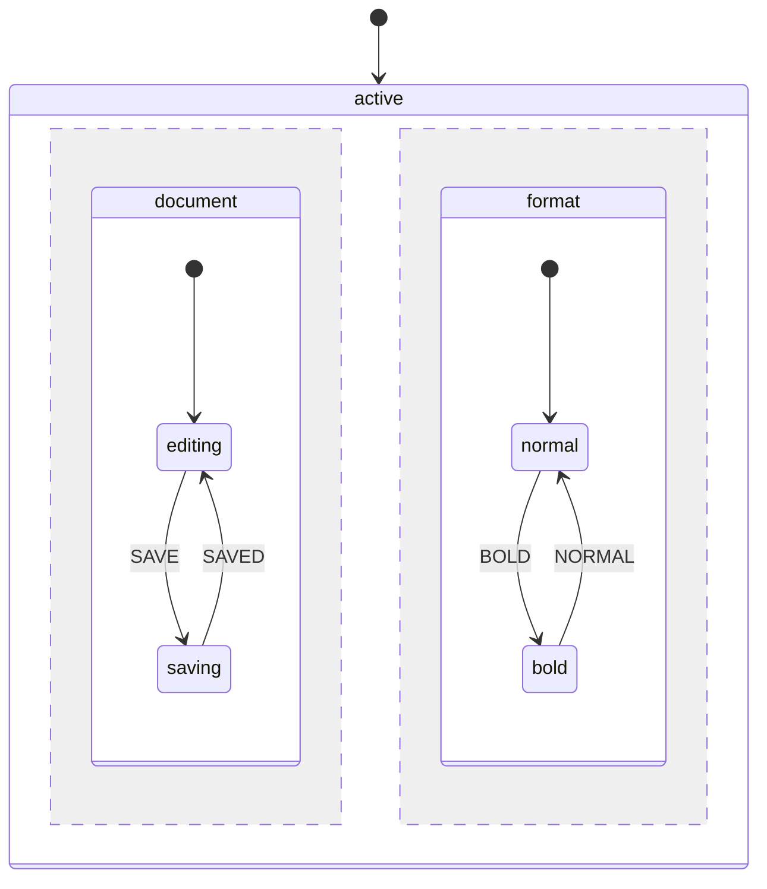

# Parallel States

Parallel states (also known as orthogonal states) allow multiple independent state regions to be active simultaneously. Each region processes events independently while sharing the same context.

## When to Use Parallel States

Parallel states are useful when:

- Multiple independent processes run concurrently (e.g., document editing + autosave status)
- You need to track multiple toggles or modes (e.g., bold, italic, underline formatting)
- A workflow has parallel tracks that must all complete (e.g., payment + shipping + documents)
- Different aspects of a system operate independently but belong to the same machine

## Basic Syntax

Define a parallel state by setting `type` to `'parallel'`:

```php
MachineDefinition::define([
    'id' => 'editor',
    'initial' => 'active',
    'states' => [
        'active' => [
            'type' => 'parallel',  // Mark as parallel
            'states' => [
                'document' => [
                    'initial' => 'editing',
                    'states' => [
                        'editing' => [
                            'on' => ['SAVE' => 'saving'],
                        ],
                        'saving' => [
                            'on' => ['SAVED' => 'editing'],
                        ],
                    ],
                ],
                'format' => [
                    'initial' => 'normal',
                    'states' => [
                        'normal' => [
                            'on' => ['BOLD' => 'bold'],
                        ],
                        'bold' => [
                            'on' => ['NORMAL' => 'normal'],
                        ],
                    ],
                ],
            ],
        ],
    ],
]);
```



## State Value Representation

In parallel states, `$state->value` is a flat array containing all active leaf state IDs:

```php
$state = $definition->getInitialState();

// State value contains both active regions
$state->value;
// [
//     'editor.active.document.editing',
//     'editor.active.format.normal',
// ]
```

### Checking Active States

Use the `matches()` method to check if a specific state is active:

```php
// Check individual states
$state->matches('active.document.editing');  // true
$state->matches('active.format.normal');     // true

// Check multiple states at once with `matchesAll()`
$state->matchesAll([
    'active.document.editing',
    'active.format.bold',
]);  // false - format is in 'normal', not 'bold'

// Check if currently in a parallel state with `isInParallelState()`
$state->isInParallelState();  // true
```

::: warning Full Path Required
The `matches()` method requires the full path to the leaf state. Partial paths (like `active.document` without the leaf state) will return false. Always specify the complete path to the active leaf state.
:::

## Event Handling

Events are broadcast to all active regions. Each region independently evaluates whether it can handle the event.

### Single Region Handling

When an event is only defined in one region, only that region transitions:

```php
$state = $definition->getInitialState();
// document: editing, format: normal

$state = $definition->transition(['type' => 'BOLD'], $state);
// document: editing (unchanged)
// format: bold (transitioned)
```

### Multiple Region Handling

The same event can trigger transitions in multiple regions simultaneously:

```php
MachineDefinition::define([
    'id' => 'editor',
    'initial' => 'active',
    'context' => ['value' => ''],
    'states' => [
        'active' => [
            'type' => 'parallel',
            'states' => [
                'editing' => [
                    'initial' => 'idle',
                    'states' => [
                        'idle' => [
                            'on' => [
                                'CHANGE' => [
                                    'target' => 'modified',
                                    'actions' => 'updateValue',
                                ],
                            ],
                        ],
                        'modified' => [],
                    ],
                ],
                'status' => [
                    'initial' => 'saved',
                    'states' => [
                        'saved' => [
                            'on' => ['CHANGE' => 'unsaved'],
                        ],
                        'unsaved' => [
                            'on' => ['SAVE' => 'saved'],
                        ],
                    ],
                ],
            ],
        ],
    ],
]);

// CHANGE event triggers transitions in BOTH regions
$state = $definition->transition(['type' => 'CHANGE'], $state);
$state->matches('active.editing.modified');  // true
$state->matches('active.status.unsaved');    // true
```

## Entry and Exit Actions

Entry and exit actions fire for each region during transitions. Understanding the execution order is important for proper state initialization and cleanup.

### Entry Action Execution Order

When entering a parallel state, entry actions fire in this specific order:

1. **Parallel state entry** - The parallel state's own entry action
2. **Region 1 initial state entry** - First region's initial state
3. **Region 2 initial state entry** - Second region's initial state
4. *(continues for all regions in definition order)*

```php
MachineDefinition::define(
    config: [
        'id' => 'machine',
        'initial' => 'active',
        'states' => [
            'active' => [
                'type' => 'parallel',
                'entry' => 'logParallelEntry',  // 1. Fires first
                'states' => [
                    'region1' => [
                        'initial' => 'a',
                        'states' => [
                            'a' => [
                                'entry' => 'logRegion1Entry',  // 2. Fires second
                            ],
                        ],
                    ],
                    'region2' => [
                        'initial' => 'b',
                        'states' => [
                            'b' => [
                                'entry' => 'logRegion2Entry',  // 3. Fires third
                            ],
                        ],
                    ],
                    'region3' => [
                        'initial' => 'c',
                        'states' => [
                            'c' => [
                                'entry' => 'logRegion3Entry',  // 4. Fires fourth
                            ],
                        ],
                    ],
                ],
            ],
        ],
    ],
    behavior: [
        'actions' => [
            'logParallelEntry' => fn () => Log::info('1. Entering parallel state'),
            'logRegion1Entry' => fn () => Log::info('2. Entering region 1'),
            'logRegion2Entry' => fn () => Log::info('3. Entering region 2'),
            'logRegion3Entry' => fn () => Log::info('4. Entering region 3'),
        ],
    ]
);

// Log output:
// 1. Entering parallel state
// 2. Entering region 1
// 3. Entering region 2
// 4. Entering region 3
```

### Exit Action Execution Order

Exit actions fire for leaf states and the parallel state itself:

1. **Leaf state exits** - Exit actions for each active leaf state (in definition order)
2. **Parallel state exit** - The parallel state's own exit action (last)

::: warning Region Exit Actions
Region (compound state) exit actions are **not** automatically invoked when leaving a parallel state. Only leaf states and the parallel state itself run exit actions.
:::

```php
MachineDefinition::define(
    config: [
        'id' => 'machine',
        'initial' => 'active',
        'states' => [
            'active' => [
                'type' => 'parallel',
                'exit' => 'logParallelExit',  // 3. Fires last
                'states' => [
                    'region1' => [
                        'initial' => 'a',
                        'states' => [
                            'a' => [
                                'exit' => 'logStateAExit',  // 1. Fires first
                            ],
                        ],
                    ],
                    'region2' => [
                        'initial' => 'b',
                        'states' => [
                            'b' => [
                                'exit' => 'logStateBExit',  // 2. Fires second
                            ],
                        ],
                    ],
                ],
            ],
            'inactive' => [],
        ],
    ],
    behavior: [
        'actions' => [
            'logStateAExit' => fn () => Log::info('1. Exiting state a'),
            'logStateBExit' => fn () => Log::info('2. Exiting state b'),
            'logParallelExit' => fn () => Log::info('3. Exiting parallel state'),
        ],
    ]
);

// When transitioning from 'active' to 'inactive', log output:
// 1. Exiting state a
// 2. Exiting state b
// 3. Exiting parallel state
```

::: tip Action Order Summary
**Entry**: Outside → Inside (parallel → leaf states in each region)
**Exit**: Leaf states first → Parallel state last
:::

## Shared Context

All regions share the same `ContextManager`. Actions in any region can read and modify the context:

```php
MachineDefinition::define(
    config: [
        'id' => 'counter',
        'initial' => 'active',
        'context' => ['count' => 0],
        'states' => [
            'active' => [
                'type' => 'parallel',
                'states' => [
                    'incrementer' => [
                        'initial' => 'ready',
                        'states' => [
                            'ready' => [
                                'on' => [
                                    'INCREMENT' => [
                                        'actions' => 'increment',
                                    ],
                                ],
                            ],
                        ],
                    ],
                    'decrementer' => [
                        'initial' => 'ready',
                        'states' => [
                            'ready' => [
                                'on' => [
                                    'DECREMENT' => [
                                        'actions' => 'decrement',
                                    ],
                                ],
                            ],
                        ],
                    ],
                ],
            ],
        ],
    ],
    behavior: [
        'actions' => [
            'increment' => fn (ContextManager $ctx) => $ctx->set('count', $ctx->get('count') + 1),
            'decrement' => fn (ContextManager $ctx) => $ctx->set('count', $ctx->get('count') - 1),
        ],
    ]
);
```

::: warning Context Conflicts
When multiple regions modify the same context key in response to the same event, the last region (in definition order) wins. Design your context structure to avoid conflicts or use separate keys per region. Use `set()` and `get()` methods for context access.
:::

## Final States and onDone

When all regions of a parallel state reach their final states, the parallel state is considered complete. Use `onDone` to transition when this happens:

```php
MachineDefinition::define([
    'id' => 'checkout',
    'initial' => 'processing',
    'states' => [
        'processing' => [
            'type' => 'parallel',
            'onDone' => 'complete',  // Transition when ALL regions are final
            'states' => [
                'payment' => [
                    'initial' => 'pending',
                    'states' => [
                        'pending' => [
                            'on' => ['PAYMENT_SUCCESS' => 'done'],
                        ],
                        'done' => ['type' => 'final'],
                    ],
                ],
                'shipping' => [
                    'initial' => 'preparing',
                    'states' => [
                        'preparing' => [
                            'on' => ['SHIPPED' => 'done'],
                        ],
                        'done' => ['type' => 'final'],
                    ],
                ],
            ],
        ],
        'complete' => ['type' => 'final'],
    ],
]);

$state = $definition->getInitialState();
// processing.payment.pending, processing.shipping.preparing

$state = $definition->transition(['type' => 'PAYMENT_SUCCESS'], $state);
// processing.payment.done, processing.shipping.preparing
// Still in processing - shipping not complete

$state = $definition->transition(['type' => 'SHIPPED'], $state);
// Now both regions are final - automatically transitions to 'complete'
$state->matches('complete');  // true
```

### onDone with Actions

You can also specify actions to run when the parallel state completes:

```php
'processing' => [
    'type' => 'parallel',
    'onDone' => [
        'target' => 'complete',
        'actions' => 'sendConfirmation',
    ],
    'states' => [...],
],
```

## Nested Parallel States

Parallel states can be nested within compound states, and compound states can be nested within parallel regions. You can even nest parallel states within parallel states.

### Parallel Inside Compound

```php
'active' => [
    'initial' => 'loading',
    'states' => [
        'loading' => [
            'on' => ['LOADED' => 'ready'],
        ],
        'ready' => [
            'type' => 'parallel',  // Parallel state inside compound
            'states' => [
                'audio' => [...],
                'video' => [...],
            ],
        ],
    ],
],
```

### Compound Inside Parallel Region

```php
'player' => [
    'type' => 'parallel',
    'states' => [
        'track' => [
            'initial' => 'stopped',  // Compound inside parallel region
            'states' => [
                'stopped' => [...],
                'playing' => [...],
                'paused' => [...],
            ],
        ],
        'volume' => [
            'initial' => 'unmuted',
            'states' => [
                'unmuted' => [...],
                'muted' => [...],
            ],
        ],
    ],
],
```

### Deep Nesting (3+ Levels)

You can create complex hierarchies with multiple levels of nesting. EventMachine recursively resolves all leaf states regardless of nesting depth.

**Structure: Parallel → Compound → Parallel → Leaf**

```
deep (machine)
└── root (PARALLEL)
    ├── branch1 (compound)
    │   └── leaf (PARALLEL)
    │       ├── subleaf1 (compound)
    │       │   ├── a ← active leaf
    │       │   └── b
    │       └── subleaf2 (compound)
    │           ├── x ← active leaf
    │           └── y
    └── branch2 (compound)
        ├── waiting ← active leaf
        └── finished
```

```php
MachineDefinition::define([
    'id' => 'deep',
    'initial' => 'root',
    'states' => [
        'root' => [
            'type' => 'parallel',  // Level 1: Outer parallel
            'states' => [
                'branch1' => [
                    'initial' => 'leaf',  // Level 2: Compound region
                    'states' => [
                        'leaf' => [
                            'type' => 'parallel',  // Level 3: Nested parallel
                            'states' => [
                                'subleaf1' => [
                                    'initial' => 'a',  // Level 4: Inner compound
                                    'states' => [
                                        'a' => ['on' => ['GO1' => 'b']],  // Level 5: Leaf
                                        'b' => [],
                                    ],
                                ],
                                'subleaf2' => [
                                    'initial' => 'x',
                                    'states' => [
                                        'x' => ['on' => ['GO2' => 'y']],
                                        'y' => [],
                                    ],
                                ],
                            ],
                        ],
                    ],
                ],
                'branch2' => [
                    'initial' => 'waiting',
                    'states' => [
                        'waiting' => ['on' => ['DONE' => 'finished']],
                        'finished' => [],
                    ],
                ],
            ],
        ],
    ],
]);
```

### State Value in Deep Nesting

The `$state->value` array always contains the fully-qualified IDs of all active **leaf** states:

```php
$state = $definition->getInitialState();

// State value includes ALL leaf states from ALL nesting levels:
$state->value;
// [
//     'deep.root.branch1.leaf.subleaf1.a',  // From nested parallel, region 1
//     'deep.root.branch1.leaf.subleaf2.x',  // From nested parallel, region 2
//     'deep.root.branch2.waiting',          // From outer parallel, region 2
// ]

// Note: 3 active states because:
// - Outer parallel (root) has 2 regions: branch1, branch2
// - branch1's initial (leaf) is itself parallel with 2 regions: subleaf1, subleaf2
// - Total: 2 (from nested) + 1 (from outer) = 3 leaf states
```

### Transitions in Deep Nesting

Each region independently handles events at its own level:

```php
$state = $definition->getInitialState();
// branch1.leaf.subleaf1.a, branch1.leaf.subleaf2.x, branch2.waiting

// Event handled by nested parallel region subleaf1
$state = $definition->transition(['type' => 'GO1'], $state);
$state->value;
// [
//     'deep.root.branch1.leaf.subleaf1.b',  // Changed: a → b
//     'deep.root.branch1.leaf.subleaf2.x',  // Unchanged
//     'deep.root.branch2.waiting',          // Unchanged
// ]

// Event handled by nested parallel region subleaf2
$state = $definition->transition(['type' => 'GO2'], $state);
$state->value;
// [
//     'deep.root.branch1.leaf.subleaf1.b',  // Unchanged
//     'deep.root.branch1.leaf.subleaf2.y',  // Changed: x → y
//     'deep.root.branch2.waiting',          // Unchanged
// ]

// Event handled by outer parallel region branch2
$state = $definition->transition(['type' => 'DONE'], $state);
$state->value;
// [
//     'deep.root.branch1.leaf.subleaf1.b',  // Unchanged
//     'deep.root.branch1.leaf.subleaf2.y',  // Unchanged
//     'deep.root.branch2.finished',         // Changed: waiting → finished
// ]
```

### Using `matches()` with Deep Nesting

The `matches()` method checks for exact matches against active leaf states. You must provide the full path from the machine's initial state:

```php
// Check specific leaf states with `matches()` - must be full path
$state->matches('root.branch1.leaf.subleaf1.a');  // true
$state->matches('root.branch1.leaf.subleaf2.x');  // true
$state->matches('root.branch2.waiting');          // true

// Intermediate paths do NOT match
$state->matches('root.branch1.leaf');  // false - not a leaf state
$state->matches('root.branch1');       // false - not a leaf state
$state->matches('root');               // false - not a leaf state

// Partial paths (without machine id prefix) also don't work
$state->matches('branch2.waiting');    // false - missing 'root' prefix
$state->matches('subleaf1.a');         // false - missing full path
```

::: warning Full Paths Required
Always use the complete path from the initial state to the leaf when calling `matches()`. For example, use `root.branch1.leaf.subleaf1.a` instead of just `subleaf1.a`.
:::

::: tip Deep Nesting Best Practices
- Keep nesting to 3 levels or fewer when possible for maintainability
- Use meaningful names that indicate the hierarchy level (e.g., `region`, `subregion`)
- Consider breaking very deep structures into separate machines that communicate via events
:::

## Transitioning Into Parallel States

When a transition targets a parallel state, all of its regions are automatically entered.

### From Non-Parallel to Parallel

```php
MachineDefinition::define([
    'id' => 'app',
    'initial' => 'idle',
    'states' => [
        'idle' => [
            'on' => ['START' => 'processing'],
        ],
        'processing' => [
            'type' => 'parallel',
            'states' => [
                'task1' => [
                    'initial' => 'pending',
                    'states' => [
                        'pending' => [],
                        'complete' => [],
                    ],
                ],
                'task2' => [
                    'initial' => 'pending',
                    'states' => [
                        'pending' => [],
                        'complete' => [],
                    ],
                ],
            ],
        ],
    ],
]);

$state = $definition->getInitialState();
$state->matches('idle');  // true

$state = $definition->transition(['type' => 'START'], $state);
// Both regions are automatically entered
$state->matches('processing.task1.pending');  // true
$state->matches('processing.task2.pending');  // true
```

### Transitioning Into Nested Parallel (Within Parallel Region)

When you're already in a parallel state and a region transitions to a state that is itself parallel, all nested regions are properly initialized:

```php
MachineDefinition::define([
    'id' => 'nested',
    'initial' => 'active',
    'states' => [
        'active' => [
            'type' => 'parallel',
            'states' => [
                'outer1' => [
                    'initial' => 'off',
                    'states' => [
                        'off' => [
                            'on' => ['ACTIVATE' => 'on'],
                        ],
                        'on' => [
                            'type' => 'parallel',  // Target is parallel!
                            'states' => [
                                'inner1' => [
                                    'initial' => 'idle',
                                    'states' => [
                                        'idle' => ['on' => ['WORK1' => 'working']],
                                        'working' => [],
                                    ],
                                ],
                                'inner2' => [
                                    'initial' => 'idle',
                                    'states' => [
                                        'idle' => ['on' => ['WORK2' => 'working']],
                                        'working' => [],
                                    ],
                                ],
                            ],
                        ],
                    ],
                ],
                'outer2' => [
                    'initial' => 'waiting',
                    'states' => [
                        'waiting' => ['on' => ['PROCEED' => 'done']],
                        'done' => [],
                    ],
                ],
            ],
        ],
    ],
]);

$state = $definition->getInitialState();
// Initial: outer1.off, outer2.waiting
$state->value;
// ['nested.active.outer1.off', 'nested.active.outer2.waiting']

// Transition to 'on' which is a parallel state
$state = $definition->transition(['type' => 'ACTIVATE'], $state);

// The nested parallel is fully expanded - both inner regions entered!
$state->value;
// [
//     'nested.active.outer1.on.inner1.idle',  // Nested region 1
//     'nested.active.outer1.on.inner2.idle',  // Nested region 2
//     'nested.active.outer2.waiting',         // Outer region unchanged
// ]

$state->matches('active.outer1.on.inner1.idle');  // true
$state->matches('active.outer1.on.inner2.idle');  // true
$state->matches('active.outer2.waiting');         // true
```

::: info Entry Actions When Entering Nested Parallel
When transitioning into a nested parallel state, entry actions fire in order:
1. The parallel state's entry action (`on`)
2. Each nested region's initial state entry action (`inner1.idle`, `inner2.idle`)
:::

## Persistence

Parallel state values are automatically persisted to the database. The `machine_value` column stores the array of active state IDs as JSON:

```php
// State is persisted with all active regions
$machine = OrderWorkflowMachine::create();
$machine->send(['type' => 'START']);

// Get the root event ID for later restoration
$rootEventId = $machine->state->history->first()->root_event_id;

// Later, restore from database using the root event ID
$machine = OrderWorkflowMachine::create(state: $rootEventId);
$state = $machine->state;

// All parallel regions are restored
$state->matches('processing.payment.pending');   // true
$state->matches('processing.shipping.preparing'); // true
```

## Practical Example: Word Processor

A word processor with independent formatting toggles:

```php
MachineDefinition::define([
    'id' => 'word',
    'initial' => 'editing',
    'states' => [
        'editing' => [
            'type' => 'parallel',
            'states' => [
                'bold' => [
                    'initial' => 'off',
                    'states' => [
                        'off' => ['on' => ['TOGGLE_BOLD' => 'on']],
                        'on' => ['on' => ['TOGGLE_BOLD' => 'off']],
                    ],
                ],
                'italic' => [
                    'initial' => 'off',
                    'states' => [
                        'off' => ['on' => ['TOGGLE_ITALIC' => 'on']],
                        'on' => ['on' => ['TOGGLE_ITALIC' => 'off']],
                    ],
                ],
                'underline' => [
                    'initial' => 'off',
                    'states' => [
                        'off' => ['on' => ['TOGGLE_UNDERLINE' => 'on']],
                        'on' => ['on' => ['TOGGLE_UNDERLINE' => 'off']],
                    ],
                ],
                'list' => [
                    'initial' => 'none',
                    'states' => [
                        'none' => [
                            'on' => [
                                'BULLETS' => 'bullets',
                                'NUMBERS' => 'numbers',
                            ],
                        ],
                        'bullets' => [
                            'on' => [
                                'NONE' => 'none',
                                'NUMBERS' => 'numbers',
                            ],
                        ],
                        'numbers' => [
                            'on' => [
                                'BULLETS' => 'bullets',
                                'NONE' => 'none',
                            ],
                        ],
                    ],
                ],
            ],
        ],
    ],
]);

$state = $definition->getInitialState();
// All formatting off, no list

$state = $definition->transition(['type' => 'TOGGLE_BOLD'], $state);
$state = $definition->transition(['type' => 'TOGGLE_ITALIC'], $state);
$state = $definition->transition(['type' => 'BULLETS'], $state);

$state->matches('editing.bold.on');      // true
$state->matches('editing.italic.on');    // true
$state->matches('editing.underline.off'); // true
$state->matches('editing.list.bullets'); // true
```

## Validation Rules

Parallel states have specific validation rules:

1. **Must have child states**: A parallel state requires at least one region
2. **Cannot have `initial` property**: Unlike compound states, parallel states cannot specify an initial state (all regions enter simultaneously)
3. **Regions must have `initial`**: Each region (child of parallel) must be a compound state with its own `initial` property

```php
// Invalid - parallel with no children
'invalid' => [
    'type' => 'parallel',
    'states' => [],  // Error: requires at least one region
],

// Invalid - parallel with initial
'invalid' => [
    'type' => 'parallel',
    'initial' => 'region1',  // Error: parallel cannot have initial
    'states' => [...],
],
```

## Best Practices

### 1. Use Meaningful Region Names

Name regions after what they represent, not their position:

```php
// Good
'states' => [
    'playback' => [...],
    'volume' => [...],
]

// Avoid
'states' => [
    'region1' => [...],
    'region2' => [...],
]
```

### 2. Keep Regions Independent

Design regions to be as independent as possible. If regions frequently need to know about each other's state, consider whether parallel states are the right choice.

### 3. Use Guards for Cross-Region Logic

When you need to check another region's state before transitioning:

```php
MachineDefinition::define(
    config: [
        'states' => [
            'parallel' => [
                'type' => 'parallel',
                'states' => [
                    'region1' => [
                        'initial' => 'waiting',
                        'states' => [
                            'waiting' => [
                                'on' => [
                                    'PROCEED' => [
                                        'target' => 'done',
                                        'guards' => 'isRegion2Ready',
                                    ],
                                ],
                            ],
                            'done' => [],
                        ],
                    ],
                    'region2' => [...],
                ],
            ],
        ],
    ],
    behavior: [
        'guards' => [
            'isRegion2Ready' => fn (ContextManager $ctx, EventBehavior $event, State $state)
                => $state->matches('parallel.region2.ready'),  // Using `matches()` to check other region
        ],
    ]
);
```

### 4. Prefer `onDone` for Synchronization

Use `onDone` instead of complex guards when you need to wait for all regions to complete.

### 5. Document Region Dependencies

If regions have implicit dependencies (e.g., one region writes context that another reads), document this clearly in your machine definition.
