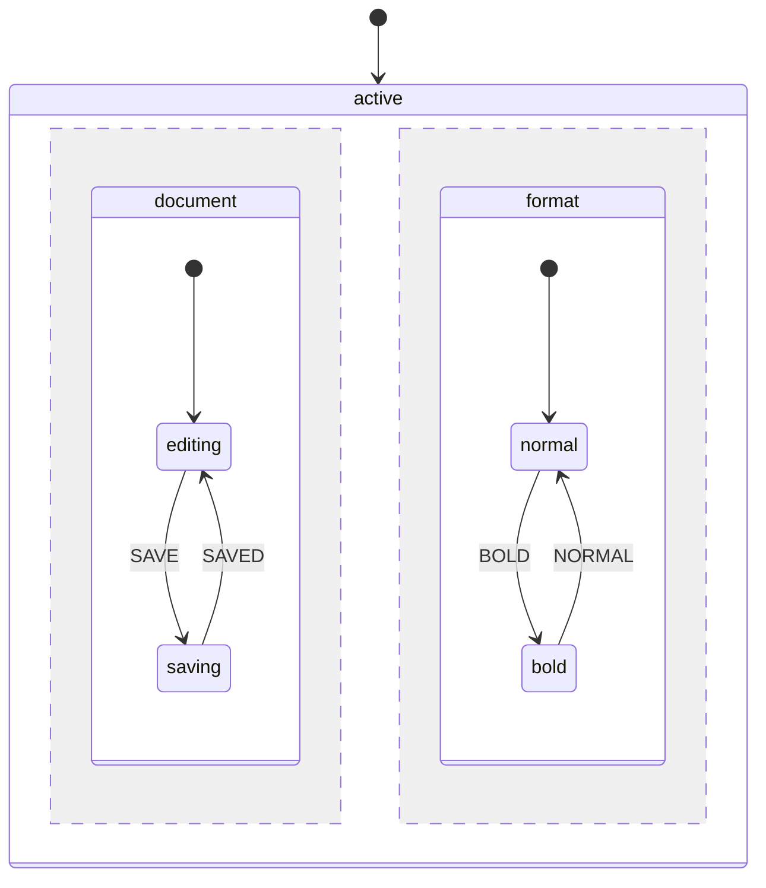

# Parallel States

Parallel states (also known as orthogonal states) allow multiple independent state regions to be active simultaneously. Each region processes events independently while sharing the same context.

## When to Use Parallel States

Parallel states are useful when:

- Multiple independent processes run concurrently (e.g., document editing + autosave status)
- You need to track multiple toggles or modes (e.g., bold, italic, underline formatting)
- A workflow has parallel tracks that must all complete (e.g., payment + shipping + documents)
- Different aspects of a system operate independently but belong to the same machine

## Basic Syntax

Define a parallel state by setting `type` to `'parallel'`:

```php
MachineDefinition::define([
    'id' => 'editor',
    'initial' => 'active',
    'states' => [
        'active' => [
            'type' => 'parallel',  // Mark as parallel
            'states' => [
                'document' => [
                    'initial' => 'editing',
                    'states' => [
                        'editing' => [
                            'on' => ['SAVE' => 'saving'],
                        ],
                        'saving' => [
                            'on' => ['SAVED' => 'editing'],
                        ],
                    ],
                ],
                'format' => [
                    'initial' => 'normal',
                    'states' => [
                        'normal' => [
                            'on' => ['BOLD' => 'bold'],
                        ],
                        'bold' => [
                            'on' => ['NORMAL' => 'normal'],
                        ],
                    ],
                ],
            ],
        ],
    ],
]);
```



## State Value Representation

In parallel states, `$state->value` is a flat array containing all active leaf state IDs:

```php
$state = $definition->getInitialState();

// State value contains both active regions
$state->value;
// [
//     'editor.active.document.editing',
//     'editor.active.format.normal',
// ]
```

### Checking Active States

Use the `matches()` method to check if a specific state is active:

```php
// Check individual states
$state->matches('active.document.editing');  // true
$state->matches('active.format.normal');     // true

// Check multiple states at once
$state->matchesAll([
    'active.document.editing',
    'active.format.bold',
]);  // false - format is in 'normal', not 'bold'

// Check if currently in a parallel state
$state->isInParallelState();  // true
```

::: tip Partial Path Matching
The `matches()` method supports partial paths. You can check `active.document` to verify you're in the document region without specifying the exact leaf state.
:::

## Event Handling

Events are broadcast to all active regions. Each region independently evaluates whether it can handle the event.

### Single Region Handling

When an event is only defined in one region, only that region transitions:

```php
$state = $definition->getInitialState();
// document: editing, format: normal

$state = $definition->transition(['type' => 'BOLD'], $state);
// document: editing (unchanged)
// format: bold (transitioned)
```

### Multiple Region Handling

The same event can trigger transitions in multiple regions simultaneously:

```php
MachineDefinition::define([
    'id' => 'editor',
    'initial' => 'active',
    'context' => ['value' => ''],
    'states' => [
        'active' => [
            'type' => 'parallel',
            'states' => [
                'editing' => [
                    'initial' => 'idle',
                    'states' => [
                        'idle' => [
                            'on' => [
                                'CHANGE' => [
                                    'target' => 'modified',
                                    'actions' => 'updateValue',
                                ],
                            ],
                        ],
                        'modified' => [],
                    ],
                ],
                'status' => [
                    'initial' => 'saved',
                    'states' => [
                        'saved' => [
                            'on' => ['CHANGE' => 'unsaved'],
                        ],
                        'unsaved' => [
                            'on' => ['SAVE' => 'saved'],
                        ],
                    ],
                ],
            ],
        ],
    ],
]);

// CHANGE event triggers transitions in BOTH regions
$state = $definition->transition(['type' => 'CHANGE'], $state);
$state->matches('active.editing.modified');  // true
$state->matches('active.status.unsaved');    // true
```

## Entry and Exit Actions

Entry and exit actions fire for each region during transitions.

### Initial Entry

When entering a parallel state, entry actions fire for:
1. The parallel state itself
2. Each region's initial state

```php
MachineDefinition::define(
    config: [
        'id' => 'machine',
        'initial' => 'active',
        'states' => [
            'active' => [
                'type' => 'parallel',
                'entry' => 'logParallelEntry',  // Fires first
                'states' => [
                    'region1' => [
                        'initial' => 'a',
                        'states' => [
                            'a' => [
                                'entry' => 'logRegion1Entry',  // Fires second
                            ],
                        ],
                    ],
                    'region2' => [
                        'initial' => 'b',
                        'states' => [
                            'b' => [
                                'entry' => 'logRegion2Entry',  // Fires third
                            ],
                        ],
                    ],
                ],
            ],
        ],
    ],
    behavior: [
        'actions' => [
            'logParallelEntry' => fn () => Log::info('Entering parallel state'),
            'logRegion1Entry' => fn () => Log::info('Entering region 1'),
            'logRegion2Entry' => fn () => Log::info('Entering region 2'),
        ],
    ]
);
```

### Exit Actions

Exit actions fire in reverse order - deepest states first:

```php
'region1' => [
    'initial' => 'a',
    'exit' => 'logRegion1Exit',  // Fires when leaving region
    'states' => [
        'a' => [
            'exit' => 'logStateAExit',  // Fires first (deepest)
        ],
    ],
],
```

## Shared Context

All regions share the same `ContextManager`. Actions in any region can read and modify the context:

```php
MachineDefinition::define(
    config: [
        'id' => 'counter',
        'initial' => 'active',
        'context' => ['count' => 0],
        'states' => [
            'active' => [
                'type' => 'parallel',
                'states' => [
                    'incrementer' => [
                        'initial' => 'ready',
                        'states' => [
                            'ready' => [
                                'on' => [
                                    'INCREMENT' => [
                                        'actions' => 'increment',
                                    ],
                                ],
                            ],
                        ],
                    ],
                    'decrementer' => [
                        'initial' => 'ready',
                        'states' => [
                            'ready' => [
                                'on' => [
                                    'DECREMENT' => [
                                        'actions' => 'decrement',
                                    ],
                                ],
                            ],
                        ],
                    ],
                ],
            ],
        ],
    ],
    behavior: [
        'actions' => [
            'increment' => fn (ContextManager $ctx) => $ctx->set('count', $ctx->get('count') + 1),
            'decrement' => fn (ContextManager $ctx) => $ctx->set('count', $ctx->get('count') - 1),
        ],
    ]
);
```

::: warning Context Conflicts
When multiple regions modify the same context key in response to the same event, the last region (in definition order) wins. Design your context structure to avoid conflicts or use separate keys per region.
:::

## Final States and onDone

When all regions of a parallel state reach their final states, the parallel state is considered complete. Use `onDone` to transition when this happens:

```php
MachineDefinition::define([
    'id' => 'checkout',
    'initial' => 'processing',
    'states' => [
        'processing' => [
            'type' => 'parallel',
            'onDone' => 'complete',  // Transition when ALL regions are final
            'states' => [
                'payment' => [
                    'initial' => 'pending',
                    'states' => [
                        'pending' => [
                            'on' => ['PAYMENT_SUCCESS' => 'done'],
                        ],
                        'done' => ['type' => 'final'],
                    ],
                ],
                'shipping' => [
                    'initial' => 'preparing',
                    'states' => [
                        'preparing' => [
                            'on' => ['SHIPPED' => 'done'],
                        ],
                        'done' => ['type' => 'final'],
                    ],
                ],
            ],
        ],
        'complete' => ['type' => 'final'],
    ],
]);

$state = $definition->getInitialState();
// processing.payment.pending, processing.shipping.preparing

$state = $definition->transition(['type' => 'PAYMENT_SUCCESS'], $state);
// processing.payment.done, processing.shipping.preparing
// Still in processing - shipping not complete

$state = $definition->transition(['type' => 'SHIPPED'], $state);
// Now both regions are final - automatically transitions to 'complete'
$state->matches('complete');  // true
```

### onDone with Actions

You can also specify actions to run when the parallel state completes:

```php
'processing' => [
    'type' => 'parallel',
    'onDone' => [
        'target' => 'complete',
        'actions' => 'sendConfirmation',
    ],
    'states' => [...],
],
```

## Nested Parallel States

Parallel states can be nested within compound states, and compound states can be nested within parallel regions. You can even nest parallel states within parallel states.

### Parallel Inside Compound

```php
'active' => [
    'initial' => 'loading',
    'states' => [
        'loading' => [
            'on' => ['LOADED' => 'ready'],
        ],
        'ready' => [
            'type' => 'parallel',  // Parallel state inside compound
            'states' => [
                'audio' => [...],
                'video' => [...],
            ],
        ],
    ],
],
```

### Compound Inside Parallel Region

```php
'player' => [
    'type' => 'parallel',
    'states' => [
        'track' => [
            'initial' => 'stopped',  // Compound inside parallel region
            'states' => [
                'stopped' => [...],
                'playing' => [...],
                'paused' => [...],
            ],
        ],
        'volume' => [
            'initial' => 'unmuted',
            'states' => [
                'unmuted' => [...],
                'muted' => [...],
            ],
        ],
    ],
],
```

### Deep Nesting

You can create complex hierarchies with multiple levels of nesting:

```php
MachineDefinition::define([
    'id' => 'deep',
    'initial' => 'root',
    'states' => [
        'root' => [
            'type' => 'parallel',
            'states' => [
                'branch1' => [
                    'initial' => 'leaf',
                    'states' => [
                        'leaf' => [
                            'type' => 'parallel',  // Nested parallel
                            'states' => [
                                'subleaf1' => [
                                    'initial' => 'a',
                                    'states' => [
                                        'a' => ['on' => ['GO1' => 'b']],
                                        'b' => [],
                                    ],
                                ],
                                'subleaf2' => [
                                    'initial' => 'x',
                                    'states' => [
                                        'x' => ['on' => ['GO2' => 'y']],
                                        'y' => [],
                                    ],
                                ],
                            ],
                        ],
                    ],
                ],
                'branch2' => [
                    'initial' => 'waiting',
                    'states' => [
                        'waiting' => ['on' => ['DONE' => 'finished']],
                        'finished' => [],
                    ],
                ],
            ],
        ],
    ],
]);

$state = $definition->getInitialState();
// State value includes all leaf states:
// [
//     'deep.root.branch1.leaf.subleaf1.a',
//     'deep.root.branch1.leaf.subleaf2.x',
//     'deep.root.branch2.waiting',
// ]
```

## Transitioning Into Parallel States

When a transition targets a parallel state, all of its regions are automatically entered:

```php
MachineDefinition::define([
    'id' => 'app',
    'initial' => 'idle',
    'states' => [
        'idle' => [
            'on' => ['START' => 'processing'],
        ],
        'processing' => [
            'type' => 'parallel',
            'states' => [
                'task1' => [
                    'initial' => 'pending',
                    'states' => [
                        'pending' => [],
                        'complete' => [],
                    ],
                ],
                'task2' => [
                    'initial' => 'pending',
                    'states' => [
                        'pending' => [],
                        'complete' => [],
                    ],
                ],
            ],
        ],
    ],
]);

$state = $definition->getInitialState();
$state->matches('idle');  // true

$state = $definition->transition(['type' => 'START'], $state);
// Both regions are automatically entered
$state->matches('processing.task1.pending');  // true
$state->matches('processing.task2.pending');  // true
```

## Persistence

Parallel state values are automatically persisted to the database. The `machine_value` column stores the array of active state IDs as JSON:

```php
// State is persisted with all active regions
$machine = new Machine(OrderWorkflowMachine::class);
$machine->send(['type' => 'START']);

// Later, restore from database
$machine = Machine::restore(OrderWorkflowMachine::class, $rootEventId);
$state = $machine->state;

// All parallel regions are restored
$state->matches('processing.payment.pending');   // true
$state->matches('processing.shipping.preparing'); // true
```

## Practical Example: Word Processor

A word processor with independent formatting toggles:

```php
MachineDefinition::define([
    'id' => 'word',
    'initial' => 'editing',
    'states' => [
        'editing' => [
            'type' => 'parallel',
            'states' => [
                'bold' => [
                    'initial' => 'off',
                    'states' => [
                        'off' => ['on' => ['TOGGLE_BOLD' => 'on']],
                        'on' => ['on' => ['TOGGLE_BOLD' => 'off']],
                    ],
                ],
                'italic' => [
                    'initial' => 'off',
                    'states' => [
                        'off' => ['on' => ['TOGGLE_ITALIC' => 'on']],
                        'on' => ['on' => ['TOGGLE_ITALIC' => 'off']],
                    ],
                ],
                'underline' => [
                    'initial' => 'off',
                    'states' => [
                        'off' => ['on' => ['TOGGLE_UNDERLINE' => 'on']],
                        'on' => ['on' => ['TOGGLE_UNDERLINE' => 'off']],
                    ],
                ],
                'list' => [
                    'initial' => 'none',
                    'states' => [
                        'none' => [
                            'on' => [
                                'BULLETS' => 'bullets',
                                'NUMBERS' => 'numbers',
                            ],
                        ],
                        'bullets' => [
                            'on' => [
                                'NONE' => 'none',
                                'NUMBERS' => 'numbers',
                            ],
                        ],
                        'numbers' => [
                            'on' => [
                                'BULLETS' => 'bullets',
                                'NONE' => 'none',
                            ],
                        ],
                    ],
                ],
            ],
        ],
    ],
]);

$state = $definition->getInitialState();
// All formatting off, no list

$state = $definition->transition(['type' => 'TOGGLE_BOLD'], $state);
$state = $definition->transition(['type' => 'TOGGLE_ITALIC'], $state);
$state = $definition->transition(['type' => 'BULLETS'], $state);

$state->matches('editing.bold.on');      // true
$state->matches('editing.italic.on');    // true
$state->matches('editing.underline.off'); // true
$state->matches('editing.list.bullets'); // true
```

## Validation Rules

Parallel states have specific validation rules:

1. **Must have child states**: A parallel state requires at least one region
2. **Cannot have `initial` property**: Unlike compound states, parallel states cannot specify an initial state (all regions enter simultaneously)
3. **Regions must have `initial`**: Each region (child of parallel) must be a compound state with its own `initial` property

```php
// Invalid - parallel with no children
'invalid' => [
    'type' => 'parallel',
    'states' => [],  // Error: requires at least one region
],

// Invalid - parallel with initial
'invalid' => [
    'type' => 'parallel',
    'initial' => 'region1',  // Error: parallel cannot have initial
    'states' => [...],
],
```

## Best Practices

### 1. Use Meaningful Region Names

Name regions after what they represent, not their position:

```php
// Good
'states' => [
    'playback' => [...],
    'volume' => [...],
]

// Avoid
'states' => [
    'region1' => [...],
    'region2' => [...],
]
```

### 2. Keep Regions Independent

Design regions to be as independent as possible. If regions frequently need to know about each other's state, consider whether parallel states are the right choice.

### 3. Use Guards for Cross-Region Logic

When you need to check another region's state before transitioning:

```php
MachineDefinition::define(
    config: [
        'states' => [
            'parallel' => [
                'type' => 'parallel',
                'states' => [
                    'region1' => [
                        'initial' => 'waiting',
                        'states' => [
                            'waiting' => [
                                'on' => [
                                    'PROCEED' => [
                                        'target' => 'done',
                                        'guards' => 'isRegion2Ready',
                                    ],
                                ],
                            ],
                            'done' => [],
                        ],
                    ],
                    'region2' => [...],
                ],
            ],
        ],
    ],
    behavior: [
        'guards' => [
            'isRegion2Ready' => fn (ContextManager $ctx, EventBehavior $event, State $state)
                => $state->matches('parallel.region2.ready'),
        ],
    ]
);
```

### 4. Prefer `onDone` for Synchronization

Use `onDone` instead of complex guards when you need to wait for all regions to complete.

### 5. Document Region Dependencies

If regions have implicit dependencies (e.g., one region writes context that another reads), document this clearly in your machine definition.
