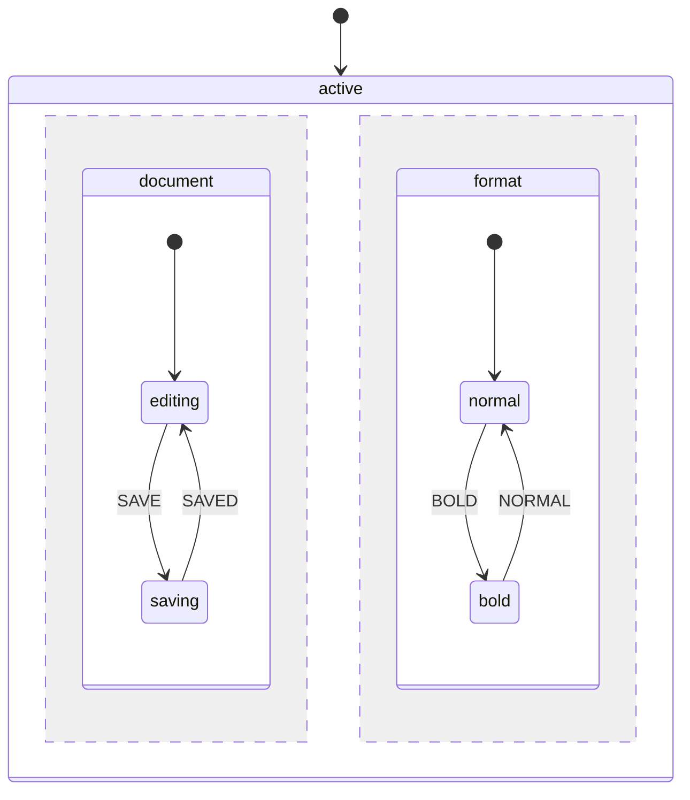

# Parallel States

Parallel states (also known as orthogonal states) allow multiple independent state regions to be active simultaneously. Each region processes events independently while sharing the same context.

**Related pages:**
- [Event Handling](./event-handling) - Events, entry/exit actions, `onDone`
- [Persistence](./persistence) - Database storage and restoration

## When to Use Parallel States

Parallel states are useful when:

- Multiple independent processes run concurrently (e.g., document editing + autosave status)
- You need to track multiple toggles or modes (e.g., bold, italic, underline formatting)
- A workflow has parallel tracks that must all complete (e.g., payment + shipping + documents)
- Different aspects of a system operate independently but belong to the same machine

## Basic Syntax

Define a parallel state by setting `type` to `'parallel'`:

```php
MachineDefinition::define([
    'id' => 'editor',
    'initial' => 'active',
    'states' => [
        'active' => [
            'type' => 'parallel',  // Mark as parallel
            'states' => [
                'document' => [
                    'initial' => 'editing',
                    'states' => [
                        'editing' => [
                            'on' => ['SAVE' => 'saving'],
                        ],
                        'saving' => [
                            'on' => ['SAVED' => 'editing'],
                        ],
                    ],
                ],
                'format' => [
                    'initial' => 'normal',
                    'states' => [
                        'normal' => [
                            'on' => ['BOLD' => 'bold'],
                        ],
                        'bold' => [
                            'on' => ['NORMAL' => 'normal'],
                        ],
                    ],
                ],
            ],
        ],
    ],
]);
```



## State Value Representation

In parallel states, `$state->value` is a flat array containing all active leaf state IDs:

```php
$state = $definition->getInitialState();

// State value contains both active regions
$state->value;
// [
//     'editor.active.document.editing',
//     'editor.active.format.normal',
// ]
```

### Checking Active States

Use the `matches()` method to check if a specific state is active:

```php
// Check individual states
$state->matches('active.document.editing');  // true
$state->matches('active.format.normal');     // true

// Check multiple states at once with matchesAll()
$state->matchesAll([
    'active.document.editing',
    'active.format.bold',
]);  // false - format is in 'normal', not 'bold'

// Check if currently in a parallel state with isInParallelState()
$state->isInParallelState();  // true
```

::: warning Full Path Required
The `matches()` method requires the full path to the leaf state. Partial paths (like `active.document` without the leaf state) will return false. Always specify the complete path to the active leaf state.
:::

## Practical Example: Word Processor

A word processor with independent formatting toggles:

```php
MachineDefinition::define([
    'id' => 'word',
    'initial' => 'editing',
    'states' => [
        'editing' => [
            'type' => 'parallel',
            'states' => [
                'bold' => [
                    'initial' => 'off',
                    'states' => [
                        'off' => ['on' => ['TOGGLE_BOLD' => 'on']],
                        'on' => ['on' => ['TOGGLE_BOLD' => 'off']],
                    ],
                ],
                'italic' => [
                    'initial' => 'off',
                    'states' => [
                        'off' => ['on' => ['TOGGLE_ITALIC' => 'on']],
                        'on' => ['on' => ['TOGGLE_ITALIC' => 'off']],
                    ],
                ],
                'underline' => [
                    'initial' => 'off',
                    'states' => [
                        'off' => ['on' => ['TOGGLE_UNDERLINE' => 'on']],
                        'on' => ['on' => ['TOGGLE_UNDERLINE' => 'off']],
                    ],
                ],
                'list' => [
                    'initial' => 'none',
                    'states' => [
                        'none' => [
                            'on' => [
                                'BULLETS' => 'bullets',
                                'NUMBERS' => 'numbers',
                            ],
                        ],
                        'bullets' => [
                            'on' => [
                                'NONE' => 'none',
                                'NUMBERS' => 'numbers',
                            ],
                        ],
                        'numbers' => [
                            'on' => [
                                'BULLETS' => 'bullets',
                                'NONE' => 'none',
                            ],
                        ],
                    ],
                ],
            ],
        ],
    ],
]);

$state = $definition->getInitialState();
// All formatting off, no list

$state = $definition->transition(['type' => 'TOGGLE_BOLD'], $state);
$state = $definition->transition(['type' => 'TOGGLE_ITALIC'], $state);
$state = $definition->transition(['type' => 'BULLETS'], $state);

$state->matches('editing.bold.on');      // true
$state->matches('editing.italic.on');    // true
$state->matches('editing.underline.off'); // true
$state->matches('editing.list.bullets'); // true
```

## Validation Rules

Parallel states have specific validation rules:

1. **Must have child states**: A parallel state requires at least one region
2. **Cannot have `initial` property**: Unlike compound states, parallel states cannot specify an initial state (all regions enter simultaneously)
3. **Regions must have `initial`**: Each region (child of parallel) must be a compound state with its own `initial` property

```php
// Invalid - parallel with no children
'invalid' => [
    'type' => 'parallel',
    'states' => [],  // Error: requires at least one region
],

// Invalid - parallel with initial
'invalid' => [
    'type' => 'parallel',
    'initial' => 'region1',  // Error: parallel cannot have initial
    'states' => [...],
],
```

## Best Practices

### 1. Use Meaningful Region Names

Name regions after what they represent, not their position:

```php
// Good
'states' => [
    'playback' => [...],
    'volume' => [...],
]

// Avoid
'states' => [
    'region1' => [...],
    'region2' => [...],
]
```

### 2. Keep Regions Independent

Design regions to be as independent as possible. If regions frequently need to know about each other's state, consider whether parallel states are the right choice.

### 3. Use Guards for Cross-Region Logic

When you need to check another region's state before transitioning:

```php
MachineDefinition::define(
    config: [
        'states' => [
            'parallel' => [
                'type' => 'parallel',
                'states' => [
                    'region1' => [
                        'initial' => 'waiting',
                        'states' => [
                            'waiting' => [
                                'on' => [
                                    'PROCEED' => [
                                        'target' => 'done',
                                        'guards' => 'isRegion2Ready',
                                    ],
                                ],
                            ],
                            'done' => [],
                        ],
                    ],
                    'region2' => [...],
                ],
            ],
        ],
    ],
    behavior: [
        'guards' => [
            'isRegion2Ready' => fn (ContextManager $ctx, EventBehavior $event, State $state)
                => $state->matches('parallel.region2.ready'),
        ],
    ]
);
```

### 4. Prefer `onDone` for Synchronization

Use `onDone` instead of complex guards when you need to wait for all regions to complete.

### 5. Document Region Dependencies

If regions have implicit dependencies (e.g., one region writes context that another reads), document this clearly in your machine definition.
