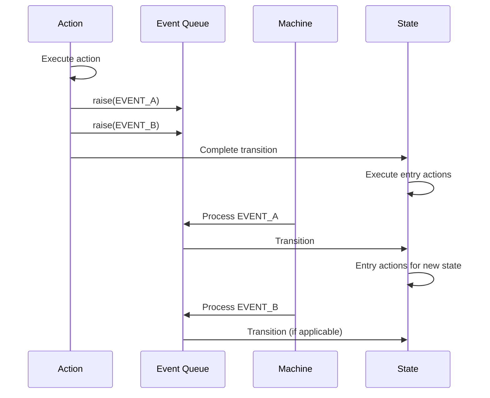

# Raised Events

Raised events allow actions to queue additional events for processing after the current transition completes. This enables complex workflows where one action triggers subsequent state changes.

## Basic Usage

Use `$this->raise()` in an action to queue an event:

<!-- doctest-attr: ignore -->
```php
use Tarfinlabs\EventMachine\Behavior\ActionBehavior;

class ProcessOrderAction extends ActionBehavior
{
    public function __invoke(ContextManager $context): void
    {
        $context->processed = true;

        // Queue an event
        $this->raise(['type' => 'ORDER_PROCESSED']);
    }
}
```

## Event Queue Processing



1. Action executes and calls `raise()`
2. Events are queued (not processed immediately)
3. Current transition completes
4. Entry actions execute
5. Queued events process one by one

## Raise with Payload

<!-- doctest-attr: ignore -->
```php
class CalculateAction extends ActionBehavior
{
    public function __invoke(ContextManager $context): void
    {
        $result = $this->calculate($context);

        $this->raise([
            'type' => 'CALCULATION_COMPLETE',
            'payload' => [
                'result' => $result,
                'timestamp' => now()->toIso8601String(),
            ],
        ]);
    }
}
```

## Multiple Raised Events

<!-- doctest-attr: ignore -->
```php
class ProcessAction extends ActionBehavior
{
    public function __invoke(ContextManager $context): void
    {
        // Process items
        foreach ($context->items as $item) {
            $this->raise([
                'type' => 'ITEM_PROCESSED',
                'payload' => ['itemId' => $item['id']],
            ]);
        }

        // Final event
        $this->raise(['type' => 'ALL_ITEMS_PROCESSED']);
    }
}
```

Events are processed in the order they were raised.

## Practical Examples

### Order Processing Chain

<!-- doctest-attr: ignore -->
```php
class StartProcessingAction extends ActionBehavior
{
    public function __invoke(ContextManager $context): void
    {
        $context->processingStarted = true;

        // Trigger validation
        $this->raise(['type' => 'VALIDATE']);
    }
}

class ValidateOrderAction extends ActionBehavior
{
    public function __invoke(ContextManager $context): void
    {
        if ($this->isValid($context)) {
            $context->isValid = true;
            $this->raise(['type' => 'VALIDATION_PASSED']);
        } else {
            $context->validationErrors = $this->getErrors($context);
            $this->raise(['type' => 'VALIDATION_FAILED']);
        }
    }
}
```

### Workflow with Notifications

<!-- doctest-attr: ignore -->
```php
class ApproveRequestAction extends ActionBehavior
{
    public function __invoke(ContextManager $context): void
    {
        $context->approvedAt = now();
        $context->approvedBy = auth()->id();

        // Trigger notification events
        $this->raise([
            'type' => 'NOTIFY_REQUESTER',
            'payload' => ['message' => 'Your request has been approved'],
        ]);

        $this->raise([
            'type' => 'NOTIFY_TEAM',
            'payload' => ['message' => 'Request #' . $context->requestId . ' approved'],
        ]);
    }
}
```

### Conditional Event Raising

<!-- doctest-attr: ignore -->
```php
class ProcessPaymentAction extends ActionBehavior
{
    public function __construct(
        private readonly PaymentGateway $gateway,
    ) {}

    public function __invoke(ContextManager $context): void
    {
        try {
            $result = $this->gateway->charge(
                $context->paymentMethod,
                $context->total,
            );

            $context->paymentId = $result->id;
            $this->raise(['type' => 'PAYMENT_SUCCESS']);

        } catch (PaymentDeclinedException $e) {
            $context->paymentError = $e->getMessage();
            $this->raise(['type' => 'PAYMENT_DECLINED']);

        } catch (PaymentException $e) {
            $context->paymentError = $e->getMessage();
            $this->raise(['type' => 'PAYMENT_ERROR']);
        }
    }
}
```

### State Machine with Raised Events

<!-- doctest-attr: ignore -->
```php
MachineDefinition::define(
    config: [
        'id' => 'order',
        'initial' => 'pending',
        'states' => [
            'pending' => [
                'on' => [
                    'SUBMIT' => [
                        'target' => 'validating',
                        'actions' => 'startValidation',
                    ],
                ],
            ],
            'validating' => [
                'entry' => 'validateOrder',
                'on' => [
                    'VALIDATION_PASSED' => 'processing',
                    'VALIDATION_FAILED' => 'rejected',
                ],
            ],
            'processing' => [
                'entry' => 'processPayment',
                'on' => [
                    'PAYMENT_SUCCESS' => 'confirmed',
                    'PAYMENT_DECLINED' => 'paymentFailed',
                    'PAYMENT_ERROR' => 'error',
                ],
            ],
            'confirmed' => [
                'entry' => 'sendConfirmation',
            ],
            'rejected' => [],
            'paymentFailed' => [
                'on' => ['RETRY' => 'processing'],
            ],
            'error' => [],
        ],
    ],
    behavior: [
        'actions' => [
            'validateOrder' => ValidateOrderAction::class,
            'processPayment' => ProcessPaymentAction::class,
            'sendConfirmation' => SendConfirmationAction::class,
        ],
    ],
);
```

### Chained Actions with Events

<!-- doctest-attr: ignore -->
```php
class XAction extends ActionBehavior
{
    public function __invoke(ContextManager $context): void
    {
        $context->value .= 'x';
        $this->raise(['type' => '@x']);
    }
}

class YAction extends ActionBehavior
{
    public function __invoke(ContextManager $context): void
    {
        $context->value .= 'y';
        $this->raise(['type' => '@y']);
    }
}

// Machine definition
'states' => [
    '#a' => [
        'entry' => '!x',  // XAction
        'on' => ['@x' => '#x'],
    ],
    '#x' => [
        'entry' => '!y',  // YAction
        'on' => ['@y' => '#y'],
    ],
    '#y' => [],
],

// Result after starting:
// 1. Enter #a, run XAction (value='x'), raise @x
// 2. Entry complete, process @x, transition to #x
// 3. Enter #x, run YAction (value='xy'), raise @y
// 4. Entry complete, process @y, transition to #y
// Final: state=#y, context.value='xy'
```

## Event History

Raised events appear in the event history:

<!-- doctest-attr: ignore -->
```php
$machine = OrderMachine::create();
$machine->send(['type' => 'SUBMIT']);

$history = $machine->state->history;

// History includes:
// - 'order.event.@validation.raised' (internal event)
// - '@validation' (the raised event)
// - ... subsequent events
```

## Entry Actions and Raised Events

Important: Entry actions complete before raised events are processed.

<!-- doctest-attr: ignore -->
```php
class EntryAction extends ActionBehavior
{
    public function __invoke(ContextManager $context): void
    {
        $context->executionOrder[] = 'entry';
    }
}

class TransitionAction extends ActionBehavior
{
    public function __invoke(ContextManager $context): void
    {
        $context->executionOrder[] = 'transition';
        $this->raise(['type' => 'NEXT']);
    }
}

// Order of execution:
// 1. transition action (calls raise())
// 2. target state entry action
// 3. NEXT event processed
```

## Testing Raised Events

<!-- doctest-attr: ignore -->
```php
it('processes raised events in order', function () {
    $machine = MachineDefinition::define(
        config: [
            'initial' => 'a',
            'context' => ['log' => []],
            'states' => [
                'a' => [
                    'entry' => 'logAndRaise',
                    'on' => ['NEXT' => 'b'],
                ],
                'b' => [
                    'entry' => 'logB',
                ],
            ],
        ],
        behavior: [
            'actions' => [
                'logAndRaise' => function ($context) {
                    $context->log[] = 'a';
                    // Can't use $this->raise() in inline function
                    // Use class-based action instead
                },
                'logB' => fn($ctx) => $ctx->log[] = 'b',
            ],
        ],
    );
});
```

## Best Practices

### 1. Use for Workflow Progression

<!-- doctest-attr: ignore -->
```php
// Good - clear workflow progression
$this->raise(['type' => 'VALIDATION_COMPLETE']);
$this->raise(['type' => 'READY_FOR_PAYMENT']);

// Avoid - generic events
$this->raise(['type' => 'NEXT']);
$this->raise(['type' => 'DONE']);
```

### 2. Include Relevant Payload

<!-- doctest-attr: ignore -->
```php
$this->raise([
    'type' => 'ITEM_PROCESSED',
    'payload' => [
        'itemId' => $item->id,
        'status' => 'success',
        'processedAt' => now()->toIso8601String(),
    ],
]);
```

### 3. Handle Failures Explicitly

<!-- doctest-attr: ignore -->
```php
try {
    $result = $this->process();
    $this->raise(['type' => 'SUCCESS', 'payload' => $result]);
} catch (Exception $e) {
    $this->raise([
        'type' => 'FAILURE',
        'payload' => ['error' => $e->getMessage()],
    ]);
}
```

### 4. Avoid Raising Too Many Events

<!-- doctest-attr: ignore -->
```php
// Avoid - too many events
foreach ($items as $item) {
    $this->raise(['type' => 'PROCESS_ITEM']);
}

// Better - batch processing
$this->processAllItems($context->items);
$this->raise(['type' => 'ALL_ITEMS_PROCESSED']);
```

### 5. Use Class-Based Actions

Raised events require `$this->raise()`, which is only available in class-based actions:

<!-- doctest-attr: ignore -->
```php
// Works - class-based action
class MyAction extends ActionBehavior
{
    public function __invoke($context): void
    {
        $this->raise(['type' => 'EVENT']);
    }
}

// Doesn't work - inline function
'actions' => [
    'myAction' => fn($ctx) => $this->raise(['type' => 'EVENT']), // Error! `raise()` not available
],
```
