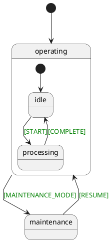

# UML Diagram Generation

EventMachine provides automatic UML diagram generation to visualize your state machines. This feature helps with documentation, debugging, and team communication by creating clear visual representations of your machine logic.

## Overview

The `machine:uml` command generates PlantUML diagrams from your machine definitions, showing states, transitions, events, and hierarchical relationships in a standardized UML format.

## Generating Diagrams

### Basic Usage

```bash
php artisan machine:uml "App\\Machines\\TrafficLightMachine"
```

This creates a `.puml` file in the same directory as your machine class that can be rendered into various image formats.

### Command Syntax

```bash
php artisan machine:uml {machine : The Machine path}
```

- **machine**: Fully qualified class name of your machine definition

## Generated Output

### File Location

The command generates a PlantUML file with the pattern:
```
{machine-directory}/{machine-id}-machine.puml
```

For example:
```
app/Machines/traffic-light-machine.puml
```

### UML Structure

The generated diagram includes:

- **Initial State**: Marked with `[*]` starting point
- **States**: All machine states with descriptions
- **Transitions**: Arrows showing state changes
- **Events**: Labeled transitions with event names
- **Hierarchical States**: Nested state representations
- **Entry Actions**: State entry behaviors

## Example Output

### Simple Machine

For a basic traffic light machine:

```puml
@startuml
skinparam linetype polyline

<style>
   stateDiagram {
             Linecolor cornflowerblue
             LineThickness 2
             FontStyle bold
             FontName Helvetica Neue

              arrow {
               LineColor cornflowerblue
               LineThickness 2
             }
           }
</style>

set namespaceSeparator none

[*] -down-> red
red -down-> green : <color:green>[TIMER]</color>
green -down-> yellow : <color:green>[TIMER]</color>
yellow -down-> red : <color:green>[TIMER]</color>

red : Red light - vehicles must stop
green : Green light - vehicles may proceed
yellow : Yellow light - prepare to stop

@enduml
```



### Hierarchical Machine

For machines with nested states:



## Rendering Diagrams

### Online Tools

1. **PlantUML Online Server**: Copy the `.puml` content to http://plantuml.com/plantuml
2. **VS Code Extension**: Use PlantUML extensions for inline preview
3. **IntelliJ/PhpStorm**: Built-in PlantUML support with live preview

### Local Tools

```bash
# Install PlantUML locally
npm install -g plantuml

# Generate PNG from PUML file
plantuml traffic-light-machine.puml

# Generate SVG
plantuml -tsvg traffic-light-machine.puml
```

### Integration with CI/CD

```yaml
# GitHub Actions example
- name: Generate UML Diagrams
  run: |
    php artisan machine:uml "App\\Machines\\TrafficLightMachine"
    php artisan machine:uml "App\\Machines\\OrderProcessingMachine"
    
- name: Convert to Images
  run: |
    plantuml -tpng *.puml
    
- name: Upload Diagrams
  uses: actions/upload-artifact@v2
  with:
    name: state-diagrams
    path: "*.png"
```

## Customization

### Styling

The command generates diagrams with predefined styling:

```puml
<style>
   stateDiagram {
             Linecolor cornflowerblue
             LineThickness 2
             FontStyle bold
             FontName Helvetica Neue

              arrow {
               LineColor cornflowerblue
               LineThickness 2
             }
           }
</style>
```

### Color Coding

- **States**: Automatically colored based on hierarchy level
- **Transitions**: Standard blue arrows
- **Events**: Green labels for clarity
- **Nested States**: Inherit parent colors for visual grouping

## Advanced Features

### Entry Actions

Entry actions are displayed as state annotations:

```puml
processing : ProcessOrderAction
processing : ValidatePaymentAction
processing : UpdateInventoryAction
```

### Complex Transitions

Multiple transition branches are handled automatically:

```puml
payment -down-> completed : <color:green>[SUCCESS]</color>
payment -down-> failed : <color:green>[FAILURE]</color>
payment -down-> pending : <color:green>[RETRY]</color>
```

### Hierarchical Nesting

Nested states maintain proper PlantUML structure:

```puml
state processing {
  [*] -down-> validation
  validation -down-> payment : <color:green>[VALIDATED]</color>
  payment -down-> fulfillment : <color:green>[PAID]</color>
}
```

## Integration Examples

### Documentation Workflow

```php
// Generate diagrams for all machines
foreach (glob('app/Machines/*.php') as $machineFile) {
    $className = 'App\\Machines\\' . basename($machineFile, '.php');
    Artisan::call('machine:uml', ['machine' => $className]);
}
```

### Development Process

1. **Design Phase**: Create initial machine definitions
2. **Visualization**: Generate UML diagrams for review
3. **Iteration**: Refine based on visual feedback
4. **Documentation**: Include diagrams in project docs

### Team Communication

```markdown
<!-- In your README.md -->
## Order Processing Flow


The order processing machine handles the complete lifecycle...
```

## Troubleshooting

### Common Issues

**Machine not found**:
```bash
# Ensure correct namespace and class name
php artisan machine:uml "App\\Machines\\TrafficLightMachine"
```

**Invalid machine definition**:
```bash
# Validate machine configuration first
php artisan machine:validate-config
```

**File permission errors**:
```bash
# Ensure write permissions to machine directory
chmod 755 app/Machines/
```

### Debugging Tips

1. **Check Machine Creation**: Ensure your machine's `create()` method works
2. **Verify State Definitions**: All referenced states must be defined
3. **Validate Transitions**: Ensure all transition targets exist

## Best Practices

### Naming Conventions

```php
// Use descriptive state names
'states' => [
    'waiting_for_payment' => [...],      // Good
    'state1' => [...],                   // Avoid
]

// Clear event names
'PAYMENT_RECEIVED' => [...],             // Good
'EVENT_A' => [...],                      // Avoid
```

### Documentation Integration

```php
// Add descriptions to states for better diagrams
StateDefinition::define([
    'id' => 'processing',
    'description' => 'Processing customer order with validation',
    // ...
]);
```

### Automated Generation

```php
// Create artisan command for batch generation
class GenerateAllUmlCommand extends Command
{
    protected $signature = 'machine:uml-all';
    
    public function handle()
    {
        $machines = [
            TrafficLightMachine::class,
            OrderProcessingMachine::class,
            DocumentWorkflowMachine::class,
        ];
        
        foreach ($machines as $machine) {
            $this->call('machine:uml', ['machine' => $machine]);
            $this->info("Generated UML for {$machine}");
        }
    }
}
```

The UML generation feature provides powerful visualization capabilities that enhance understanding and communication of your state machine designs.