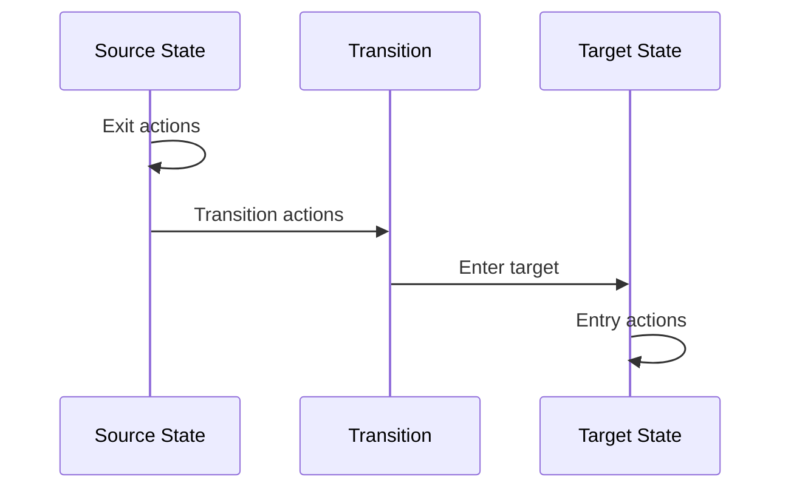

# Actions

Actions execute side effects during state transitions. They can modify context, call external services, raise events, and perform any operation needed during state changes.

## When Actions Run

Actions execute at different points in the state lifecycle:



1. **Exit actions**: When leaving a state
2. **Transition actions**: During the transition
3. **Entry actions**: When entering a state

## Defining Actions

### Inline Functions

```php
MachineDefinition::define(
    config: [
        'states' => [
            'idle' => [
                'on' => [
                    'INCREMENT' => [
                        'actions' => 'incrementCount',
                    ],
                ],
            ],
        ],
    ],
    behavior: [
        'actions' => [
            'incrementCount' => fn(ContextManager $context) => $context->count++,
        ],
    ],
);
```

### Class-Based Actions

```php
use Tarfinlabs\EventMachine\Behavior\ActionBehavior;

class IncrementAction extends ActionBehavior
{
    public function __invoke(ContextManager $context): void
    {
        $context->count++;
    }
}

// Registration
'actions' => [
    'incrementCount' => IncrementAction::class,
],
```

### Direct Class Reference

```php
'on' => [
    'INCREMENT' => [
        'actions' => IncrementAction::class,
    ],
],
```

## Multiple Actions

### Array of Actions

```php
'on' => [
    'SUBMIT' => [
        'target' => 'submitted',
        'actions' => ['validateInput', 'saveData', 'sendNotification'],
    ],
],
```

### Entry/Exit Actions

```php
'states' => [
    'loading' => [
        'entry' => ['startSpinner', 'logEntry'],
        'exit' => ['stopSpinner', 'logExit'],
        'on' => [
            'LOADED' => 'success',
        ],
    ],
],
```

## Action Parameters

Actions receive injected parameters:

```php
class ProcessAction extends ActionBehavior
{
    public function __invoke(
        ContextManager $context,
        EventBehavior $event,
        State $state,
    ): void {
        // Access context
        $orderId = $context->orderId;

        // Access event payload
        $amount = $event->payload['amount'];

        // Access current state
        $currentState = $state->currentStateDefinition->id;
    }
}
```

::: tip Available Parameters
See [Parameter Injection](/behaviors/introduction#parameter-injection) for the full list of injectable parameters (`ContextManager`, `EventBehavior`, `State`, `EventCollection`, `array`).
:::

## Action Arguments

Pass arguments using colon syntax:

```php
// Configuration
'actions' => 'addValue:100',

// Multiple arguments
'actions' => 'multiply:2,10',

// In action
class AddValueAction extends ActionBehavior
{
    public function __invoke(
        ContextManager $context,
        array $arguments,
    ): void {
        $value = $arguments[0] ?? 0;
        $context->total += $value;
    }
}
```

## Dependency Injection

Class actions support constructor injection:

```php
class ProcessOrderAction extends ActionBehavior
{
    public function __construct(
        private readonly OrderService $orderService,
        private readonly PaymentGateway $paymentGateway,
        private readonly NotificationService $notifications,
    ) {}

    public function __invoke(ContextManager $context): void
    {
        $order = $this->orderService->create($context->items);
        $this->paymentGateway->charge($order->total);
        $this->notifications->orderConfirmed($order);

        $context->orderId = $order->id;
    }
}
```

## Raising Events

Actions can queue events for processing:

```php
class ProcessAction extends ActionBehavior
{
    public function __invoke(ContextManager $context): void
    {
        $context->processed = true;

        // Queue event for after current transition completes
        $this->raise(['type' => 'PROCESSING_COMPLETE']);

        // With payload
        $this->raise([
            'type' => 'NOTIFICATION',
            'payload' => ['message' => 'Order processed'],
        ]);
    }
}
```

Raised events are processed after the current transition and all entry actions complete.

## Required Context

Declare required context keys:

```php
class ChargePaymentAction extends ActionBehavior
{
    public static array $requiredContext = [
        'userId' => 'string',
        'amount' => 'numeric',
        'paymentMethod' => 'string',
    ];

    public function __invoke(ContextManager $context): void
    {
        // Context is guaranteed to have these keys
        $this->paymentGateway->charge(
            $context->userId,
            $context->amount,
            $context->paymentMethod,
        );
    }
}
```

## Logging

Enable execution logging:

```php
class ImportantAction extends ActionBehavior
{
    public bool $shouldLog = true;

    public function __invoke(ContextManager $context): void
    {
        // Execution will be logged
    }
}
```

## Practical Examples

### Updating Context

```php
class AddItemAction extends ActionBehavior
{
    public function __invoke(
        ContextManager $context,
        EventBehavior $event,
    ): void {
        $item = $event->payload['item'];

        $context->items[] = $item;
        $context->itemCount = count($context->items);
        $context->total += $item['price'];
    }
}
```

### External Service Call

```php
class SendEmailAction extends ActionBehavior
{
    public function __construct(
        private readonly Mailer $mailer,
    ) {}

    public function __invoke(ContextManager $context): void
    {
        $this->mailer->send(
            to: $context->userEmail,
            template: 'order-confirmation',
            data: [
                'orderId' => $context->orderId,
                'items' => $context->items,
                'total' => $context->total,
            ],
        );
    }
}
```

### Database Operation

```php
class CreateOrderAction extends ActionBehavior
{
    public function __invoke(ContextManager $context): void
    {
        $order = Order::create([
            'user_id' => $context->userId,
            'items' => $context->items,
            'total' => $context->total,
            'status' => 'pending',
        ]);

        $context->orderId = $order->id;
    }
}
```

### Conditional Logic

```php
class ProcessPaymentAction extends ActionBehavior
{
    public function __construct(
        private readonly PaymentGateway $gateway,
    ) {}

    public function __invoke(ContextManager $context): void
    {
        $result = $this->gateway->charge(
            $context->paymentMethod,
            $context->total,
        );

        if ($result->successful) {
            $context->paymentId = $result->id;
            $this->raise(['type' => 'PAYMENT_SUCCESS']);
        } else {
            $context->paymentError = $result->message;
            $this->raise(['type' => 'PAYMENT_FAILED']);
        }
    }
}
```

### Chained Actions

```php
'on' => [
    'CHECKOUT' => [
        'target' => 'processing',
        'actions' => [
            ValidateCartAction::class,
            CalculateTotalsAction::class,
            ReserveInventoryAction::class,
            CreateOrderAction::class,
            SendConfirmationAction::class,
        ],
    ],
],
```

## Testing Actions

```php
use Tests\Stubs\Actions\IncrementAction;

it('increments the count', function () {
    IncrementAction::fake();

    IncrementAction::shouldRun()
        ->once()
        ->andReturnUsing(function (ContextManager $context) {
            $context->count++;
        });

    $machine = CounterMachine::create();
    $machine->send(['type' => 'INCREMENT']);

    IncrementAction::assertRan();
    expect($machine->state->context->count)->toBe(1);
});
```

## Best Practices

### 1. Keep Actions Focused

One action, one responsibility:

```php
// Good
class IncrementCountAction extends ActionBehavior { ... }
class SendNotificationAction extends ActionBehavior { ... }

// Avoid
class DoEverythingAction extends ActionBehavior { ... }
```

### 2. Use Dependency Injection

```php
class ProcessOrderAction extends ActionBehavior
{
    public function __construct(
        private readonly OrderService $orders,
    ) {}
}
```

### 3. Handle Errors Gracefully

```php
class ExternalApiAction extends ActionBehavior
{
    public function __invoke(ContextManager $context): void
    {
        try {
            $result = $this->api->call($context->data);
            $context->apiResult = $result;
        } catch (ApiException $e) {
            $context->apiError = $e->getMessage();
            $this->raise(['type' => 'API_ERROR']);
        }
    }
}
```

### 4. Use Raised Events for Flow Control

```php
class ValidateAction extends ActionBehavior
{
    public function __invoke(ContextManager $context): void
    {
        if ($this->isValid($context)) {
            $this->raise(['type' => 'VALIDATION_PASSED']);
        } else {
            $this->raise(['type' => 'VALIDATION_FAILED']);
        }
    }
}
```
