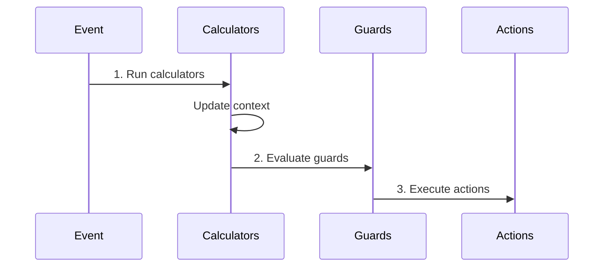

# Calculators

Calculators compute derived values before guards and actions run. They're useful for preparing data that guards need to evaluate or that actions need to use.

## Execution Order



Calculators run first, so guards and actions can use the calculated values.

## Basic Usage

### Inline Calculator

```php
MachineDefinition::define(
    config: [
        'states' => [
            'cart' => [
                'on' => [
                    'CHECKOUT' => [
                        'target' => 'checkout',
                        'calculators' => 'calculateTotal',
                        'guards' => 'hasMinimumTotal',
                    ],
                ],
            ],
        ],
    ],
    behavior: [
        'calculators' => [
            'calculateTotal' => function (ContextManager $context) {
                $context->total = collect($context->items)->sum('price');
            },
        ],
        'guards' => [
            'hasMinimumTotal' => fn($ctx) => $ctx->total >= 10,
        ],
    ],
);
```

### Class-Based Calculator

```php
use Tarfinlabs\EventMachine\Behavior\CalculatorBehavior;

class CalculateTotalCalculator extends CalculatorBehavior
{
    public function __invoke(ContextManager $context): void
    {
        $subtotal = collect($context->items)->sum('price');
        $tax = $subtotal * 0.1;
        $shipping = $this->calculateShipping($context);

        $context->subtotal = $subtotal;
        $context->tax = $tax;
        $context->shipping = $shipping;
        $context->total = $subtotal + $tax + $shipping;
    }

    private function calculateShipping(ContextManager $context): float
    {
        $itemCount = count($context->items);
        return $itemCount > 5 ? 0 : 5.99;
    }
}
```

## Multiple Calculators

Chain calculators for complex computations:

```php
'on' => [
    'CHECKOUT' => [
        'target' => 'processing',
        'calculators' => [
            'calculateSubtotal',
            'applyDiscounts',
            'calculateTax',
            'calculateShipping',
            'calculateFinalTotal',
        ],
        'guards' => 'hasValidTotal',
    ],
],
```

## Calculator Parameters

```php
class DiscountCalculator extends CalculatorBehavior
{
    public function __invoke(
        ContextManager $context,
        EventBehavior $event,
    ): void {
        $discountCode = $event->payload['discountCode'] ?? null;

        if ($discountCode) {
            $discount = $this->lookupDiscount($discountCode);
            $context->discount = $discount;
            $context->total -= $discount;
        }
    }
}
```

## Dependency Injection

```php
class CalculateTaxCalculator extends CalculatorBehavior
{
    public function __construct(
        private readonly TaxService $taxService,
    ) {}

    public function __invoke(ContextManager $context): void
    {
        $taxRate = $this->taxService->getRateForAddress(
            $context->shippingAddress
        );

        $context->taxRate = $taxRate;
        $context->tax = $context->subtotal * $taxRate;
    }
}
```

## Practical Examples

### Order Total Calculation

```php
class CalculateOrderTotalCalculator extends CalculatorBehavior
{
    public function __invoke(ContextManager $context): void
    {
        $items = collect($context->items);

        // Calculate subtotal
        $subtotal = $items->sum(fn($item) =>
            $item['price'] * $item['quantity']
        );

        // Apply discount
        $discount = $this->calculateDiscount($context, $subtotal);

        // Calculate tax (after discount)
        $taxable = $subtotal - $discount;
        $tax = $taxable * 0.1;

        // Calculate shipping
        $shipping = $this->calculateShipping($items);

        // Set all values
        $context->subtotal = $subtotal;
        $context->discount = $discount;
        $context->tax = $tax;
        $context->shipping = $shipping;
        $context->total = $taxable + $tax + $shipping;
    }

    private function calculateDiscount($context, $subtotal): float
    {
        if ($context->discountCode === 'SAVE20') {
            return $subtotal * 0.2;
        }
        return 0;
    }

    private function calculateShipping($items): float
    {
        $weight = $items->sum('weight');
        return $weight > 10 ? 15.99 : 5.99;
    }
}
```

### User Eligibility Calculation

```php
class CalculateEligibilityCalculator extends CalculatorBehavior
{
    public function __construct(
        private readonly UserService $users,
        private readonly CreditService $credit,
    ) {}

    public function __invoke(ContextManager $context): void
    {
        $user = $this->users->find($context->userId);

        // Calculate credit score
        $creditScore = $this->credit->getScore($user);

        // Calculate debt ratio
        $debtRatio = $user->total_debt / $user->annual_income;

        // Calculate eligibility
        $context->creditScore = $creditScore;
        $context->debtRatio = $debtRatio;
        $context->isEligible = $creditScore >= 650 && $debtRatio < 0.4;
        $context->maxLoanAmount = $this->calculateMaxLoan($creditScore, $user);
    }
}
```

### Pricing Calculation

```php
class CalculatePricingCalculator extends CalculatorBehavior
{
    public function __invoke(
        ContextManager $context,
        EventBehavior $event,
    ): void {
        $plan = $event->payload['plan'];
        $period = $event->payload['period'] ?? 'monthly';

        $pricing = $this->getPricing($plan, $period);

        $context->plan = $plan;
        $context->period = $period;
        $context->basePrice = $pricing['base'];
        $context->discount = $pricing['discount'];
        $context->finalPrice = $pricing['final'];
    }

    private function getPricing(string $plan, string $period): array
    {
        $prices = [
            'basic' => ['monthly' => 9.99, 'yearly' => 99.99],
            'pro' => ['monthly' => 19.99, 'yearly' => 199.99],
            'enterprise' => ['monthly' => 49.99, 'yearly' => 499.99],
        ];

        $base = $prices[$plan][$period] ?? 0;
        $discount = $period === 'yearly' ? $base * 0.17 : 0;

        return [
            'base' => $base,
            'discount' => $discount,
            'final' => $base - $discount,
        ];
    }
}
```

### Date/Time Calculations

```php
class CalculateDeliveryDateCalculator extends CalculatorBehavior
{
    public function __invoke(ContextManager $context): void
    {
        $shippingMethod = $context->shippingMethod ?? 'standard';

        $deliveryDays = match ($shippingMethod) {
            'express' => 2,
            'priority' => 5,
            'standard' => 7,
            default => 10,
        };

        $orderDate = now();
        $deliveryDate = $orderDate->addBusinessDays($deliveryDays);

        $context->orderDate = $orderDate->toDateString();
        $context->estimatedDelivery = $deliveryDate->toDateString();
        $context->deliveryDays = $deliveryDays;
    }
}
```

## Calculator vs Action

| Aspect | Calculator | Action |
|--------|------------|--------|
| Runs | Before guards | After guards pass |
| Purpose | Prepare data | Execute side effects |
| Typical use | Compute values | Call services, send emails |
| Can block transition | No (use guards) | No |

### When to Use Calculators

- Computing totals, averages, or aggregates
- Looking up data needed by guards
- Preparing context for guards/actions
- Formatting or transforming data

### When to Use Actions

- Saving to database
- Sending notifications
- Calling external APIs
- Any side effects

## Testing Calculators

```php
it('calculates order total correctly', function () {
    $machine = MachineDefinition::define(
        config: [
            'initial' => 'cart',
            'context' => [
                'items' => [
                    ['price' => 10, 'quantity' => 2],
                    ['price' => 25, 'quantity' => 1],
                ],
            ],
            'states' => [
                'cart' => [
                    'on' => [
                        'CALCULATE' => [
                            'calculators' => 'calculateTotal',
                        ],
                    ],
                ],
            ],
        ],
        behavior: [
            'calculators' => [
                'calculateTotal' => function ($ctx) {
                    $ctx->total = collect($ctx->items)
                        ->sum(fn($i) => $i['price'] * $i['quantity']);
                },
            ],
        ],
    );

    $state = $machine->transition(['type' => 'CALCULATE']);

    expect($state->context->total)->toBe(45);
});
```

## Best Practices

### 1. Keep Calculators Pure

Calculate values, don't trigger side effects:

```php
// Good - only calculates
$context->total = collect($context->items)->sum('price');

// Avoid - side effect
$this->analytics->track('total_calculated', $context->total);
```

### 2. Order Calculators Logically

```php
'calculators' => [
    'calculateSubtotal',    // First: base calculation
    'applyDiscounts',       // Second: depends on subtotal
    'calculateTax',         // Third: depends on discounted amount
    'calculateTotal',       // Last: combines all values
],
```

### 3. Use Descriptive Names

```php
// Good
'calculators' => [
    'calculateOrderSubtotal',
    'calculateShippingCost',
    'applyMembershipDiscount',
],

// Avoid
'calculators' => ['calc1', 'calc2', 'doStuff'],
```

### 4. Handle Edge Cases

```php
public function __invoke(ContextManager $context): void
{
    $items = $context->items ?? [];

    if (empty($items)) {
        $context->total = 0;
        return;
    }

    $context->total = collect($items)->sum('price');
}
```

## Next Steps

- [Guards](/behaviors/guards) - Use calculated values in conditions
- [Actions](/behaviors/actions) - Execute side effects after calculations
- [Results](/behaviors/results) - Compute final output in final states
