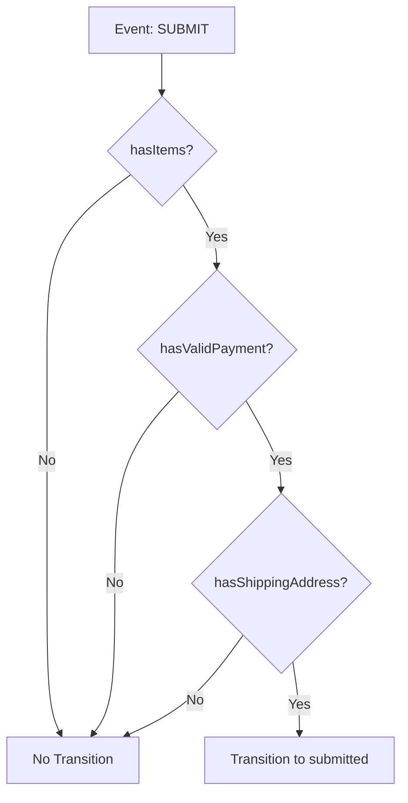
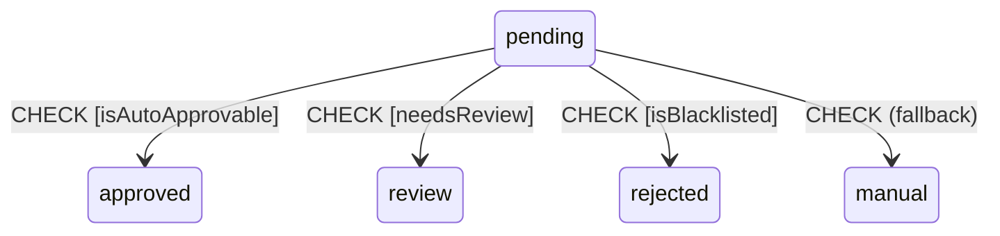
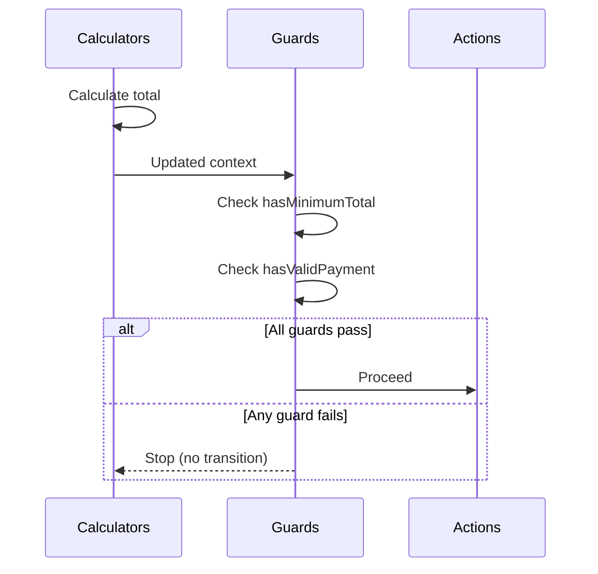

# Guards

Guards are conditions that control whether a transition can occur. They evaluate to `true` (allow) or `false` (deny) based on the current context and event.

## Basic Guards

### Inline Guard

```php
MachineDefinition::define(
    config: [
        'states' => [
            'idle' => [
                'on' => [
                    'SUBMIT' => [
                        'target' => 'submitted',
                        'guards' => 'hasItems',
                    ],
                ],
            ],
        ],
    ],
    behavior: [
        'guards' => [
            'hasItems' => fn(ContextManager $context) => count($context->items) > 0,
        ],
    ],
);
```

### Class-Based Guard

```php
use Tarfinlabs\EventMachine\Behavior\GuardBehavior;

class HasItemsGuard extends GuardBehavior
{
    public function __invoke(ContextManager $context): bool
    {
        return count($context->items) > 0;
    }
}

// Registration
'guards' => [
    'hasItems' => HasItemsGuard::class,
],
```

## Multiple Guards (AND Logic)

All guards must pass for the transition to occur. Guards evaluate in order and **short-circuit** on the first failure:

```php
'on' => [
    'SUBMIT' => [
        'target' => 'submitted',
        'guards' => ['hasItems', 'hasValidPayment', 'hasShippingAddress'],
    ],
],
```

If `hasItems` returns `false`, `hasValidPayment` and `hasShippingAddress` never execute.

::: tip Performance
Place fastest or most likely to fail guards first to minimize unnecessary evaluations.
:::



## Multi-Path Transitions (OR Logic)

Use multiple transition branches:

```php
'on' => [
    'CHECK' => [
        ['target' => 'approved', 'guards' => 'isAutoApprovable'],
        ['target' => 'review', 'guards' => 'needsReview'],
        ['target' => 'rejected', 'guards' => 'isBlacklisted'],
        ['target' => 'manual'],  // Fallback
    ],
],
```

The first matching branch is taken:



## Guard Parameters

Guards receive injected parameters:

```php
class AmountGuard extends GuardBehavior
{
    public function __invoke(
        ContextManager $context,
        EventBehavior $event,
        State $state,
    ): bool {
        // Check context
        $hasBalance = $context->balance >= $event->payload['amount'];

        // Check event
        $isValidAmount = $event->payload['amount'] > 0;

        return $hasBalance && $isValidAmount;
    }
}
```

::: tip Available Parameters
See [Parameter Injection](/behaviors/introduction#parameter-injection) for the full list of injectable parameters (`ContextManager`, `EventBehavior`, `State`, `EventCollection`, `array`).
:::

## Guard Arguments

Pass arguments to guards:

```php
// Configuration
'guards' => 'minimumAmount:100',

// Guard implementation
class MinimumAmountGuard extends GuardBehavior
{
    public function __invoke(
        ContextManager $context,
        array $arguments,
    ): bool {
        $minimum = $arguments[0] ?? 0;
        return $context->amount >= $minimum;
    }
}
```

## Dependency Injection

```php
class HasPermissionGuard extends GuardBehavior
{
    public function __construct(
        private readonly AuthorizationService $auth,
    ) {}

    public function __invoke(ContextManager $context): bool
    {
        return $this->auth->can($context->userId, 'submit_order');
    }
}
```

## Required Context

Declare required context:

```php
class HasBalanceGuard extends GuardBehavior
{
    public static array $requiredContext = [
        'userId' => 'string',
        'balance' => 'numeric',
    ];

    public function __invoke(ContextManager $context): bool
    {
        return $context->balance > 0;
    }
}
```

## Practical Examples

### Simple Condition

```php
class IsEvenGuard extends GuardBehavior
{
    public function __invoke(ContextManager $context): bool
    {
        return $context->count % 2 === 0;
    }
}
```

### Complex Validation

```php
class CanCheckoutGuard extends GuardBehavior
{
    public function __invoke(ContextManager $context): bool
    {
        // Must have items
        if (empty($context->items)) {
            return false;
        }

        // Must have valid payment
        if (!$context->has('paymentMethod')) {
            return false;
        }

        // Must have shipping address
        if (!$context->has('shippingAddress')) {
            return false;
        }

        // Total must be positive
        if ($context->total <= 0) {
            return false;
        }

        return true;
    }
}
```

### External Service Check

```php
class InventoryAvailableGuard extends GuardBehavior
{
    public function __construct(
        private readonly InventoryService $inventory,
    ) {}

    public function __invoke(ContextManager $context): bool
    {
        foreach ($context->items as $item) {
            if (!$this->inventory->isAvailable($item['id'], $item['quantity'])) {
                return false;
            }
        }
        return true;
    }
}
```

### User Permission Check

```php
class HasRoleGuard extends GuardBehavior
{
    public function __invoke(
        ContextManager $context,
        array $arguments,
    ): bool {
        $requiredRole = $arguments[0] ?? 'user';
        return $context->user->hasRole($requiredRole);
    }
}

// Usage
'guards' => 'hasRole:admin',
```

### Time-Based Guard

```php
class WithinBusinessHoursGuard extends GuardBehavior
{
    public function __invoke(): bool
    {
        $hour = now()->hour;
        return $hour >= 9 && $hour < 17;
    }
}
```

### Event Payload Validation

```php
class ValidPayloadGuard extends GuardBehavior
{
    public function __invoke(EventBehavior $event): bool
    {
        $payload = $event->payload;

        return isset($payload['amount'])
            && $payload['amount'] > 0
            && $payload['amount'] <= 10000;
    }
}
```

## Guard Execution Order

1. **Calculators** run first (modify context)
2. **Guards** evaluate using updated context
3. If all guards pass, **Actions** execute



## Logging Guards

Enable logging for debugging:

```php
class DebugGuard extends GuardBehavior
{
    public bool $shouldLog = true;

    public function __invoke(ContextManager $context): bool
    {
        // Guard evaluation will be logged
        return $context->isValid;
    }
}
```

## Testing Guards

```php
it('blocks transition when guard fails', function () {
    $machine = MachineDefinition::define(
        config: [
            'initial' => 'idle',
            'context' => ['count' => 5],
            'states' => [
                'idle' => [
                    'on' => [
                        'CHECK' => [
                            'target' => 'passed',
                            'guards' => 'isAboveTen',
                        ],
                    ],
                ],
                'passed' => [],
            ],
        ],
        behavior: [
            'guards' => [
                'isAboveTen' => fn($ctx) => $ctx->count > 10,
            ],
        ],
    );

    // Guard fails - no transition
    $state = $machine->transition(['type' => 'CHECK']);
    expect($state->matches('idle'))->toBeTrue();

    // Update context and try again
    $state->context->count = 15;
    $newState = $machine->transition(['type' => 'CHECK'], $state);
    expect($newState->matches('passed'))->toBeTrue();
});
```

## Best Practices

### 1. Keep Guards Pure

Guards should only read, never modify:

```php
// Good - only reads context
'guards' => [
    'hasItems' => fn($ctx) => count($ctx->items) > 0,
],

// Bad - modifies context
'guards' => [
    'hasItems' => fn($ctx) => ($ctx->itemCount = count($ctx->items)) > 0,
],
```

### 2. Use Descriptive Names

```php
// Good
'guards' => ['hasMinimumBalance', 'isWithinLimit', 'hasValidPayment'],

// Avoid
'guards' => ['check1', 'validate', 'ok'],
```

### 3. Combine Simple Guards

```php
// Multiple simple guards
'guards' => ['isPositive', 'isWithinLimit'],

// Instead of one complex guard
'guards' => 'isValidAmount',
```

### 4. Use Validation Guards for User Input

For guards that should return error messages, use [Validation Guards](/behaviors/validation-guards):

```php
class ValidateAmountGuard extends ValidationGuardBehavior
{
    public ?string $errorMessage = null;

    public function __invoke(ContextManager $context): bool
    {
        if ($context->amount <= 0) {
            $this->errorMessage = 'Amount must be positive';
            return false;
        }
        return true;
    }
}
```
