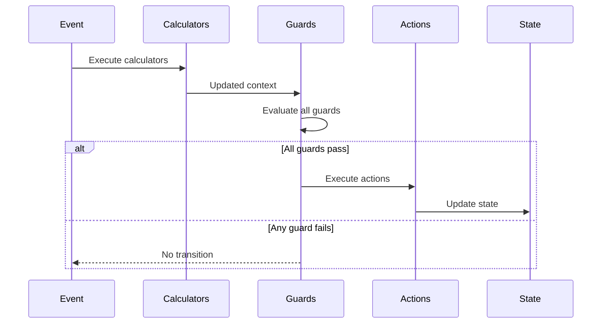

# Introduction to Behaviors

Behaviors are the building blocks for logic in EventMachine. They define how your machine responds to events, validates transitions, computes values, and produces outputs.

This section covers all behavior types in depth. If you're just getting started, read through [Actions](/behaviors/actions) and [Guards](/behaviors/guards) first - they're the most commonly used.

## Behavior Types

| Type | Purpose | Returns |
|------|---------|---------|
| [Actions](/behaviors/actions) | Execute side effects | `void` |
| [Guards](/behaviors/guards) | Control transition execution | `bool` |
| [Validation Guards](/behaviors/validation-guards) | Validate with error messages | `bool` |
| [Calculators](/behaviors/calculators) | Compute values before guards | `void` |
| [Event Behaviors](/behaviors/events) | Define event structure | Event data |
| [Outputs](/behaviors/outputs) | Compute final state output | `mixed` |
| [MachineInput](/advanced/typed-contracts) | Typed input DTO for child machine delegation | Input data |
| [MachineOutput](/advanced/typed-contracts) | Typed output DTO for final states and delegation | Output data |
| [MachineFailure](/advanced/typed-contracts) | Typed failure DTO for `@fail` error data | Failure data |

## Behavior Registration

Register behaviors in the `behavior` parameter:

```php ignore
MachineDefinition::define(
    config: [...],
    behavior: [
        'actions' => [
            'incrementCountAction' => IncrementAction::class,
            'logEventAction' => fn($ctx) => logger()->info('Action executed'),
        ],
        'guards' => [
            'isValidGuard' => IsValidGuard::class,
            'canProceedGuard' => fn($ctx) => $ctx->count > 0,
        ],
        'calculators' => [
            'calculateTotalCalculator' => CalculateTotalCalculator::class,
        ],
        'events' => [
            'SUBMIT' => SubmitEvent::class,
        ],
        'outputs' => [
            'getFinalOutput' => FinalOutputBehavior::class,
        ],
    ],
);
```

## InvokableBehavior Base Class

All behavior classes extend `InvokableBehavior`:

```php ignore
use Tarfinlabs\EventMachine\Behavior\InvokableBehavior;

abstract class InvokableBehavior
{
    // Required context declaration
    public static array $requiredContext = [];

    // Whether to log execution
    public bool $shouldLog = false;

    // Queue for raised events (protected)
    protected ?Collection $eventQueue;

    // Raise an event from within the behavior
    public function raise(EventBehavior|array $eventBehavior): void;

    // Get behavior type name
    public static function getType(): string;
}
```

## Inline vs Class Behaviors

### Inline Functions

Quick and simple:

```php ignore
'actions' => [
    'incrementAction' => fn(ContextManager $context) => $context->count++,
],

'guards' => [
    'isPositiveGuard' => fn(ContextManager $context) => $context->count > 0,
],
```

### Class Behaviors

For complex logic or dependency injection:

```php no_run
class ProcessOrderAction extends ActionBehavior
{
    public function __construct(
        private readonly OrderService $orderService,
        private readonly NotificationService $notificationService,
    ) {}

    public function __invoke(ContextManager $context): void
    {
        $order = $this->orderService->process($context->orderId);
        $this->notificationService->notify($order);
    }
}
```

## Parameter Injection

Behaviors receive parameters through dependency injection:

```php ignore
public function __invoke(
    ContextManager $context,      // Current context
    EventBehavior $event,         // Current event
    State $state,                 // Current state
    EventCollection $history,     // Event history
): void {
    // Use injected parameters
}
```

### Available Parameters

| Type | Description |
|------|-------------|
| `ContextManager` | Current machine context |
| `EventBehavior` | Event that triggered the transition |
| `State` | Current machine state |
| `EventCollection` | Event history |
| Named params | Config-defined parameters matched by name (see [Named Parameters](#named-parameters)) |

## Named Parameters

Pass typed, named parameters to behaviors using array-tuple syntax:

```php ignore
// Config — parameterized behavior is always an inner array (tuple)
'actions' => [[AddValueAction::class, 'amount' => 10, 'multiplier' => 20]],

// Behavior — receives typed named parameters
public function __invoke(ContextManager $context, int $amount, int $multiplier): void
{
    $context->total += $amount * $multiplier;
}
```

A parameterized behavior is a **tuple**: `[ClassOrKey, 'param' => value, ...]`. The tuple is always an element inside the behavior list — even when it's the only behavior.

### Parameter Resolution Order

When `__invoke` is called, parameters are resolved in this order:

1. **Framework types** — `ContextManager`, `EventBehavior`, `State`, `EventCollection`, `MachineOutput`, `MachineFailure` are matched by type-hint and injected from the framework
2. **Named params** — remaining parameters are matched by name against config-defined params
3. **Default values** — if a named param has no config match but has a PHP default, the default is used

### Error Handling

- **Missing required parameter:** If a named param has no config match and no default value, `MissingBehaviorParameterException` is thrown
- **Type coercion:** Values are passed as-is from config — PHP handles type coercion naturally (int, string, array, etc.)
- **Extra params ignored:** Config params that don't match any `__invoke` parameter are silently ignored

### `@` Prefix Convention

Keys prefixed with `@` are **framework-reserved** metadata — they are stripped before injection and never reach `__invoke`. PHP parameter names cannot start with `@`, so collision is impossible.

**`@queue` is the only `@`-key today, and it is only valid inside `listen.entry`, `listen.exit`, and `listen.transition`.** Using `@queue` (or any `@`-prefixed key) anywhere else — state `entry`/`exit` actions, transition `actions`, `guards`, `calculators`, or output tuples — throws `InvalidBehaviorDefinitionException` at definition time. This avoids the silent footgun where the key would otherwise be filtered out and the action would just run synchronously.

```php ignore
// ✓ Valid — @queue inside listen config
'listen' => [
    'entry' => [
        [AuditAction::class, 'verbose' => true, '@queue' => true],
    ],
],

// ✗ Invalid — throws InvalidBehaviorDefinitionException since 9.11.0
'states' => [
    'idle' => [
        'entry' => [[AuditAction::class, '@queue' => true]],
    ],
],
```

For async work in state `entry` actions, see [Async Work in Entry Actions](../building/defining-states.md#async-work-in-entry-actions).

### Inline Key with Named Params

Inline closures registered in the behavior map can receive named params via their inline key:

```php ignore
// Config
'guards' => [['myGuard', 'min' => 100]],

// Behavior registry
'guards' => [
    'myGuard' => fn(ContextManager $ctx, int $min): bool => $ctx->amount >= $min,
],
```

::: warning Bare Closure Restriction
A bare closure cannot be `[0]` in a tuple — use a class reference or inline key instead. Closures are not serializable and cannot be placed in the tuple position.
:::

### Migration Pitfall

When migrating from the old colon syntax to tuple syntax, **both** config AND behavior signature must be updated together. If only the config is changed but the behavior still declares `?array $arguments = null`, the old parameter gets `null` — a silent failure.

## Required Context

Declare required context keys:

```php
use Tarfinlabs\EventMachine\Behavior\ActionBehavior; // [!code hide]
use Tarfinlabs\EventMachine\ContextManager; // [!code hide]

class ProcessOrderAction extends ActionBehavior
{
    public static array $requiredContext = [
        'orderId' => 'string',
        'items' => 'array',
        'total' => 'numeric',
    ];

    public function __invoke(ContextManager $context): void
    {
        // Context is guaranteed to have these keys
    }
}
```

If required context is missing, `MissingMachineContextException` is thrown.

## Behavior Resolution

When you reference a behavior in config (actions, guards, calculators, outputs), EventMachine resolves it using a consistent dispatch order:

1. **FQCN check** — If the string is an existing class name (`class_exists`), resolve it directly from the container
2. **Registry lookup** — Otherwise, look it up in the `behavior` map (e.g., `behavior['actions'][$key]`)
3. **Not found** — Throw `BehaviorNotFoundException`

This means both formats work everywhere a behavior reference is accepted:

```php ignore
// Direct class reference — resolved via step 1 (FQCN)
'actions' => IncrementAction::class,
'guards'  => HasItemsGuard::class,
'output'  => OrderOutput::class,

// Inline key — resolved via step 2 (registry lookup)
'actions' => 'incrementAction',
'guards'  => 'hasItemsGuard',
'output'  => 'orderOutput',
```

The dispatch order is the same across all resolution points:
- Transition actions, guards, calculators (`getInvokableBehavior`)
- Entry/exit actions on states
- Output on states (`Machine::output()`)
- Output on endpoints (`MachineController`)
- Output on child machine final states (`resolveChildOutput`)
- Listener actions

::: tip FQCN Always Takes Precedence
If a class with the given name exists, it is resolved directly from the container — even if the same string happens to be registered as an inline key. This is consistent with how Laravel's service container works.
:::

### Resolution Errors

When a behavior reference cannot be resolved — for example, a typo in an inline key or an invalid behavior type — `BehaviorNotFoundException` is thrown. Double-check inline keys match entries in the `behavior` map.

Behavior tuples (the `[Class, 'param' => value]` syntax) are validated at definition time. `InvalidBehaviorDefinitionException` is thrown for malformed tuples: empty arrays, missing class reference, or closures placed in the tuple position.

## Behavior Execution Flow



## Logging

Enable logging for debugging:

```php
use Tarfinlabs\EventMachine\Behavior\ActionBehavior; // [!code hide]
use Tarfinlabs\EventMachine\ContextManager; // [!code hide]

class DebugAction extends ActionBehavior
{
    public bool $shouldLog = true;

    public function __invoke(ContextManager $context): void
    {
        // This execution will be logged
    }
}
```

## Raising Events

Behaviors can queue events:

```php
use Tarfinlabs\EventMachine\Behavior\ActionBehavior; // [!code hide]
use Tarfinlabs\EventMachine\ContextManager; // [!code hide]

class ProcessAction extends ActionBehavior
{
    public function __invoke(ContextManager $context): void
    {
        $context->processed = true;

        // Queue event for processing after current transition
        $this->raise(['type' => 'PROCESSING_COMPLETE']);
    }
}
```

See [Raised Events](/advanced/raised-events) for details.

## Faking Behaviors

For testing, behaviors can be faked:

```php no_run
// In test — shouldRun() creates a mock internally (no separate fake() needed)
ProcessOrderAction::shouldRun()
    ->once()
    ->andReturnUsing(function (ContextManager $context) {
        $context->processed = true;
    });

// Run machine
$machine->send(['type' => 'PROCESS']);

// Assert
ProcessOrderAction::assertRan();
```

Inline closures can also be faked:

```php no_run
// Spy on an inline behavior
InlineBehaviorFake::spy('broadcastAction');

// Run machine
$machine->send(['type' => 'PROCESS']);

// Assert
InlineBehaviorFake::assertRan('broadcastAction');
```

See [Fakeable Behaviors](/testing/fakeable-behaviors) (including inline closures) for details.

## Best Practices

### 1. Keep Behaviors Focused

```php
use Tarfinlabs\EventMachine\Behavior\ActionBehavior; // [!code hide]
use Tarfinlabs\EventMachine\ContextManager; // [!code hide]

// Good - single responsibility
class IncrementCountAction extends ActionBehavior
{
    public function __invoke(ContextManager $context): void
    {
        $context->count++;
    }
}

// Avoid - multiple responsibilities
class DoEverythingAction extends ActionBehavior
{
    public function __invoke(ContextManager $context): void
    {
        $context->count++;
        $this->sendEmail();
        $this->updateDatabase();
        $this->notifySlack();
    }
}
```

### 2. Use Classes for Complex Logic

```php ignore
// Simple - inline is fine
'guards' => [
    'isPositiveGuard' => fn($ctx) => $ctx->count > 0,
],

// Complex - use a class
'guards' => [
    'isValidOrderGuard' => ValidateOrderGuard::class,
],
```

### 3. Declare Required Context

```php
use Tarfinlabs\EventMachine\Behavior\ActionBehavior; // [!code hide]

class RequireContextAction extends ActionBehavior
{
    public static array $requiredContext = [
        'userId' => 'string',
        'amount' => 'numeric',
    ];
}
```

### 4. Use Dependency Injection

```php no_run
class SendNotificationAction extends ActionBehavior
{
    public function __construct(
        private readonly NotificationService $notifications,
    ) {}

    public function __invoke(ContextManager $context): void
    {
        $this->notifications->send($context->userId, 'Order processed');
    }
}
```

::: tip Detailed Guide
For comprehensive design guidelines with Do/Don't examples, see [Best Practices Overview](/best-practices/).
:::

## Testing Behaviors

All behaviors are fully testable at every level — isolated unit tests, faked during machine execution, and with constructor DI mocking. Each behavior page below includes a "Testing" section with concrete examples.

For the complete testing guide, see [Testing Overview](/testing/overview).
