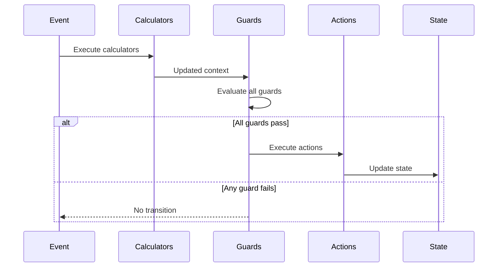

# Introduction to Behaviors

Behaviors are the building blocks for logic in EventMachine. They define how your machine responds to events, validates transitions, computes values, and produces results.

This section covers all behavior types in depth. If you're just getting started, read through [Actions](/behaviors/actions) and [Guards](/behaviors/guards) first - they're the most commonly used.

## Behavior Types

| Type | Purpose | Returns |
|------|---------|---------|
| [Actions](/behaviors/actions) | Execute side effects | `void` |
| [Guards](/behaviors/guards) | Control transition execution | `bool` |
| [Validation Guards](/behaviors/validation-guards) | Validate with error messages | `bool` |
| [Calculators](/behaviors/calculators) | Compute values before guards | `void` |
| [Event Behaviors](/behaviors/events) | Define event structure | Event data |
| [Results](/behaviors/results) | Compute final state output | `mixed` |

## Behavior Registration

Register behaviors in the `behavior` parameter:

```php ignore
MachineDefinition::define(
    config: [...],
    behavior: [
        'actions' => [
            'incrementCountAction' => IncrementAction::class,
            'logEventAction' => fn($ctx) => logger()->info('Action executed'),
        ],
        'guards' => [
            'isValidGuard' => IsValidGuard::class,
            'canProceedGuard' => fn($ctx) => $ctx->count > 0,
        ],
        'calculators' => [
            'calculateTotalCalculator' => CalculateTotalCalculator::class,
        ],
        'events' => [
            'SUBMIT' => SubmitEvent::class,
        ],
        'results' => [
            'getFinalResultResult' => FinalResultBehavior::class,
        ],
    ],
);
```

## InvokableBehavior Base Class

All behavior classes extend `InvokableBehavior`:

```php ignore
use Tarfinlabs\EventMachine\Behavior\InvokableBehavior;

abstract class InvokableBehavior
{
    // Required context declaration
    public static array $requiredContext = [];

    // Whether to log execution
    public bool $shouldLog = false;

    // Queue for raised events (protected)
    protected ?Collection $eventQueue;

    // Raise an event from within the behavior
    public function raise(EventBehavior|array $eventBehavior): void;

    // Get behavior type name
    public static function getType(): string;
}
```

## Inline vs Class Behaviors

### Inline Functions

Quick and simple:

```php ignore
'actions' => [
    'incrementAction' => fn(ContextManager $context) => $context->count++,
],

'guards' => [
    'isPositiveGuard' => fn(ContextManager $context) => $context->count > 0,
],
```

### Class Behaviors

For complex logic or dependency injection:

```php no_run
class ProcessOrderAction extends ActionBehavior
{
    public function __construct(
        private readonly OrderService $orderService,
        private readonly NotificationService $notificationService,
    ) {}

    public function __invoke(ContextManager $context): void
    {
        $order = $this->orderService->process($context->orderId);
        $this->notificationService->notify($order);
    }
}
```

## Parameter Injection

Behaviors receive parameters through dependency injection:

```php ignore
public function __invoke(
    ContextManager $context,      // Current context
    EventBehavior $event,         // Current event
    State $state,                 // Current state
    EventCollection $history,     // Event history
    array $arguments,             // Behavior arguments
): void {
    // Use injected parameters
}
```

### Available Parameters

| Type | Description |
|------|-------------|
| `ContextManager` | Current machine context |
| `EventBehavior` | Event that triggered the transition |
| `State` | Current machine state |
| `EventCollection` | Event history |
| `array` | Arguments passed to behavior |

## Behavior Arguments

Pass arguments to behaviors:

```php ignore
// In configuration
'actions' => 'addValueAction:10,20',  // Passes ['10', '20']

// In behavior
public function __invoke(ContextManager $context, array $arguments): void
{
    [$amount, $multiplier] = $arguments;
    $context->total += (int) $amount * (int) $multiplier;
}
```

### Argument Parsing Rules

Arguments are parsed from the behavior string using this format: `behaviorName:arg1,arg2,arg3`

- Arguments are split by commas
- **All arguments are passed as strings** - cast them in your behavior if needed
- No escaping mechanism (commas and colons cannot be in arguments)
- Whitespace is preserved

::: tip Complex Arguments
For complex arguments (arrays, objects, or values containing commas), use dependency injection or read from context instead of inline arguments.
:::

## Required Context

Declare required context keys:

```php
use Tarfinlabs\EventMachine\Behavior\ActionBehavior; // [!code hide]
use Tarfinlabs\EventMachine\ContextManager; // [!code hide]

class ProcessOrderAction extends ActionBehavior
{
    public static array $requiredContext = [
        'orderId' => 'string',
        'items' => 'array',
        'total' => 'numeric',
    ];

    public function __invoke(ContextManager $context): void
    {
        // Context is guaranteed to have these keys
    }
}
```

If required context is missing, `MissingMachineContextException` is thrown.

## Behavior Execution Flow



## Logging

Enable logging for debugging:

```php
use Tarfinlabs\EventMachine\Behavior\ActionBehavior; // [!code hide]
use Tarfinlabs\EventMachine\ContextManager; // [!code hide]

class DebugAction extends ActionBehavior
{
    public bool $shouldLog = true;

    public function __invoke(ContextManager $context): void
    {
        // This execution will be logged
    }
}
```

## Raising Events

Behaviors can queue events:

```php
use Tarfinlabs\EventMachine\Behavior\ActionBehavior; // [!code hide]
use Tarfinlabs\EventMachine\ContextManager; // [!code hide]

class ProcessAction extends ActionBehavior
{
    public function __invoke(ContextManager $context): void
    {
        $context->processed = true;

        // Queue event for processing after current transition
        $this->raise(['type' => 'PROCESSING_COMPLETE']);
    }
}
```

See [Raised Events](/advanced/raised-events) for details.

## Faking Behaviors

For testing, behaviors can be faked:

```php no_run
// In test — shouldRun() creates a mock internally (no separate fake() needed)
ProcessOrderAction::shouldRun()
    ->once()
    ->andReturnUsing(function (ContextManager $context) {
        $context->processed = true;
    });

// Run machine
$machine->send(['type' => 'PROCESS']);

// Assert
ProcessOrderAction::assertRan();
```

Inline closures can also be faked:

```php no_run
// Spy on an inline behavior
InlineBehaviorFake::spy('broadcastAction');

// Run machine
$machine->send(['type' => 'PROCESS']);

// Assert
InlineBehaviorFake::assertRan('broadcastAction');
```

See [Fakeable Behaviors](/testing/fakeable-behaviors) (including inline closures) for details.

## Best Practices

### 1. Keep Behaviors Focused

```php
use Tarfinlabs\EventMachine\Behavior\ActionBehavior; // [!code hide]
use Tarfinlabs\EventMachine\ContextManager; // [!code hide]

// Good - single responsibility
class IncrementCountAction extends ActionBehavior
{
    public function __invoke(ContextManager $context): void
    {
        $context->count++;
    }
}

// Avoid - multiple responsibilities
class DoEverythingAction extends ActionBehavior
{
    public function __invoke(ContextManager $context): void
    {
        $context->count++;
        $this->sendEmail();
        $this->updateDatabase();
        $this->notifySlack();
    }
}
```

### 2. Use Classes for Complex Logic

```php ignore
// Simple - inline is fine
'guards' => [
    'isPositiveGuard' => fn($ctx) => $ctx->count > 0,
],

// Complex - use a class
'guards' => [
    'isValidOrderGuard' => ValidateOrderGuard::class,
],
```

### 3. Declare Required Context

```php
use Tarfinlabs\EventMachine\Behavior\ActionBehavior; // [!code hide]

class RequireContextAction extends ActionBehavior
{
    public static array $requiredContext = [
        'userId' => 'string',
        'amount' => 'numeric',
    ];
}
```

### 4. Use Dependency Injection

```php no_run
class SendNotificationAction extends ActionBehavior
{
    public function __construct(
        private readonly NotificationService $notifications,
    ) {}

    public function __invoke(ContextManager $context): void
    {
        $this->notifications->send($context->userId, 'Order processed');
    }
}
```

## Testing Behaviors

All behaviors are fully testable at every level — isolated unit tests, faked during machine execution, and with constructor DI mocking. Each behavior page below includes a "Testing" section with concrete examples.

For the complete testing guide, see [Testing Overview](/testing/overview).
