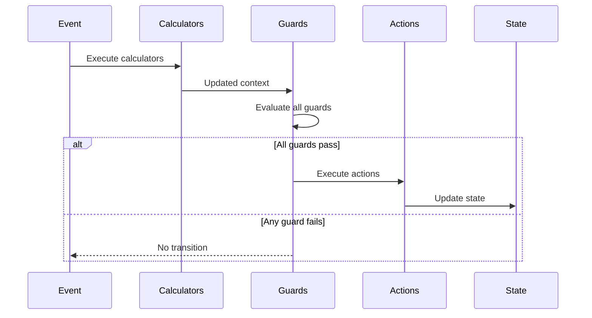

# Behaviors Overview

Behaviors are the building blocks for logic in EventMachine. They define how your machine responds to events, validates transitions, computes values, and produces results.

## Behavior Types

| Type | Purpose | Returns |
|------|---------|---------|
| [Actions](/behaviors/actions) | Execute side effects | `void` |
| [Guards](/behaviors/guards) | Control transition execution | `bool` |
| [Validation Guards](/behaviors/validation-guards) | Validate with error messages | `bool` |
| [Calculators](/behaviors/calculators) | Compute values before guards | `void` |
| [Event Behaviors](/behaviors/events) | Define event structure | Event data |
| [Results](/behaviors/results) | Compute final state output | `mixed` |

## Behavior Registration

Register behaviors in the `behavior` parameter:

```php
MachineDefinition::define(
    config: [...],
    behavior: [
        'actions' => [
            'incrementCount' => IncrementAction::class,
            'logAction' => fn($ctx) => logger()->info('Action executed'),
        ],
        'guards' => [
            'isValid' => IsValidGuard::class,
            'canProceed' => fn($ctx) => $ctx->count > 0,
        ],
        'calculators' => [
            'calculateTotal' => CalculateTotalCalculator::class,
        ],
        'events' => [
            'SUBMIT' => SubmitEvent::class,
        ],
        'results' => [
            'getFinalResult' => FinalResultBehavior::class,
        ],
    ],
);
```

## InvokableBehavior Base Class

All behavior classes extend `InvokableBehavior`:

```php
use Tarfinlabs\EventMachine\Behavior\InvokableBehavior;

abstract class InvokableBehavior
{
    // Required context declaration
    public static array $requiredContext = [];

    // Whether to log execution
    public bool $shouldLog = false;

    // Queue for raised events
    public Collection $eventQueue;

    // Raise an event from within the behavior
    public function raise(array $event): void;

    // Get behavior type name
    public function getType(): string;
}
```

## Inline vs Class Behaviors

### Inline Functions

Quick and simple:

```php
'actions' => [
    'increment' => fn(ContextManager $context) => $context->count++,
],

'guards' => [
    'isPositive' => fn(ContextManager $context) => $context->count > 0,
],
```

### Class Behaviors

For complex logic or dependency injection:

```php
class ProcessOrderAction extends ActionBehavior
{
    public function __construct(
        private readonly OrderService $orderService,
        private readonly NotificationService $notificationService,
    ) {}

    public function __invoke(ContextManager $context): void
    {
        $order = $this->orderService->process($context->orderId);
        $this->notificationService->notify($order);
    }
}
```

## Parameter Injection

Behaviors receive parameters through dependency injection:

```php
public function __invoke(
    ContextManager $context,      // Current context
    EventBehavior $event,         // Current event
    State $state,                 // Current state
    EventCollection $history,     // Event history
    array $arguments,             // Behavior arguments
): void {
    // Use injected parameters
}
```

### Available Parameters

| Type | Description |
|------|-------------|
| `ContextManager` | Current machine context |
| `EventBehavior` | Event that triggered the transition |
| `State` | Current machine state |
| `EventCollection` | Event history |
| `array` | Arguments passed to behavior |

## Behavior Arguments

Pass arguments to behaviors:

```php
// In configuration
'actions' => 'addValue:10,20',  // Passes [10, 20]

// In behavior
public function __invoke(ContextManager $context, array $arguments): void
{
    [$amount, $multiplier] = $arguments;
    $context->total += $amount * $multiplier;
}
```

## Required Context

Declare required context keys:

```php
class ProcessOrderAction extends ActionBehavior
{
    public static array $requiredContext = [
        'orderId' => 'string',
        'items' => 'array',
        'total' => 'numeric',
    ];

    public function __invoke(ContextManager $context): void
    {
        // Context is guaranteed to have these keys
    }
}
```

If required context is missing, `MissingMachineContextException` is thrown.

## Behavior Execution Flow



## Logging

Enable logging for debugging:

```php
class DebugAction extends ActionBehavior
{
    public bool $shouldLog = true;

    public function __invoke(ContextManager $context): void
    {
        // This execution will be logged
    }
}
```

## Raising Events

Behaviors can queue events:

```php
class ProcessAction extends ActionBehavior
{
    public function __invoke(ContextManager $context): void
    {
        $context->processed = true;

        // Queue event for processing after current transition
        $this->raise(['type' => 'PROCESSING_COMPLETE']);
    }
}
```

See [Raised Events](/advanced/raised-events) for details.

## Faking Behaviors

For testing, behaviors can be faked:

```php
// In test
ProcessOrderAction::fake();

ProcessOrderAction::shouldRun()
    ->once()
    ->andReturnUsing(function (ContextManager $context) {
        $context->processed = true;
    });

// Run machine
$machine->send(['type' => 'PROCESS']);

// Assert
ProcessOrderAction::assertRan();
```

See [Fakeable Behaviors](/testing/fakeable-behaviors) for details.

## Best Practices

### 1. Keep Behaviors Focused

```php
// Good - single responsibility
class IncrementCountAction extends ActionBehavior
{
    public function __invoke(ContextManager $context): void
    {
        $context->count++;
    }
}

// Avoid - multiple responsibilities
class DoEverythingAction extends ActionBehavior
{
    public function __invoke(ContextManager $context): void
    {
        $context->count++;
        $this->sendEmail();
        $this->updateDatabase();
        $this->notifySlack();
    }
}
```

### 2. Use Classes for Complex Logic

```php
// Simple - inline is fine
'guards' => [
    'isPositive' => fn($ctx) => $ctx->count > 0,
],

// Complex - use a class
'guards' => [
    'isValidOrder' => ValidateOrderGuard::class,
],
```

### 3. Declare Required Context

```php
class RequireContextAction extends ActionBehavior
{
    public static array $requiredContext = [
        'userId' => 'string',
        'amount' => 'numeric',
    ];
}
```

### 4. Use Dependency Injection

```php
class SendNotificationAction extends ActionBehavior
{
    public function __construct(
        private readonly NotificationService $notifications,
    ) {}

    public function __invoke(ContextManager $context): void
    {
        $this->notifications->send($context->userId, 'Order processed');
    }
}
```
