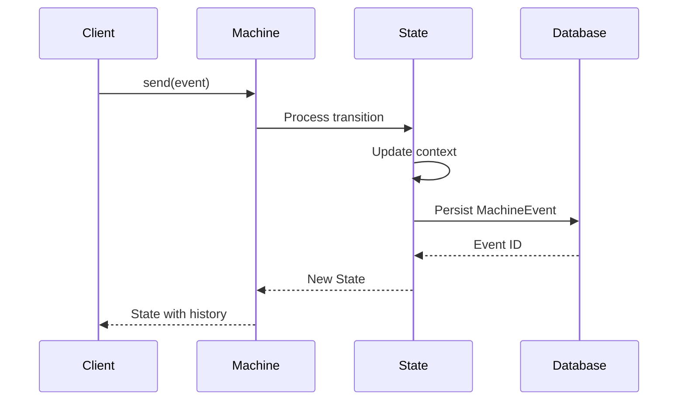

# Event Sourcing

EventMachine provides built-in event sourcing, recording every state change as an immutable event. This enables complete audit trails, state restoration, and debugging capabilities.

## How It Works

Every time a machine processes an event:

1. The event is validated
2. Transition logic executes (guards, actions, calculators)
3. State changes
4. All events are persisted to the database



## MachineEvent Model

Events are stored in the `machine_events` table:

```php
// Schema
Schema::create('machine_events', function (Blueprint $table) {
    $table->ulid('id')->primary();
    $table->integer('sequence_number');
    $table->timestamp('created_at');
    $table->string('machine_id');
    $table->json('machine_value');    // Current state
    $table->ulid('root_event_id');    // Root of event chain
    $table->string('source');         // 'internal' or 'external'
    $table->string('type');           // Event type
    $table->json('payload')->nullable();
    $table->integer('version');
    $table->json('context');          // Incremental context
    $table->json('meta')->nullable(); // State metadata
});
```

### Event Properties

| Column | Description |
|--------|-------------|
| `id` | Unique ULID for this event |
| `sequence_number` | Order in the event chain |
| `machine_id` | Machine identifier |
| `machine_value` | State after this event |
| `root_event_id` | ID of the first event in chain |
| `source` | `internal` or `external` |
| `type` | Event type name |
| `payload` | Event data |
| `version` | Event version number |
| `context` | Context changes (incremental) |
| `meta` | State metadata |

## Event History

Access the event history through the state:

```php
$machine = OrderMachine::create();
$machine->send(['type' => 'SUBMIT']);
$machine->send(['type' => 'APPROVE']);

// Access history
$history = $machine->state->history;

// History is an EventCollection
$history->count();           // Number of events
$history->pluck('type');     // ['machine.start', 'SUBMIT', 'APPROVE', ...]

// Get specific events
$externalEvents = $history->where('source', 'external');
$firstEvent = $history->first();
$lastEvent = $history->last();
```

## State Restoration

Restore machine state from any point in history:

```php
// Create and use machine
$machine = OrderMachine::create();
$machine->send(['type' => 'SUBMIT']);
$machine->send(['type' => 'APPROVE']);

// Get the root event ID
$rootEventId = $machine->state->history->first()->root_event_id;

// Later: Restore the machine
$restored = OrderMachine::create(state: $rootEventId);

// State is fully reconstructed
$restored->state->matches('approved'); // true
$restored->state->context->toArray();  // Full context
```

### How Restoration Works

1. Query all events with the `root_event_id`
2. Rebuild context by applying incremental changes
3. Reconstruct state definition
4. Machine is ready to continue

```php
// Events are stored incrementally
Event 1: { context: { orderId: "123", items: [], total: 0 } }  // Full
Event 2: { context: { items: [{id: 1}] } }                     // Partial
Event 3: { context: { total: 100 } }                           // Partial

// Restored context
{ orderId: "123", items: [{id: 1}], total: 100 }
```

## Internal Events

EventMachine generates internal events for tracking:

```php
$history = $machine->state->history;

// Machine lifecycle
$history->where('type', 'like', 'machine.%');

// State changes
$history->where('type', 'like', '%.enter');
$history->where('type', 'like', '%.exit');

// Examples
'order.machine.start'
'order.state.pending.enter'
'order.transition.start'
'order.action.calculateTotal.finish'
'order.state.pending.exit'
'order.state.processing.enter'
```

## Querying Events

```php
use Tarfinlabs\EventMachine\Models\MachineEvent;

// All events for a machine instance
$events = MachineEvent::where('root_event_id', $rootId)->get();

// Recent events
$recent = MachineEvent::where('machine_id', 'order')
    ->latest()
    ->take(100)
    ->get();

// Events of specific type
$submits = MachineEvent::where('type', 'SUBMIT')
    ->where('source', 'external')
    ->get();

// Events in date range
$events = MachineEvent::whereBetween('created_at', [$start, $end])
    ->get();
```

## Disabling Persistence

For testing or ephemeral machines:

```php
MachineDefinition::define(
    config: [
        'should_persist' => false,
        'initial' => 'idle',
        'states' => [...],
    ],
);
```

Or per-machine:

```php
class EphemeralMachine extends Machine
{
    public static function definition(): MachineDefinition
    {
        return MachineDefinition::define(
            config: [
                'should_persist' => false,
                ...
            ],
        );
    }
}
```

## Event Archival

For performance, old events can be archived:

```php
// Archival configuration
'archival' => [
    'enabled' => true,
    'days_inactive' => 30,
    'level' => 6,  // Compression level
],
```

See [Archival & Compression](/laravel-integration/archival-compression) for details.

## Distributed Locking

EventMachine uses distributed locking to prevent concurrent modifications:

```php
// When sending an event
$machine->send(['type' => 'SUBMIT']);

// Behind the scenes:
// 1. Acquire lock on root_event_id
// 2. Process event
// 3. Persist state
// 4. Release lock

// If lock can't be acquired:
throw new MachineAlreadyRunningException();
```

## Transactional Events

Events can be wrapped in database transactions:

```php
class CriticalEvent extends EventBehavior
{
    public bool $isTransactional = true; // Default

    public static function getType(): string
    {
        return 'CRITICAL_OPERATION';
    }
}

// If any action fails, all changes roll back
$machine->send(new CriticalEvent());
```

### Non-Transactional Events

For performance-critical operations:

```php
class FastEvent extends EventBehavior
{
    public bool $isTransactional = false;

    public static function getType(): string
    {
        return 'FAST_UPDATE';
    }
}
```

## Use Cases

### Audit Trails

```php
// Get complete audit trail
$events = MachineEvent::where('root_event_id', $orderId)
    ->with('actor')
    ->get()
    ->map(fn($e) => [
        'timestamp' => $e->created_at,
        'action' => $e->type,
        'actor' => $e->actor,
        'data' => $e->payload,
    ]);
```

### Debugging

```php
// Replay events to debug
$events = MachineEvent::where('root_event_id', $rootId)
    ->orderBy('sequence_number')
    ->get();

foreach ($events as $event) {
    dump([
        'seq' => $event->sequence_number,
        'type' => $event->type,
        'context_change' => $event->context,
        'state' => $event->machine_value,
    ]);
}
```

### Time Travel

```php
// Find state at specific time
$eventAtTime = MachineEvent::where('root_event_id', $rootId)
    ->where('created_at', '<=', $timestamp)
    ->orderBy('sequence_number', 'desc')
    ->first();

// Restore to that point
$machine = OrderMachine::create(state: $rootId);
// Note: This restores to latest state
// For true time travel, you'd need to replay events up to the point
```

### Analytics

```php
// Average time in each state
$avgTimeInState = MachineEvent::where('type', 'like', '%.enter')
    ->selectRaw('type, AVG(duration_in_state) as avg_duration')
    ->groupBy('type')
    ->get();

// Most common transitions
$transitions = MachineEvent::where('source', 'external')
    ->selectRaw('type, COUNT(*) as count')
    ->groupBy('type')
    ->orderByDesc('count')
    ->get();
```

## Best Practices

### 1. Use Meaningful Event Types

```php
// Good - describes what happened
'ORDER_SUBMITTED_BY_CUSTOMER'
'PAYMENT_CONFIRMED_BY_GATEWAY'
'INVENTORY_RESERVED'

// Avoid - too generic
'UPDATE'
'CHANGE'
'PROCESS'
```

### 2. Include Actor Information

```php
class SubmitEvent extends EventBehavior
{
    public function actor(ContextManager $context): mixed
    {
        return auth()->user()?->id ?? 'system';
    }
}
```

### 3. Keep Payload Minimal

```php
// Good - store references
'payload' => ['orderId' => $order->id]

// Avoid - store entire objects
'payload' => ['order' => $order->toArray()]
```

### 4. Plan for Archival

Configure archival early for high-volume systems:

```php
// config/machine.php
'archival' => [
    'days_inactive' => 7,    // Archive sooner for high volume
    'level' => 9,            // Maximum compression
],
```
