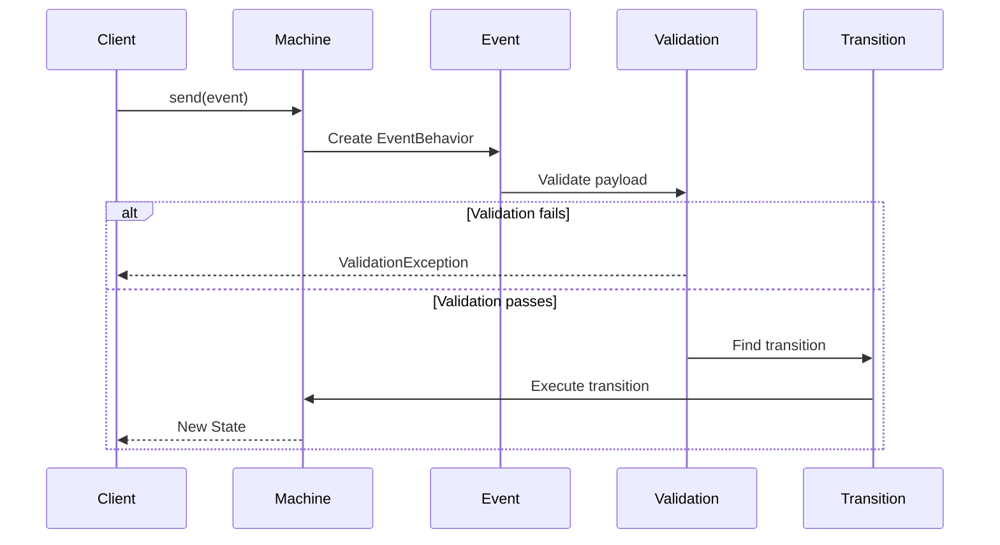

# Events

Events are signals that trigger state transitions. They carry information about what happened and can include payload data.

## Event Structure

### Basic Event

The simplest event is an array with a `type`:

```php
$machine->send(['type' => 'SUBMIT']);
```

### Event with Payload

Include additional data:

```php
$machine->send([
    'type' => 'ADD_ITEM',
    'payload' => [
        'productId' => 123,
        'quantity' => 2,
        'price' => 29.99,
    ],
]);
```

### Accessing Event Data

In behaviors, the event is injected:

```php
'actions' => [
    'addItem' => function (ContextManager $context, EventBehavior $event) {
        $context->items[] = [
            'id' => $event->payload['productId'],
            'quantity' => $event->payload['quantity'],
            'price' => $event->payload['price'],
        ];
    },
],
```

## Event Types

### String Event Types

The most common approach:

```php
'on' => [
    'SUBMIT' => 'processing',
    'CANCEL' => 'cancelled',
    'ADD_ITEM' => ['actions' => 'addItem'],
],
```

### Event Class Types

Use the class name as the event type:

```php
use App\Events\AddItemEvent;

'on' => [
    AddItemEvent::class => ['actions' => 'addItem'],
],

// Sending
$machine->send(new AddItemEvent(productId: 123, quantity: 2));
```

## Custom Event Classes

Create custom events for type safety and validation:

```php
use Tarfinlabs\EventMachine\Behavior\EventBehavior;
use Spatie\LaravelData\Attributes\Validation\Required;
use Spatie\LaravelData\Attributes\Validation\Min;

class AddItemEvent extends EventBehavior
{
    public function __construct(
        #[Required]
        public int $productId,

        #[Min(1)]
        public int $quantity = 1,

        public ?float $price = null,
    ) {
        parent::__construct();
    }

    public static function getType(): string
    {
        return 'ADD_ITEM';
    }
}
```

### Registering Event Classes

Map string types to event classes:

```php
MachineDefinition::define(
    config: [...],
    behavior: [
        'events' => [
            'ADD_ITEM' => AddItemEvent::class,
            'REMOVE_ITEM' => RemoveItemEvent::class,
        ],
    ],
);
```

## Event Validation

### Using Laravel Validation Rules

```php
class SubmitOrderEvent extends EventBehavior
{
    public static function getType(): string
    {
        return 'SUBMIT_ORDER';
    }

    public static function rules(): array
    {
        return [
            'payload.items' => ['required', 'array', 'min:1'],
            'payload.address' => ['required', 'string'],
            'payload.payment_method' => ['required', 'in:card,bank,cash'],
        ];
    }

    public static function messages(): array
    {
        return [
            'payload.items.required' => 'Order must have at least one item',
            'payload.items.min' => 'Order must have at least one item',
        ];
    }
}
```

### Validation in Action

```php
try {
    $machine->send([
        'type' => 'SUBMIT_ORDER',
        'payload' => [
            'items' => [],  // Invalid - empty array
        ],
    ]);
} catch (MachineEventValidationException $e) {
    // Handle validation failure
    $errors = $e->errors();
}
```

## Event Properties

### `type`

The event type identifier:

```php
$event->type; // 'SUBMIT' or 'App\Events\SubmitEvent'
```

### `payload`

Event data:

```php
$event->payload; // ['productId' => 123, 'quantity' => 2]
```

### `isTransactional`

Whether to wrap the transition in a database transaction:

```php
class CriticalEvent extends EventBehavior
{
    public bool $isTransactional = true; // Default

    public static function getType(): string
    {
        return 'CRITICAL';
    }
}
```

### `actor`

The entity performing the action:

```php
class SubmitEvent extends EventBehavior
{
    public function actor(ContextManager $context): mixed
    {
        return auth()->user();
    }
}
```

### `source`

Event origin (internal or external):

```php
use Tarfinlabs\EventMachine\Enums\SourceType;

$event->source; // SourceType::EXTERNAL or SourceType::INTERNAL
```

## Internal Events

EventMachine generates internal events for tracking:

```php
// Machine lifecycle
'machine.start'
'machine.finish'

// State transitions
'machine.state.{state}.enter'
'machine.state.{state}.exit'
'machine.state.{state}.entry.start'
'machine.state.{state}.entry.finish'

// Transition tracking
'machine.transition.start'
'machine.transition.finish'
'machine.transition.fail'

// Action execution
'machine.action.{action}.start'
'machine.action.{action}.finish'

// Guard evaluation
'machine.guard.{guard}.pass'
'machine.guard.{guard}.fail'

// Raised events
'machine.event.{event}.raised'
```

## Raised Events

Actions can queue events for processing:

```php
class ProcessAction extends ActionBehavior
{
    public function __invoke(ContextManager $context): void
    {
        $context->processed = true;

        // Queue an event
        $this->raise(['type' => 'PROCESSED']);

        // Or with payload
        $this->raise([
            'type' => 'NOTIFICATION',
            'payload' => ['message' => 'Processing complete'],
        ]);
    }
}
```

See [Raised Events](/advanced/raised-events) for details.

## Event Flow



## Transactional Events

Control database transaction behavior:

```php
class NonTransactionalEvent extends EventBehavior
{
    public bool $isTransactional = false;

    public static function getType(): string
    {
        return 'FAST_UPDATE';
    }
}
```

::: warning
Non-transactional events won't rollback on failure. Use with caution.
:::

## Best Practices

### 1. Use Descriptive Event Names

```php
// Good
'ORDER_SUBMITTED'
'PAYMENT_RECEIVED'
'ITEM_ADDED_TO_CART'

// Avoid
'SUBMIT'
'DONE'
'UPDATE'
```

### 2. Keep Payload Minimal

```php
// Good - only necessary data
'payload' => [
    'productId' => 123,
    'quantity' => 2,
],

// Avoid - redundant data
'payload' => [
    'product' => [...full product object...],
    'user' => [...full user object...],
    'timestamp' => now(),
    'requestId' => uuid(),
],
```

### 3. Validate at Event Level

```php
class AddItemEvent extends EventBehavior
{
    public static function rules(): array
    {
        return [
            'payload.productId' => 'required|integer|exists:products,id',
            'payload.quantity' => 'required|integer|min:1|max:100',
        ];
    }
}
```

### 4. Use Event Classes for Complex Events

```php
// Simple events - array is fine
$machine->send(['type' => 'CANCEL']);

// Complex events - use classes
$machine->send(new SubmitOrderEvent(
    items: $cartItems,
    shippingAddress: $address,
    paymentMethod: 'card',
));
```
