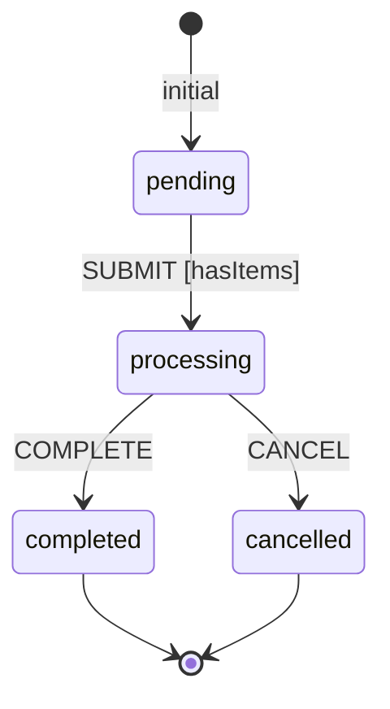

# Machine Definition

The `MachineDefinition` class is the blueprint for your state machines. It defines all states, transitions, behaviors, and configuration options.

## Basic Structure

```php
use Tarfinlabs\EventMachine\Definition\MachineDefinition;

$machine = MachineDefinition::define(
    config: [
        'id' => 'myMachine',
        'initial' => 'idle',
        'context' => [...],
        'states' => [...],
    ],
    behavior: [
        'actions' => [...],
        'guards' => [...],
        'events' => [...],
        'calculators' => [...],
        'results' => [...],
    ],
    scenarios: [...],
);
```

## Configuration Options

### `id`

A unique identifier for the machine. Used in state paths and event tracking.

```php
'id' => 'order_machine',
```

State values will be prefixed with this ID: `order_machine.pending`

### `initial`

The initial state when the machine starts.

```php
'initial' => 'idle',
```

### `version`

Optional version string for the machine definition.

```php
'version' => '1.0.0',
```

### `context`

Initial context data. Can be an array or a custom context class.

```php
// Array context
'context' => [
    'count' => 0,
    'items' => [],
],

// Custom context class
'context' => OrderContext::class,
```

### `states`

State definitions. See [States](/core-concepts/states) for details.

```php
'states' => [
    'idle' => [
        'on' => ['START' => 'running'],
    ],
    'running' => [
        'on' => ['STOP' => 'idle'],
    ],
],
```

### `delimiter`

Separator for state paths. Default is `.`

```php
'delimiter' => '.',  // Results in 'machine.parent.child'
```

### `should_persist`

Whether to persist events to the database. Default is `true`.

```php
'should_persist' => false,  // Disable persistence
```

### `scenarios_enabled`

Enable scenario-based configuration overrides. Default is `false`.

```php
'scenarios_enabled' => true,
```

## Behavior Registration

Behaviors are registered in the second parameter:

```php
MachineDefinition::define(
    config: [...],
    behavior: [
        'actions' => [
            'increment' => fn($ctx) => $ctx->count++,
            'logAction' => LogAction::class,
        ],
        'guards' => [
            'isValid' => fn($ctx) => $ctx->count > 0,
            'canSubmit' => CanSubmitGuard::class,
        ],
        'events' => [
            'SUBMIT' => SubmitEvent::class,
        ],
        'calculators' => [
            'calculateTotal' => CalculateTotalCalculator::class,
        ],
        'results' => [
            'getFinalResult' => FinalResultBehavior::class,
        ],
        'context' => OrderContext::class,
    ],
);
```

### Inline vs Class Behaviors

**Inline functions** are great for simple logic:

```php
'actions' => [
    'increment' => fn($context) => $context->count++,
],
```

**Class behaviors** are better for complex logic with dependencies:

```php
'actions' => [
    'processOrder' => ProcessOrderAction::class,
],
```

## Creating Machine Classes

For reusable machines, extend the `Machine` class:

```php
use Tarfinlabs\EventMachine\Actor\Machine;
use Tarfinlabs\EventMachine\Definition\MachineDefinition;

class OrderMachine extends Machine
{
    public static function definition(): MachineDefinition
    {
        return MachineDefinition::define(
            config: [
                'id' => 'order',
                'initial' => 'pending',
                'context' => OrderContext::class,
                'states' => [
                    'pending' => [
                        'on' => [
                            'SUBMIT' => [
                                'target' => 'processing',
                                'guards' => 'hasItems',
                            ],
                        ],
                    ],
                    'processing' => [
                        'on' => [
                            'COMPLETE' => 'completed',
                            'CANCEL' => 'cancelled',
                        ],
                    ],
                    'completed' => ['type' => 'final'],
                    'cancelled' => ['type' => 'final'],
                ],
            ],
            behavior: [
                'guards' => [
                    'hasItems' => fn($ctx) => count($ctx->items) > 0,
                ],
            ],
        );
    }
}
```

## Usage Examples

### Creating and Starting

```php
// Using MachineDefinition directly
$definition = MachineDefinition::define([...]);
$state = $definition->getInitialState();

// Using Machine class
$machine = OrderMachine::create();
$machine->send(['type' => 'SUBMIT']);
```

### Getting Initial State

```php
$state = $definition->getInitialState();

// With initial event
$state = $definition->getInitialState([
    'type' => 'INIT',
    'payload' => ['userId' => 123],
]);
```

### Transitioning States

```php
// Stateless transition (returns new state)
$newState = $definition->transition(
    event: ['type' => 'SUBMIT'],
    state: $currentState,
);

// With Machine class (stateful)
$machine->send(['type' => 'SUBMIT']);
```

### Restoring from Event ID

```php
$machine = OrderMachine::create(state: $rootEventId);
```

## State Diagram



## Configuration Validation

EventMachine validates configuration at definition time:

```php
// These will throw exceptions:
'states' => [
    'final_state' => [
        'type' => 'final',
        'states' => [...],  // Error: Final states cannot have children
    ],
],

'states' => [
    'final_state' => [
        'type' => 'final',
        'on' => ['EVENT' => 'other'],  // Error: Final states cannot have transitions
    ],
],
```

## Key Properties

| Property | Type | Description |
|----------|------|-------------|
| `id` | `string` | Machine identifier |
| `version` | `?string` | Machine version |
| `root` | `StateDefinition` | Root state definition |
| `idMap` | `array<StateDefinition>` | ID to state mapping |
| `stateDefinitions` | `array<StateDefinition>` | Child states |
| `events` | `array<string>` | All accepted event types |
| `eventQueue` | `Collection` | Queue for raised events |
| `initialStateDefinition` | `StateDefinition` | Initial state |
| `shouldPersist` | `bool` | Persistence flag |
| `scenariosEnabled` | `bool` | Scenarios flag |
| `delimiter` | `string` | State path delimiter |
