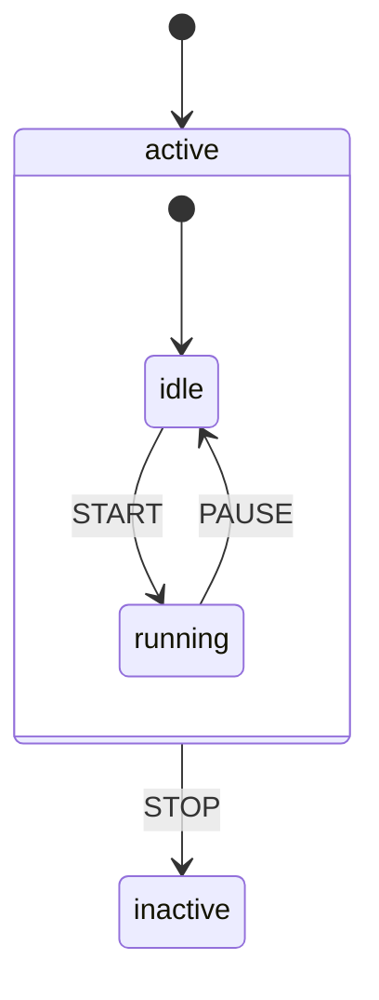
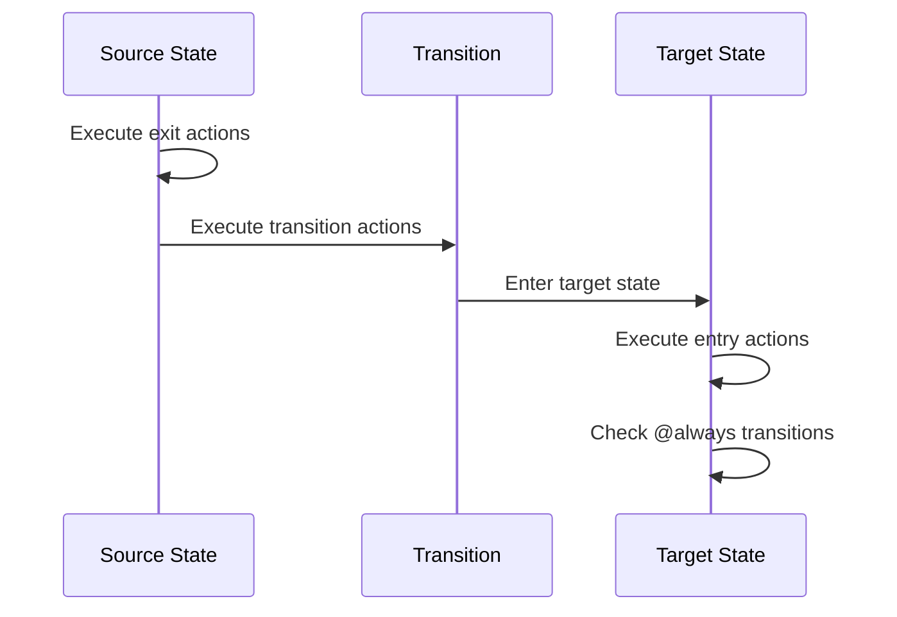
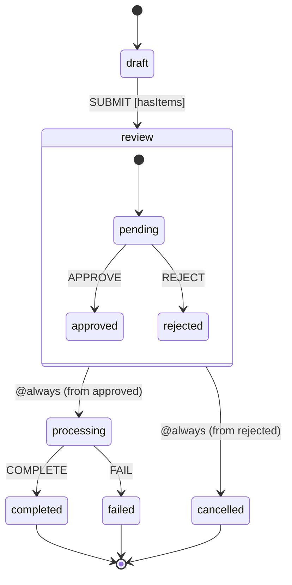

# States

States represent the different conditions or modes your machine can be in. EventMachine supports three types of states: atomic, compound, and final.

## State Types

### Atomic States

Leaf states with no children. The most common type:

```php
'states' => [
    'idle' => [
        'on' => ['START' => 'running'],
    ],
    'running' => [
        'on' => ['STOP' => 'idle'],
    ],
],
```

### Compound States

Parent states containing child states:

```php
'states' => [
    'active' => [
        'initial' => 'idle',
        'states' => [
            'idle' => [
                'on' => ['START' => 'running'],
            ],
            'running' => [
                'on' => ['PAUSE' => 'idle'],
            ],
        ],
        'on' => [
            'STOP' => 'inactive',  // Available from any child state
        ],
    ],
    'inactive' => [],
],
```



### Final States

Terminal states that indicate the machine has completed:

```php
'states' => [
    'processing' => [
        'on' => [
            'COMPLETE' => 'success',
            'FAIL' => 'failure',
        ],
    ],
    'success' => [
        'type' => 'final',
        'result' => 'getSuccessResult',
    ],
    'failure' => [
        'type' => 'final',
        'result' => 'getFailureResult',
    ],
],
```

::: warning
Final states cannot have:
- Child states
- Outgoing transitions
:::

## State Configuration

### `on`

Defines transitions for events:

```php
'idle' => [
    'on' => [
        'START' => 'running',                    // Simple transition
        'SUBMIT' => [                            // Complex transition
            'target' => 'submitted',
            'guards' => 'isValid',
            'actions' => 'submitForm',
        ],
    ],
],
```

### `entry`

Actions executed when entering the state:

```php
'loading' => [
    'entry' => 'startLoading',
    // or multiple actions
    'entry' => ['startLoading', 'logEntry'],
],
```

### `exit`

Actions executed when leaving the state:

```php
'loading' => [
    'exit' => 'stopLoading',
    // or multiple actions
    'exit' => ['stopLoading', 'cleanup'],
],
```

### `initial`

For compound states, the initial child state:

```php
'active' => [
    'initial' => 'idle',
    'states' => [
        'idle' => [...],
        'running' => [...],
    ],
],
```

### `type`

Explicitly set state type:

```php
'completed' => [
    'type' => 'final',
],
```

### `description`

Human-readable description:

```php
'pending' => [
    'description' => 'Waiting for user input',
    'on' => [...],
],
```

### `meta`

Arbitrary metadata:

```php
'error' => [
    'meta' => [
        'severity' => 'critical',
        'retryable' => false,
    ],
],
```

### `result`

For final states, defines the result behavior:

```php
'completed' => [
    'type' => 'final',
    'result' => 'computeFinalResult',
],
```

## State IDs and Paths

Each state has a unique ID based on its path:

```php
'states' => [
    'parent' => [
        'states' => [
            'child' => [
                'states' => [
                    'grandchild' => [],
                ],
            ],
        ],
    ],
],

// State IDs:
// - machine.parent
// - machine.parent.child
// - machine.parent.child.grandchild
```

## Working with State Objects

### Checking Current State

```php
$machine = OrderMachine::create();
$state = $machine->state;

// Check if in a specific state
$state->matches('pending');        // true/false
$state->matches('active.running'); // For nested states

// Get state value (array of state IDs)
$state->value; // ['order.pending']
```

### Accessing State Definition

```php
$stateDefinition = $state->currentStateDefinition;

$stateDefinition->id;          // 'order.pending'
$stateDefinition->key;         // 'pending'
$stateDefinition->path;        // ['order', 'pending']
$stateDefinition->type;        // StateDefinitionType::ATOMIC
$stateDefinition->description; // 'Awaiting submission'
$stateDefinition->meta;        // ['priority' => 'normal']
```

### State History

```php
// Access event history
$state->history; // EventCollection of MachineEvent models

// Get root event ID
$rootEventId = $state->history->first()->root_event_id;
```

## State Lifecycle



### Execution Order

1. **Source state exit actions** run first
2. **Transition actions** run during transition
3. **Target state entry actions** run after entering
4. **@always transitions** are checked after entry

## State Type Detection

EventMachine automatically determines state type:

```php
// ATOMIC: No child states
'idle' => [
    'on' => ['START' => 'running'],
],

// COMPOUND: Has child states
'active' => [
    'states' => [
        'idle' => [],
        'running' => [],
    ],
],

// FINAL: Explicit type
'completed' => [
    'type' => 'final',
],
```

## Complete Example

```php
MachineDefinition::define(
    config: [
        'id' => 'order',
        'initial' => 'draft',
        'states' => [
            'draft' => [
                'description' => 'Order is being drafted',
                'on' => [
                    'SUBMIT' => [
                        'target' => 'review',
                        'guards' => 'hasItems',
                    ],
                ],
            ],
            'review' => [
                'description' => 'Order is under review',
                'initial' => 'pending',
                'states' => [
                    'pending' => [
                        'entry' => 'notifyReviewer',
                        'on' => [
                            'APPROVE' => 'approved',
                            'REJECT' => 'rejected',
                        ],
                    ],
                    'approved' => [
                        'on' => ['@always' => '#processing'],
                    ],
                    'rejected' => [
                        'on' => ['@always' => '#cancelled'],
                    ],
                ],
            ],
            'processing' => [
                'entry' => 'startProcessing',
                'exit' => 'cleanup',
                'on' => [
                    'COMPLETE' => 'completed',
                    'FAIL' => 'failed',
                ],
            ],
            'completed' => [
                'type' => 'final',
                'result' => 'getOrderResult',
                'meta' => ['success' => true],
            ],
            'cancelled' => [
                'type' => 'final',
                'meta' => ['success' => false],
            ],
            'failed' => [
                'type' => 'final',
                'meta' => ['success' => false, 'retryable' => true],
            ],
        ],
    ],
);
```


