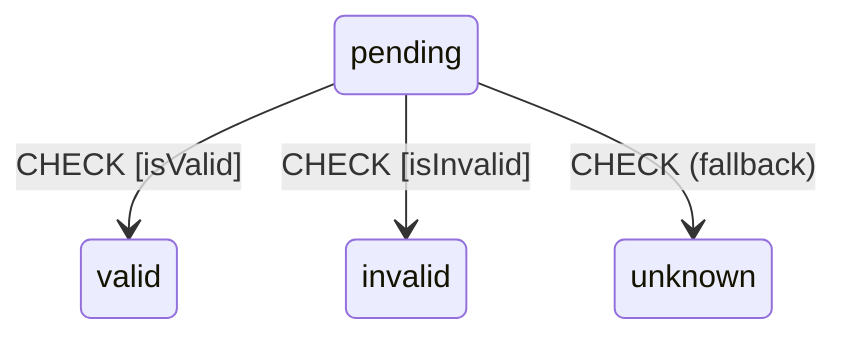
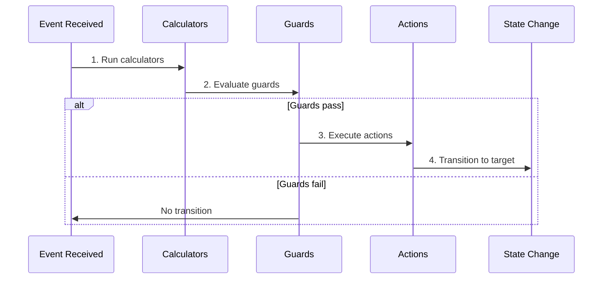

# Transitions

Transitions define how the machine moves from one state to another in response to events. EventMachine supports simple, guarded, and multi-path transitions.

## Basic Transitions

### Simple String Target

The simplest transition specifies just the target state:

```php
'idle' => [
    'on' => [
        'START' => 'running',  // Go to 'running' state
    ],
],
```

### Complex Transition Object

For more control, use an object with configuration:

```php
'idle' => [
    'on' => [
        'START' => [
            'target' => 'running',
            'guards' => 'canStart',
            'actions' => 'logStart',
        ],
    ],
],
```

## Transition Configuration

### `target`

The destination state:

```php
'target' => 'processing',

// Target nested state
'target' => 'active.running',

// Target using ID selector
'target' => '#completed',  // Targets state with id 'completed'
```

### `guards`

Conditions that must pass for the transition:

```php
// Single guard
'guards' => 'isValid',

// Multiple guards (all must pass)
'guards' => ['isValid', 'hasPermission'],

// Guard class
'guards' => ValidateOrderGuard::class,
```

### `actions`

Side effects to execute during transition:

```php
// Single action
'actions' => 'logTransition',

// Multiple actions
'actions' => ['logTransition', 'sendNotification'],

// Action class
'actions' => ProcessOrderAction::class,
```

### `calculators`

Compute values before guards run:

```php
'calculators' => 'calculateTotal',

// The calculated value is available to guards
'calculators' => 'calculateTotal',
'guards' => 'hasValidTotal',  // Can check the calculated total
```

### `description`

Human-readable description:

```php
'description' => 'Transition to processing when order is valid',
```

## Guarded Transitions

### Single Guard

```php
'on' => [
    'SUBMIT' => [
        'target' => 'submitted',
        'guards' => 'isValid',
    ],
],

// In behavior
'guards' => [
    'isValid' => fn($context) => $context->items->count() > 0,
],
```

### Multiple Guards (AND Logic)

All guards must pass:

```php
'on' => [
    'SUBMIT' => [
        'target' => 'submitted',
        'guards' => ['isValid', 'hasPermission', 'withinLimit'],
    ],
],
```

### Inline Guards

```php
'guards' => [
    'isValid' => function (ContextManager $context, EventBehavior $event) {
        return $context->amount > 0 && $context->amount <= 10000;
    },
],
```

## Multi-Path Transitions

When an event can lead to different states based on conditions:

```php
'on' => [
    'CHECK' => [
        ['target' => 'valid', 'guards' => 'isValid'],
        ['target' => 'invalid', 'guards' => 'isInvalid'],
        ['target' => 'unknown'],  // Fallback (no guard)
    ],
],
```

The first matching branch is taken. Always include a fallback as the last option.



### Real-World Example

```php
'pending' => [
    'on' => [
        'PROCESS' => [
            [
                'target' => 'approved',
                'guards' => 'isAutoApprovable',
                'actions' => 'autoApprove',
            ],
            [
                'target' => 'review',
                'guards' => 'requiresReview',
                'actions' => 'sendToReview',
            ],
            [
                'target' => 'rejected',
                'guards' => 'isBlacklisted',
                'actions' => 'logRejection',
            ],
            [
                'target' => 'manual_review',
                'actions' => 'escalate',
            ],
        ],
    ],
],
```

## Self-Transitions

Transitions that stay in the same state (useful for updating context):

```php
'active' => [
    'on' => [
        'INCREMENT' => [
            // No target = self-transition
            'actions' => 'incrementCounter',
        ],
    ],
],
```

::: tip
Self-transitions still trigger entry and exit actions if they exist.
:::

## Always Transitions

Automatic transitions that occur immediately after entering a state:

```php
'checking' => [
    'on' => [
        '@always' => [
            ['target' => 'valid', 'guards' => 'isValid'],
            ['target' => 'invalid'],
        ],
    ],
],
```

See [@always Transitions](/advanced/always-transitions) for details.

## Transition Execution Order



1. **Calculators** run first, updating context
2. **Guards** evaluate using the updated context
3. If guards pass, **Actions** execute
4. **State change** occurs
5. **Entry actions** of target state run
6. **@always transitions** are checked

## Event Types

### String Events

```php
$machine->send(['type' => 'SUBMIT']);
```

### Events with Payload

```php
$machine->send([
    'type' => 'ADD_ITEM',
    'payload' => [
        'productId' => 123,
        'quantity' => 2,
    ],
]);
```

### Event Classes

```php
$machine->send(new AddItemEvent(productId: 123, quantity: 2));
```

## Complete Example

```php
MachineDefinition::define(
    config: [
        'id' => 'order',
        'initial' => 'cart',
        'context' => [
            'items' => [],
            'total' => 0,
            'discount' => 0,
        ],
        'states' => [
            'cart' => [
                'on' => [
                    'ADD_ITEM' => [
                        'actions' => 'addItem',
                    ],
                    'REMOVE_ITEM' => [
                        'actions' => 'removeItem',
                    ],
                    'CHECKOUT' => [
                        'target' => 'checkout',
                        'guards' => 'hasItems',
                    ],
                ],
            ],
            'checkout' => [
                'on' => [
                    'APPLY_DISCOUNT' => [
                        'calculators' => 'calculateDiscount',
                        'guards' => 'isValidDiscount',
                        'actions' => 'applyDiscount',
                    ],
                    'SUBMIT' => [
                        'target' => 'processing',
                        'calculators' => 'calculateTotal',
                        'guards' => ['hasValidPayment', 'hasValidAddress'],
                        'actions' => ['createOrder', 'sendConfirmation'],
                    ],
                    'BACK' => 'cart',
                ],
            ],
            'processing' => [
                'on' => [
                    'COMPLETE' => 'completed',
                    'FAIL' => 'failed',
                ],
            ],
            'completed' => ['type' => 'final'],
            'failed' => ['type' => 'final'],
        ],
    ],
    behavior: [
        'guards' => [
            'hasItems' => fn($ctx) => count($ctx->items) > 0,
            'isValidDiscount' => fn($ctx, $event) =>
                $event->payload['code'] !== '' && $ctx->discount === 0,
            'hasValidPayment' => fn($ctx) => $ctx->get('payment') !== null,
            'hasValidAddress' => fn($ctx) => $ctx->get('address') !== null,
        ],
        'calculators' => [
            'calculateDiscount' => function ($ctx, $event) {
                $ctx->discount = $event->payload['amount'] ?? 0;
            },
            'calculateTotal' => function ($ctx) {
                $ctx->total = collect($ctx->items)->sum('price') - $ctx->discount;
            },
        ],
        'actions' => [
            'addItem' => function ($ctx, $event) {
                $ctx->items[] = $event->payload['item'];
            },
            'removeItem' => function ($ctx, $event) {
                $ctx->items = array_filter(
                    $ctx->items,
                    fn($item) => $item['id'] !== $event->payload['itemId']
                );
            },
            'applyDiscount' => function ($ctx) {
                // Discount already calculated
            },
            'createOrder' => CreateOrderAction::class,
            'sendConfirmation' => SendConfirmationAction::class,
        ],
    ],
);
```
