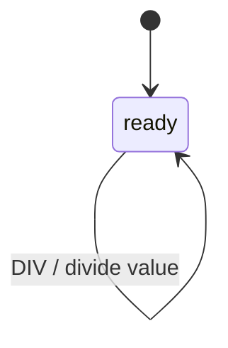

# Calculator Example

A simple example demonstrating inline actions with event payloads.

## Overview

This example models a basic calculator with four operations:
- Addition (ADD)
- Subtraction (SUB)
- Multiplication (MUL)
- Division (DIV)



## Machine Definition

```php
<?php

namespace App\Machines;

use Tarfinlabs\EventMachine\Actor\Machine;
use Tarfinlabs\EventMachine\ContextManager;
use Tarfinlabs\EventMachine\Definition\EventDefinition;
use Tarfinlabs\EventMachine\Definition\MachineDefinition;

class CalculatorMachine extends Machine
{
    public static function definition(): ?MachineDefinition
    {
        return MachineDefinition::define(
            config: [
                'initial' => 'ready',
                'context' => [
                    'result' => 0,
                ],
                'states' => [
                    'ready' => [
                        'on' => [
                            'ADD' => ['actions' => 'additionAction'],
                            'SUB' => ['actions' => 'subtractionAction'],
                            'MUL' => ['actions' => 'multiplicationAction'],
                            'DIV' => ['actions' => 'divisionAction'],
                        ],
                    ],
                ],
            ],
            behavior: [
                'actions' => [
                    'additionAction' => function (
                        ContextManager $context,
                        EventDefinition $event
                    ): void {
                        $context->result = $context->result + $event->payload['value'];
                    },
                    'subtractionAction' => function (
                        ContextManager $context,
                        EventDefinition $event
                    ): void {
                        $context->result = $context->result - $event->payload['value'];
                    },
                    'multiplicationAction' => function (
                        ContextManager $context,
                        EventDefinition $event
                    ): void {
                        $context->result = $context->result * $event->payload['value'];
                    },
                    'divisionAction' => function (
                        ContextManager $context,
                        EventDefinition $event
                    ): void {
                        $context->result = $context->result / $event->payload['value'];
                    },
                ],
            ],
        );
    }
}
```

## Usage Examples

### Basic Arithmetic

```php
$machine = CalculatorMachine::create();

// Start at 0
expect($machine->state->context->result)->toBe(0);

// Add 10
$machine->send([
    'type' => 'ADD',
    'payload' => ['value' => 10],
]);
expect($machine->state->context->result)->toBe(10);

// Subtract 3
$machine->send([
    'type' => 'SUB',
    'payload' => ['value' => 3],
]);
expect($machine->state->context->result)->toBe(7);

// Multiply by 4
$machine->send([
    'type' => 'MUL',
    'payload' => ['value' => 4],
]);
expect($machine->state->context->result)->toBe(28);

// Divide by 2
$machine->send([
    'type' => 'DIV',
    'payload' => ['value' => 2],
]);
expect($machine->state->context->result)->toBe(14);
```

### Chained Operations

```php
$machine = CalculatorMachine::create();

// Calculate: ((5 + 3) * 2) - 4 = 12
$machine->send(['type' => 'ADD', 'payload' => ['value' => 5]]);
$machine->send(['type' => 'ADD', 'payload' => ['value' => 3]]);
$machine->send(['type' => 'MUL', 'payload' => ['value' => 2]]);
$machine->send(['type' => 'SUB', 'payload' => ['value' => 4]]);

expect($machine->state->context->result)->toBe(12);
```

## Enhanced Version with Validation

Add guards to validate operations:

```php
<?php

namespace App\Machines;

use Tarfinlabs\EventMachine\Actor\Machine;
use Tarfinlabs\EventMachine\ContextManager;
use Tarfinlabs\EventMachine\Definition\EventDefinition;
use Tarfinlabs\EventMachine\Definition\MachineDefinition;

class SafeCalculatorMachine extends Machine
{
    public static function definition(): ?MachineDefinition
    {
        return MachineDefinition::define(
            config: [
                'initial' => 'ready',
                'context' => [
                    'result' => 0,
                    'history' => [],
                ],
                'states' => [
                    'ready' => [
                        'on' => [
                            'ADD' => ['actions' => 'additionAction'],
                            'SUB' => ['actions' => 'subtractionAction'],
                            'MUL' => ['actions' => 'multiplicationAction'],
                            'DIV' => [
                                'guards'  => 'notDivideByZero',
                                'actions' => 'divisionAction',
                            ],
                            'CLEAR' => ['actions' => 'clearAction'],
                        ],
                    ],
                ],
            ],
            behavior: [
                'guards' => [
                    'notDivideByZero' => function (
                        ContextManager $context,
                        EventDefinition $event
                    ): bool {
                        return $event->payload['value'] !== 0;
                    },
                ],
                'actions' => [
                    'additionAction' => function (
                        ContextManager $context,
                        EventDefinition $event
                    ): void {
                        $context->result += $event->payload['value'];
                        $context->history[] = "+{$event->payload['value']}";
                    },
                    'subtractionAction' => function (
                        ContextManager $context,
                        EventDefinition $event
                    ): void {
                        $context->result -= $event->payload['value'];
                        $context->history[] = "-{$event->payload['value']}";
                    },
                    'multiplicationAction' => function (
                        ContextManager $context,
                        EventDefinition $event
                    ): void {
                        $context->result *= $event->payload['value'];
                        $context->history[] = "*{$event->payload['value']}";
                    },
                    'divisionAction' => function (
                        ContextManager $context,
                        EventDefinition $event
                    ): void {
                        $context->result /= $event->payload['value'];
                        $context->history[] = "/{$event->payload['value']}";
                    },
                    'clearAction' => function (ContextManager $context): void {
                        $context->result = 0;
                        $context->history = [];
                    },
                ],
            ],
        );
    }
}
```

### Safe Operations

```php
$machine = SafeCalculatorMachine::create();

$machine->send(['type' => 'ADD', 'payload' => ['value' => 10]]);
$machine->send(['type' => 'DIV', 'payload' => ['value' => 2]]);

expect($machine->state->context->result)->toBe(5);
expect($machine->state->context->history)->toBe(['+10', '/2']);

// Divide by zero is blocked
$machine->send(['type' => 'DIV', 'payload' => ['value' => 0]]);
// No transition - guard failed, result unchanged
expect($machine->state->context->result)->toBe(5);

// Clear
$machine->send(['type' => 'CLEAR']);
expect($machine->state->context->result)->toBe(0);
expect($machine->state->context->history)->toBe([]);
```

## Class-Based Version

For better organization, use action classes:

### Actions

```php
<?php

namespace App\Machines\Calculator\Actions;

use Tarfinlabs\EventMachine\Behavior\ActionBehavior;
use Tarfinlabs\EventMachine\ContextManager;
use Tarfinlabs\EventMachine\Definition\EventDefinition;

class AddAction extends ActionBehavior
{
    public function __invoke(
        ContextManager $context,
        EventDefinition $event
    ): void {
        $context->result += $event->payload['value'];
    }
}

class SubtractAction extends ActionBehavior
{
    public function __invoke(
        ContextManager $context,
        EventDefinition $event
    ): void {
        $context->result -= $event->payload['value'];
    }
}

class MultiplyAction extends ActionBehavior
{
    public function __invoke(
        ContextManager $context,
        EventDefinition $event
    ): void {
        $context->result *= $event->payload['value'];
    }
}

class DivideAction extends ActionBehavior
{
    public function __invoke(
        ContextManager $context,
        EventDefinition $event
    ): void {
        $context->result /= $event->payload['value'];
    }
}
```

### Machine with Action Classes

```php
<?php

namespace App\Machines;

use Tarfinlabs\EventMachine\Actor\Machine;
use Tarfinlabs\EventMachine\Definition\MachineDefinition;
use App\Machines\Calculator\Actions\AddAction;
use App\Machines\Calculator\Actions\SubtractAction;
use App\Machines\Calculator\Actions\MultiplyAction;
use App\Machines\Calculator\Actions\DivideAction;

class CalculatorMachine extends Machine
{
    public static function definition(): ?MachineDefinition
    {
        return MachineDefinition::define(
            config: [
                'initial' => 'ready',
                'context' => ['result' => 0],
                'states' => [
                    'ready' => [
                        'on' => [
                            'ADD' => ['actions' => AddAction::class],
                            'SUB' => ['actions' => SubtractAction::class],
                            'MUL' => ['actions' => MultiplyAction::class],
                            'DIV' => ['actions' => DivideAction::class],
                        ],
                    ],
                ],
            ],
        );
    }
}
```

## Testing

```php
it('performs addition', function () {
    $machine = CalculatorMachine::create();

    $machine->send(['type' => 'ADD', 'payload' => ['value' => 5]]);

    expect($machine->state->context->result)->toBe(5);
});

it('performs multiple operations', function () {
    $machine = CalculatorMachine::create();

    $machine->send(['type' => 'ADD', 'payload' => ['value' => 10]]);
    $machine->send(['type' => 'MUL', 'payload' => ['value' => 3]]);
    $machine->send(['type' => 'SUB', 'payload' => ['value' => 5]]);

    expect($machine->state->context->result)->toBe(25);
});

it('stays in ready state', function () {
    $machine = CalculatorMachine::create();

    $machine->send(['type' => 'ADD', 'payload' => ['value' => 10]]);
    $machine->send(['type' => 'ADD', 'payload' => ['value' => 5]]);

    expect($machine->state->matches('ready'))->toBeTrue();
});
```

## Key Concepts Demonstrated

1. **Single State Machine** - All operations in one state (no transitions)
2. **Inline Actions** - Closures as behavior definitions
3. **Event Payloads** - Accessing payload data in actions
4. **Context Updates** - Modifying context from actions
5. **Guards for Validation** - Preventing invalid operations
