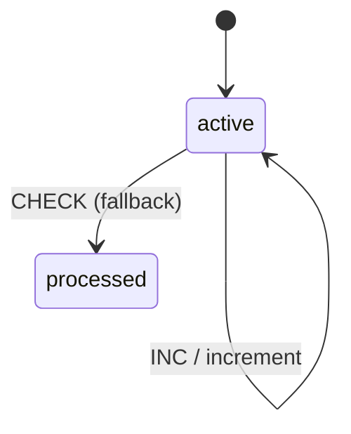

# Guarded Transitions Example

An example demonstrating multi-path transitions with conditional guards.

## Overview

This example shows how to route transitions based on context conditions using arrays of guarded branches.



## Machine Definition

```php
<?php

namespace App\Machines;

use Tarfinlabs\EventMachine\Actor\Machine;
use Tarfinlabs\EventMachine\ContextManager;
use Tarfinlabs\EventMachine\Definition\MachineDefinition;

class GuardedMachine extends Machine
{
    public static function definition(): MachineDefinition
    {
        return MachineDefinition::define(
            config: [
                'initial' => 'active',
                'context' => [
                    'count' => 1,
                ],
                'states' => [
                    'active' => [
                        'on' => [
                            'CHECK' => [
                                // First branch - guarded
                                [
                                    'guards'  => 'isEvenGuard',
                                    'actions' => 'recordAction',
                                ],
                                // Second branch - fallback (no guard)
                                [
                                    'target' => 'processed',
                                ],
                            ],
                            'INC' => [
                                'actions' => 'incrementAction',
                            ],
                        ],
                    ],
                    'processed' => [],
                ],
            ],
            behavior: [
                'guards' => [
                    'isEvenGuard' => function (ContextManager $context): bool {
                        return $context->get('count') % 2 === 0;
                    },
                ],
                'actions' => [
                    'incrementAction' => function (ContextManager $context): void {
                        $context->set('count', $context->get('count') + 1);
                    },
                    'recordAction' => function (ContextManager $context): void {
                        $context->set('recorded', true);
                    },
                ],
            ],
        );
    }
}
```

## How Multi-Path Works

When `CHECK` event is sent:

1. **Evaluate first branch** - If `isEvenGuard` returns `true`, execute `recordAction` and stay in `active`
2. **Evaluate second branch** - If first fails, transition to `processed` (no guard = always passes)

The first matching branch wins.

## Usage

### When Count is Odd

```php
$machine = GuardedMachine::create();

// count = 1 (odd)
expect($machine->state->context->count)->toBe(1);

// Send CHECK
$machine->send(['type' => 'CHECK']);

// First branch fails (1 is not even)
// Second branch runs (fallback)
expect($machine->state->matches('processed'))->toBeTrue();
```

### When Count is Even

```php
$machine = GuardedMachine::create();
$machine->state->context->count = 2;

// count = 2 (even)
$machine->send(['type' => 'CHECK']);

// First branch passes (2 is even)
// recordAction executes, stays in active
expect($machine->state->matches('active'))->toBeTrue();
expect($machine->state->context->recorded)->toBeTrue();
```

### Changing Count Before Check

```php
$machine = GuardedMachine::create();

// count = 1 (odd)
$machine->send(['type' => 'CHECK']);
expect($machine->state->matches('processed'))->toBeTrue();

// Reset for demonstration
$machine = GuardedMachine::create();

// Increment: count = 2 (even)
$machine->send(['type' => 'INC']);
expect($machine->state->context->count)->toBe(2);

// Now CHECK takes first branch
$machine->send(['type' => 'CHECK']);
expect($machine->state->matches('active'))->toBeTrue();
expect($machine->state->context->recorded)->toBeTrue();
```

## Advanced Multi-Path

Three or more branches with different targets:

```php
<?php

namespace App\Machines;

use Tarfinlabs\EventMachine\Actor\Machine;
use Tarfinlabs\EventMachine\ContextManager;
use Tarfinlabs\EventMachine\Definition\MachineDefinition;

class ApprovalMachine extends Machine
{
    public static function definition(): MachineDefinition
    {
        return MachineDefinition::define(
            config: [
                'initial' => 'pending',
                'context' => [
                    'amount' => 0,
                    'user_role' => 'employee',
                ],
                'states' => [
                    'pending' => [
                        'on' => [
                            'SUBMIT' => [
                                // Auto-approve small amounts
                                [
                                    'target' => 'approved',
                                    'guards' => 'isSmallAmount',
                                    'actions' => 'autoApprove',
                                ],
                                // Manager approves medium amounts
                                [
                                    'target' => 'manager_review',
                                    'guards' => 'isMediumAmount',
                                ],
                                // Large amounts need executive approval
                                [
                                    'target' => 'executive_review',
                                    'guards' => 'isLargeAmount',
                                ],
                                // Fallback - reject
                                [
                                    'target' => 'rejected',
                                    'actions' => 'rejectInvalid',
                                ],
                            ],
                        ],
                    ],
                    'manager_review' => [
                        'on' => [
                            'APPROVE' => 'approved',
                            'REJECT' => 'rejected',
                        ],
                    ],
                    'executive_review' => [
                        'on' => [
                            'APPROVE' => 'approved',
                            'REJECT' => 'rejected',
                        ],
                    ],
                    'approved' => [
                        'type' => 'final',
                    ],
                    'rejected' => [
                        'type' => 'final',
                    ],
                ],
            ],
            behavior: [
                'guards' => [
                    'isSmallAmount' => fn(ContextManager $c) =>
                        $c->amount > 0 && $c->amount <= 100,
                    'isMediumAmount' => fn(ContextManager $c) =>
                        $c->amount > 100 && $c->amount <= 1000,
                    'isLargeAmount' => fn(ContextManager $c) =>
                        $c->amount > 1000,
                ],
                'actions' => [
                    'autoApprove' => function (ContextManager $c): void {
                        $c->set('approved_by', 'system');
                        $c->set('approved_at', now()->toDateTimeString());
                    },
                    'rejectInvalid' => function (ContextManager $c): void {
                        $c->set('rejection_reason', 'Invalid amount');
                    },
                ],
            ],
        );
    }
}
```

### Usage

```php
// Small amount - auto-approved
$machine = ApprovalMachine::create();
$machine->state->context->amount = 50;
$machine->send(['type' => 'SUBMIT']);
expect($machine->state->matches('approved'))->toBeTrue();
expect($machine->state->context->approved_by)->toBe('system');

// Medium amount - needs manager
$machine = ApprovalMachine::create();
$machine->state->context->amount = 500;
$machine->send(['type' => 'SUBMIT']);
expect($machine->state->matches('manager_review'))->toBeTrue();

// Large amount - needs executive
$machine = ApprovalMachine::create();
$machine->state->context->amount = 5000;
$machine->send(['type' => 'SUBMIT']);
expect($machine->state->matches('executive_review'))->toBeTrue();

// Invalid amount (0 or negative) - rejected
$machine = ApprovalMachine::create();
$machine->state->context->amount = 0;
$machine->send(['type' => 'SUBMIT']);
expect($machine->state->matches('rejected'))->toBeTrue();
```

## Multiple Guards Per Branch

Combine guards with logical AND:

```php
'SUBMIT' => [
    [
        'target' => 'express_approved',
        'guards' => ['isSmallAmount', 'isPremiumUser'],
        'actions' => 'expressApprove',
    ],
    [
        'target' => 'standard_review',
    ],
],
```

Both guards must pass for the first branch.

## Guard with Calculators

Pre-compute values before guard evaluation:

```php
'SUBMIT' => [
    [
        'target' => 'approved',
        'calculators' => 'calculateRiskScore',
        'guards' => 'isLowRisk',
        'actions' => 'approve',
    ],
    [
        'target' => 'manual_review',
    ],
],
```

## Testing Multi-Path Transitions

```php
use App\Machines\GuardedMachine;
use App\Machines\ApprovalMachine;

it('takes guarded branch when condition met', function () {
    $machine = GuardedMachine::create();
    $machine->state->context->count = 2; // even

    $machine->send(['type' => 'CHECK']);

    expect($machine->state->matches('active'))->toBeTrue();
    expect($machine->state->context->recorded)->toBeTrue();
});

it('takes fallback branch when guard fails', function () {
    $machine = GuardedMachine::create();
    // count = 1 (odd)

    $machine->send(['type' => 'CHECK']);

    expect($machine->state->matches('processed'))->toBeTrue();
});

it('routes to correct approval path', function () {
    // Test each amount threshold
    $testCases = [
        ['amount' => 50, 'expected' => 'approved'],
        ['amount' => 500, 'expected' => 'manager_review'],
        ['amount' => 5000, 'expected' => 'executive_review'],
        ['amount' => 0, 'expected' => 'rejected'],
    ];

    foreach ($testCases as $case) {
        $machine = ApprovalMachine::create();
        $machine->state->context->amount = $case['amount'];
        $machine->send(['type' => 'SUBMIT']);

        expect($machine->state->matches($case['expected']))->toBeTrue();
    }
});
```

## Key Concepts Demonstrated

1. **Multi-Path Transitions** - Array of guarded branches
2. **Branch Priority** - First matching branch wins
3. **Fallback Branches** - Unguarded branches always match
4. **Actions Per Branch** - Each branch can have its own actions
5. **Target Per Branch** - Each branch can have different target states

## Branch Evaluation Order

```
Event Received (CHECK)
     │
     ▼
┌─────────────────────┐
│ Branch 1            │
│ Guard: isEvenGuard  │───► Pass? Execute actions, use target
└─────────────────────┘
     │ Fail
     ▼
┌─────────────────────┐
│ Branch 2            │
│ Guard: (none)       │───► Always passes, use target
└─────────────────────┘
```

## Best Practices

### Always Have a Fallback

```php
// GOOD - Has fallback
'EVENT' => [
    ['target' => 'a', 'guards' => 'conditionA'],
    ['target' => 'b', 'guards' => 'conditionB'],
    ['target' => 'default'], // Fallback
],

// BAD - May not transition
'EVENT' => [
    ['target' => 'a', 'guards' => 'conditionA'],
    ['target' => 'b', 'guards' => 'conditionB'],
    // No fallback - if both fail, nothing happens
],
```

### Order Branches Specifically to Generally

```php
// GOOD - Specific first
'SUBMIT' => [
    ['target' => 'a', 'guards' => ['condA', 'condB', 'condC']], // Most specific
    ['target' => 'b', 'guards' => ['condA', 'condB']],
    ['target' => 'c', 'guards' => 'condA'],
    ['target' => 'd'], // Most general (fallback)
],
```
