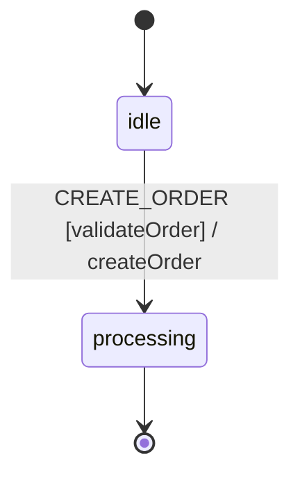

# Order Processing Example

A practical example demonstrating calculators, guards, and actions working together.

## Overview

This example models an order processing workflow with:
- Calculator to modify context before guard evaluation
- Guard to validate the order
- Action to execute the business logic



## Execution Order

When processing the `CREATE_ORDER` event:

1. **Calculators** run first - modify context
2. **Guards** run second - validate with modified context
3. **Actions** run last - perform side effects

## Machine Definition

```php
<?php

namespace App\Machines;

use Tarfinlabs\EventMachine\Actor\Machine;
use Tarfinlabs\EventMachine\ContextManager;
use Tarfinlabs\EventMachine\Behavior\EventBehavior;
use Tarfinlabs\EventMachine\Definition\MachineDefinition;

class OrderMachine extends Machine
{
    public static function definition(): MachineDefinition
    {
        return MachineDefinition::define(
            config: [
                'initial' => 'idle',
                'context' => [
                    'items_count' => 0,
                ],
                'states' => [
                    'idle' => [
                        'on' => [
                            'CREATE_ORDER' => [
                                'target'      => 'processing',
                                'calculators' => 'calculateOrderTotal',
                                'guards'      => 'validateOrder',
                                'actions'     => 'createOrder',
                            ],
                        ],
                    ],
                    'processing' => [],
                ],
            ],
            behavior: [
                'calculators' => [
                    'calculateOrderTotal' => function (ContextManager $context): void {
                        // Modify context BEFORE guard runs
                        $context->items_count *= 10;
                    },
                ],
                'guards' => [
                    'validateOrder' => function (ContextManager $context): bool {
                        // Guard sees MODIFIED context
                        return $context->get('items_count') > 0;
                    },
                ],
                'actions' => [
                    'createOrder' => function (ContextManager $context): void {
                        $context->set('order_created', true);
                    },
                ],
            ],
        );
    }
}
```

## Usage

### Successful Order

```php
$machine = OrderMachine::create();

// Set items_count before sending event
$machine->state->context->items_count = 5;

$machine->send(['type' => 'CREATE_ORDER']);

// Calculator: 5 * 10 = 50
// Guard: 50 > 0 = true (passes)
// Action: order_created = true

expect($machine->state->matches('processing'))->toBeTrue();
expect($machine->state->context->items_count)->toBe(50);
expect($machine->state->context->order_created)->toBeTrue();
```

### Failed Order (Empty Cart)

```php
$machine = OrderMachine::create();

// items_count is 0 (default)
$machine->send(['type' => 'CREATE_ORDER']);

// Calculator: 0 * 10 = 0
// Guard: 0 > 0 = false (fails)
// Action: NOT executed

expect($machine->state->matches('idle'))->toBeTrue();
expect($machine->state->context->has('order_created'))->toBeFalse();
```

## Enhanced Order Machine

A more complete order processing example:

```php
<?php

namespace App\Machines;

use Tarfinlabs\EventMachine\Actor\Machine;
use Tarfinlabs\EventMachine\ContextManager;
use Tarfinlabs\EventMachine\Definition\EventDefinition;
use Tarfinlabs\EventMachine\Definition\MachineDefinition;

class FullOrderMachine extends Machine
{
    public static function definition(): MachineDefinition
    {
        return MachineDefinition::define(
            config: [
                'initial' => 'cart',
                'context' => [
                    'items' => [],
                    'subtotal' => 0,
                    'tax' => 0,
                    'discount' => 0,
                    'total' => 0,
                    'order_id' => null,
                ],
                'states' => [
                    'cart' => [
                        'on' => [
                            'ADD_ITEM' => [
                                'actions' => 'addItem',
                            ],
                            'REMOVE_ITEM' => [
                                'guards' => 'itemExists',
                                'actions' => 'removeItem',
                            ],
                            'CHECKOUT' => [
                                'target' => 'checkout',
                                'guards' => 'hasItems',
                                'calculators' => [
                                    'calculateSubtotal',
                                    'calculateTax',
                                    'calculateTotal',
                                ],
                            ],
                        ],
                    ],
                    'checkout' => [
                        'on' => [
                            'APPLY_DISCOUNT' => [
                                'guards' => 'validDiscount',
                                'calculators' => 'applyDiscount',
                                'actions' => 'recalculateTotal',
                            ],
                            'CONFIRM' => [
                                'target' => 'confirmed',
                                'guards' => 'validTotal',
                                'actions' => 'generateOrderId',
                            ],
                            'BACK_TO_CART' => 'cart',
                        ],
                    ],
                    'confirmed' => [
                        'on' => [
                            'PROCESS_PAYMENT' => [
                                'target' => 'paid',
                                'actions' => 'processPayment',
                            ],
                        ],
                    ],
                    'paid' => [
                        'type' => 'final',
                    ],
                ],
            ],
            behavior: [
                'guards' => [
                    'hasItems' => fn(ContextManager $c) =>
                        count($c->items) > 0,
                    'itemExists' => fn(ContextManager $c, EventDefinition $e) =>
                        isset($c->items[$e->payload['id']]),
                    'validDiscount' => fn(ContextManager $c, EventDefinition $e) =>
                        $e->payload['code'] === 'SAVE10',
                    'validTotal' => fn(ContextManager $c) =>
                        $c->total > 0,
                ],
                'calculators' => [
                    'calculateSubtotal' => function (ContextManager $c): void {
                        $c->subtotal = array_reduce(
                            $c->items,
                            fn($sum, $item) => $sum + ($item['price'] * $item['quantity']),
                            0
                        );
                    },
                    'calculateTax' => function (ContextManager $c): void {
                        $c->tax = $c->subtotal * 0.1; // 10% tax
                    },
                    'calculateTotal' => function (ContextManager $c): void {
                        $c->total = $c->subtotal + $c->tax - $c->discount;
                    },
                    'applyDiscount' => function (ContextManager $c): void {
                        $c->discount = $c->subtotal * 0.1; // 10% discount
                    },
                ],
                'actions' => [
                    'addItem' => function (ContextManager $c, EventDefinition $e): void {
                        $item = $e->payload['item'];
                        $c->items[$item['id']] = $item;
                    },
                    'removeItem' => function (ContextManager $c, EventDefinition $e): void {
                        unset($c->items[$e->payload['id']]);
                    },
                    'recalculateTotal' => function (ContextManager $c): void {
                        $c->total = $c->subtotal + $c->tax - $c->discount;
                    },
                    'generateOrderId' => function (ContextManager $c): void {
                        $c->order_id = 'ORD-' . uniqid();
                    },
                    'processPayment' => function (ContextManager $c): void {
                        $c->set('paid_at', now()->toDateTimeString());
                    },
                ],
            ],
        );
    }
}
```

### Full Order Flow

```php
$order = FullOrderMachine::create();

// Add items
$order->send([
    'type' => 'ADD_ITEM',
    'payload' => [
        'item' => ['id' => 'sku-1', 'name' => 'Widget', 'price' => 100, 'quantity' => 2],
    ],
]);
$order->send([
    'type' => 'ADD_ITEM',
    'payload' => [
        'item' => ['id' => 'sku-2', 'name' => 'Gadget', 'price' => 50, 'quantity' => 1],
    ],
]);

expect($order->state->matches('cart'))->toBeTrue();

// Checkout
$order->send(['type' => 'CHECKOUT']);

expect($order->state->matches('checkout'))->toBeTrue();
expect($order->state->context->subtotal)->toBe(250); // 200 + 50
expect($order->state->context->tax)->toBe(25);        // 10% of 250
expect($order->state->context->total)->toBe(275);     // 250 + 25

// Apply discount
$order->send([
    'type' => 'APPLY_DISCOUNT',
    'payload' => ['code' => 'SAVE10'],
]);

expect($order->state->context->discount)->toBe(25);  // 10% of 250
expect($order->state->context->total)->toBe(250);    // 275 - 25

// Confirm
$order->send(['type' => 'CONFIRM']);

expect($order->state->matches('confirmed'))->toBeTrue();
expect($order->state->context->order_id)->toStartWith('ORD-');

// Pay
$order->send(['type' => 'PROCESS_PAYMENT']);

expect($order->state->matches('paid'))->toBeTrue();
```

## Class-Based Implementation

For better organization:

### Calculators

```php
<?php

namespace App\Machines\Order\Calculators;

use Tarfinlabs\EventMachine\Behavior\CalculatorBehavior;
use App\Machines\Order\OrderContext;

class CalculateSubtotalCalculator extends CalculatorBehavior
{
    public function __invoke(OrderContext $context): void
    {
        $context->subtotal = collect($context->items)
            ->sum(fn($item) => $item['price'] * $item['quantity']);
    }
}

class CalculateTaxCalculator extends CalculatorBehavior
{
    public function __invoke(OrderContext $context): void
    {
        $context->tax = $context->subtotal * $this->taxRate;
    }

    public function __construct(
        private float $taxRate = 0.1
    ) {}
}

class CalculateTotalCalculator extends CalculatorBehavior
{
    public function __invoke(OrderContext $context): void
    {
        $context->total = $context->subtotal + $context->tax - $context->discount;
    }
}
```

### Guards

```php
<?php

namespace App\Machines\Order\Guards;

use Tarfinlabs\EventMachine\Behavior\GuardBehavior;
use App\Machines\Order\OrderContext;

class HasItemsGuard extends GuardBehavior
{
    public function __invoke(OrderContext $context): bool
    {
        return count($context->items) > 0;
    }
}

class ValidTotalGuard extends GuardBehavior
{
    public function __invoke(OrderContext $context): bool
    {
        return $context->total > 0;
    }
}
```

## Testing

```php
use App\Machines\OrderMachine;

it('uses calculators before guards', function () {
    $machine = OrderMachine::create();

    // items_count = 1 (before calculator)
    $machine->state->context->items_count = 1;

    $machine->send(['type' => 'CREATE_ORDER']);

    // Calculator runs: 1 * 10 = 10
    // Guard runs: 10 > 0 = true
    expect($machine->state->matches('processing'))->toBeTrue();
    expect($machine->state->context->items_count)->toBe(10);
});

it('blocks transition when guard fails', function () {
    $machine = OrderMachine::create();

    // items_count = 0
    $machine->send(['type' => 'CREATE_ORDER']);

    // Calculator runs: 0 * 10 = 0
    // Guard runs: 0 > 0 = false
    expect($machine->state->matches('idle'))->toBeTrue();
});

it('executes actions after successful guard', function () {
    $machine = OrderMachine::create();
    $machine->state->context->items_count = 5;

    $machine->send(['type' => 'CREATE_ORDER']);

    expect($machine->state->context->order_created)->toBeTrue();
});
```

## Key Concepts Demonstrated

1. **Calculators Run First** - Modify context before guards evaluate
2. **Guards Validate** - Use modified context for decisions
3. **Actions Execute Last** - Only when transition succeeds
4. **Chained Calculations** - Multiple calculators in sequence
5. **Event Payloads** - Pass data to actions

## Execution Flow

```
Event Received
     │
     ▼
┌─────────────┐
│ Calculators │ ← Modify context
└─────────────┘
     │
     ▼
┌─────────────┐
│   Guards    │ ← Validate (with modified context)
└─────────────┘
     │
     ▼ (if guards pass)
┌─────────────┐
│   Actions   │ ← Execute side effects
└─────────────┘
     │
     ▼
  Transition
```
