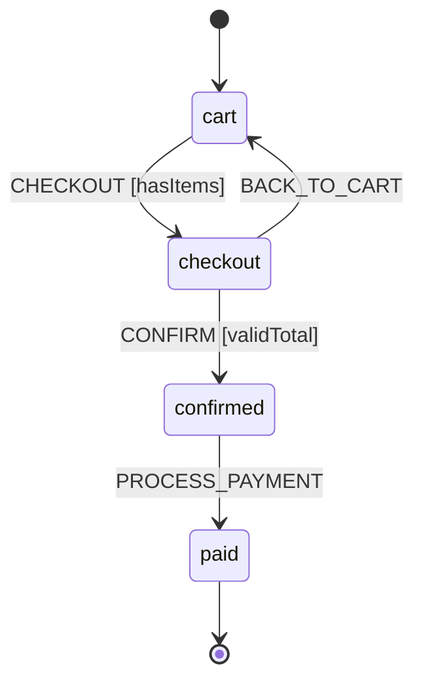
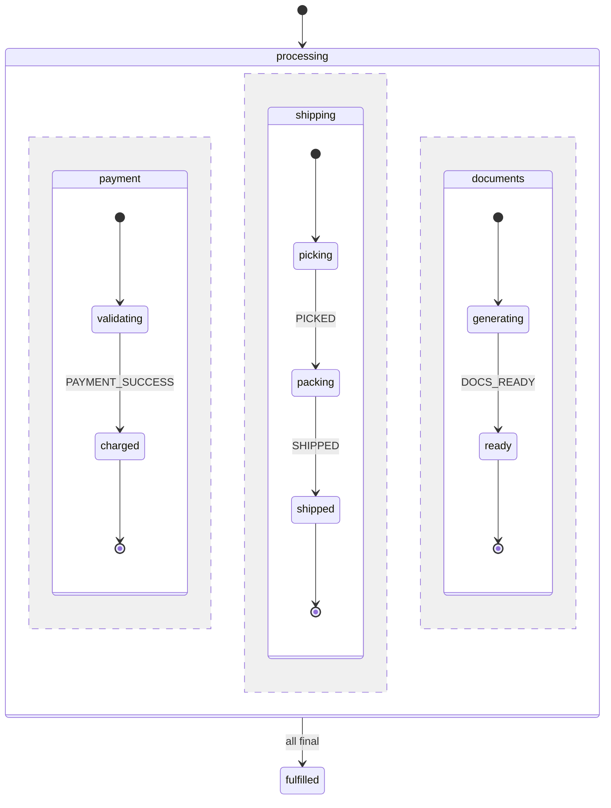

# Real-World Examples

Complete business workflow examples with multi-step processes.

## Order Processing

A shopping cart workflow with calculators, guards, and multi-state transitions.



```php no_run
<?php

namespace App\Machines;

use Tarfinlabs\EventMachine\Actor\Machine;
use Tarfinlabs\EventMachine\ContextManager;
use Tarfinlabs\EventMachine\Definition\EventDefinition;
use Tarfinlabs\EventMachine\Definition\MachineDefinition;

class OrderMachine extends Machine
{
    public static function definition(): MachineDefinition
    {
        return MachineDefinition::define(
            config: [
                'initial' => 'cart',
                'context' => [
                    'items' => [],
                    'subtotal' => 0,
                    'tax' => 0,
                    'discount' => 0,
                    'total' => 0,
                    'order_id' => null,
                ],
                'states' => [
                    'cart' => [
                        'on' => [
                            'ADD_ITEM' => ['actions' => 'addItem'],
                            'REMOVE_ITEM' => [
                                'guards' => 'itemExists',
                                'actions' => 'removeItem',
                            ],
                            'CHECKOUT' => [
                                'target' => 'checkout',
                                'guards' => 'hasItems',
                                'calculators' => [
                                    'calculateSubtotal',
                                    'calculateTax',
                                    'calculateTotal',
                                ],
                            ],
                        ],
                    ],
                    'checkout' => [
                        'on' => [
                            'APPLY_DISCOUNT' => [
                                'guards' => 'validDiscount',
                                'calculators' => 'applyDiscount',
                                'actions' => 'recalculateTotal',
                            ],
                            'CONFIRM' => [
                                'target' => 'confirmed',
                                'guards' => 'validTotal',
                                'actions' => 'generateOrderId',
                            ],
                            'BACK_TO_CART' => 'cart',
                        ],
                    ],
                    'confirmed' => [
                        'on' => [
                            'PROCESS_PAYMENT' => [
                                'target' => 'paid',
                                'actions' => 'processPayment',
                            ],
                        ],
                    ],
                    'paid' => ['type' => 'final'],
                ],
            ],
            behavior: [
                'guards' => [
                    'hasItems' => fn(ContextManager $c) => count($c->items) > 0,
                    'itemExists' => fn(ContextManager $c, EventDefinition $e)
                        => isset($c->items[$e->payload['id']]),
                    'validDiscount' => fn(ContextManager $c, EventDefinition $e)
                        => $e->payload['code'] === 'SAVE10',
                    'validTotal' => fn(ContextManager $c) => $c->total > 0,
                ],
                'calculators' => [
                    'calculateSubtotal' => function (ContextManager $c): void {
                        $c->subtotal = array_reduce(
                            $c->items,
                            fn($sum, $item) => $sum + ($item['price'] * $item['quantity']),
                            0
                        );
                    },
                    'calculateTax' => fn(ContextManager $c) => $c->tax = $c->subtotal * 0.1,
                    'calculateTotal' => fn(ContextManager $c)
                        => $c->total = $c->subtotal + $c->tax - $c->discount,
                    'applyDiscount' => fn(ContextManager $c)
                        => $c->discount = $c->subtotal * 0.1,
                ],
                'actions' => [
                    'addItem' => function (ContextManager $c, EventDefinition $e): void {
                        $item = $e->payload['item'];
                        $c->items[$item['id']] = $item;
                    },
                    'removeItem' => function (ContextManager $c, EventDefinition $e): void {
                        unset($c->items[$e->payload['id']]);
                    },
                    'recalculateTotal' => fn(ContextManager $c)
                        => $c->total = $c->subtotal + $c->tax - $c->discount,
                    'generateOrderId' => fn(ContextManager $c)
                        => $c->order_id = 'ORD-' . uniqid(),
                    'processPayment' => fn(ContextManager $c)
                        => $c->set('paid_at', now()->toDateTimeString()),
                ],
            ],
        );
    }
}
```

### Usage

```php no_run
$order = OrderMachine::create();

// Add items
$order->send([
    'type' => 'ADD_ITEM',
    'payload' => [
        'item' => ['id' => 'sku-1', 'name' => 'Widget', 'price' => 100, 'quantity' => 2],
    ],
]);

// Checkout - calculators run automatically
$order->send(['type' => 'CHECKOUT']);
expect($order->state->context->subtotal)->toBe(200);
expect($order->state->context->tax)->toBe(20);

// Apply discount and confirm
$order->send(['type' => 'APPLY_DISCOUNT', 'payload' => ['code' => 'SAVE10']]);
$order->send(['type' => 'CONFIRM']);
$order->send(['type' => 'PROCESS_PAYMENT']);

expect($order->state->matches('paid'))->toBeTrue();
```

---

## Parallel Order Fulfillment

Concurrent processing where payment, shipping, and documents must all complete.



```php no_run
<?php

namespace App\Machines;

use Tarfinlabs\EventMachine\Actor\Machine;
use Tarfinlabs\EventMachine\ContextManager;
use Tarfinlabs\EventMachine\Behavior\EventBehavior;
use Tarfinlabs\EventMachine\Definition\MachineDefinition;

class OrderFulfillmentMachine extends Machine
{
    public static function definition(): MachineDefinition
    {
        return MachineDefinition::define(
            config: [
                'id' => 'orderFulfillment',
                'initial' => 'processing',
                'context' => [
                    'order_id' => null,
                    'payment_id' => null,
                    'tracking_number' => null,
                ],
                'states' => [
                    'processing' => [
                        'type' => 'parallel',
                        'onDone' => [
                            'target' => 'fulfilled',
                            'actions' => 'sendFulfillmentNotification',
                        ],
                        'on' => [
                            'CANCEL' => [
                                'target' => 'cancelled',
                                'actions' => 'handleCancellation',
                            ],
                        ],
                        'states' => [
                            'payment' => [
                                'initial' => 'validating',
                                'states' => [
                                    'validating' => [
                                        'on' => [
                                            'PAYMENT_SUCCESS' => [
                                                'target' => 'charged',
                                                'actions' => 'recordPayment',
                                            ],
                                            'PAYMENT_FAILED' => 'failed',
                                        ],
                                    ],
                                    'charged' => ['type' => 'final'],
                                    'failed' => [
                                        'on' => ['RETRY_PAYMENT' => 'validating'],
                                    ],
                                ],
                            ],
                            'shipping' => [
                                'initial' => 'picking',
                                'states' => [
                                    'picking' => [
                                        'on' => ['PICKED' => 'packing'],
                                    ],
                                    'packing' => [
                                        'on' => ['PACKED' => 'readyToShip'],
                                    ],
                                    'readyToShip' => [
                                        'on' => [
                                            'SHIPPED' => [
                                                'target' => 'shipped',
                                                'actions' => 'recordTrackingNumber',
                                            ],
                                        ],
                                    ],
                                    'shipped' => ['type' => 'final'],
                                ],
                            ],
                            'documents' => [
                                'initial' => 'generating',
                                'states' => [
                                    'generating' => [
                                        'on' => ['DOCS_READY' => 'ready'],
                                    ],
                                    'ready' => ['type' => 'final'],
                                ],
                            ],
                        ],
                    ],
                    'fulfilled' => ['type' => 'final'],
                    'cancelled' => ['type' => 'final'],
                ],
            ],
            behavior: [
                'actions' => [
                    'recordPayment' => fn(ContextManager $c, EventBehavior $e)
                        => $c->set('payment_id', $e->payload['payment_id']),
                    'recordTrackingNumber' => fn(ContextManager $c, EventBehavior $e)
                        => $c->set('tracking_number', $e->payload['tracking_number']),
                    'sendFulfillmentNotification' => fn(ContextManager $c)
                        => NotificationService::sendFulfillmentComplete($c->get('order_id')),
                    'handleCancellation' => function (ContextManager $c): void {
                        if ($c->get('payment_id')) {
                            PaymentService::refund($c->get('payment_id'));
                        }
                    },
                ],
            ],
        );
    }
}
```

### Usage

```php no_run
$machine = OrderFulfillmentMachine::create();
$machine->state->context->set('order_id', $order->id);

// Events can arrive in any order - each region processes independently
$machine->send(['type' => 'DOCS_READY']);
$machine->send(['type' => 'PAYMENT_SUCCESS', 'payload' => ['payment_id' => 'pay_123']]);
$machine->send(['type' => 'PICKED']);
$machine->send(['type' => 'PACKED']);
$machine->send(['type' => 'SHIPPED', 'payload' => ['tracking_number' => '1Z999...']]);

// All regions final - automatically transitions to 'fulfilled'
expect($machine->state->matches('fulfilled'))->toBeTrue();
```

### Check Region Status

```php no_run
// Check individual regions
$state->matches('processing.payment.charged');   // true
$state->matches('processing.shipping.packing');  // true

// Cancel from any state
$machine->send(['type' => 'CANCEL']);
expect($machine->state->matches('cancelled'))->toBeTrue();
```
