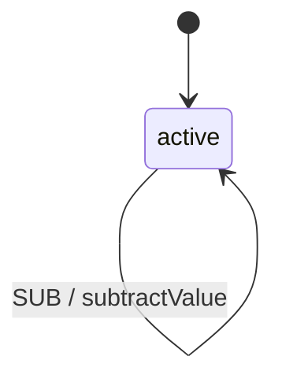

# Traffic Lights Example

A comprehensive example demonstrating custom context classes, typed behaviors, events, guards, and actions.

## Overview

This example models a traffic light counter system with:
- Custom typed context class with validation
- Multiple event types (INC, DEX, MUT, ADD, SUB)
- Validation guard with error messages
- Type-safe actions using custom context



## Custom Context Class

```php
<?php

namespace App\Machines\TrafficLights;

use Spatie\LaravelData\Optional;
use Tarfinlabs\EventMachine\ContextManager;
use Spatie\LaravelData\Attributes\Validation\Min;
use Spatie\LaravelData\Attributes\Validation\IntegerType;

class TrafficLightsContext extends ContextManager
{
    public function __construct(
        #[IntegerType]
        #[Min(0)]
        public int|Optional $count,
    ) {
        parent::__construct();

        // Set default value if not provided
        if ($this->count instanceof Optional) {
            $this->count = 0;
        }
    }

    /**
     * Helper method for business logic.
     */
    public function isCountEven(): bool
    {
        return $this->count % 2 === 0;
    }
}
```

## Event Classes

### Increase Event

```php
<?php

namespace App\Machines\TrafficLights\Events;

use Tarfinlabs\EventMachine\Behavior\EventBehavior;

class IncreaseEvent extends EventBehavior
{
    public static function getType(): string
    {
        return 'INC';
    }
}
```

### Multiply Event

```php
<?php

namespace App\Machines\TrafficLights\Events;

use Tarfinlabs\EventMachine\Behavior\EventBehavior;

class MultiplyEvent extends EventBehavior
{
    public static function getType(): string
    {
        return 'MUT';
    }

    public function validatePayload(): ?array
    {
        return [
            'factor' => ['sometimes', 'integer', 'min:1'],
        ];
    }
}
```

### Add Value Event

```php
<?php

namespace App\Machines\TrafficLights\Events;

use Tarfinlabs\EventMachine\Behavior\EventBehavior;

class AddValueEvent extends EventBehavior
{
    public static function getType(): string
    {
        return 'ADD';
    }

    public function validatePayload(): ?array
    {
        return [
            'value' => ['required', 'integer'],
        ];
    }
}
```

## Validation Guard

```php
<?php

namespace App\Machines\TrafficLights\Guards;

use Tarfinlabs\EventMachine\Behavior\ValidationGuardBehavior;
use App\Machines\TrafficLights\TrafficLightsContext;

class IsEvenGuard extends ValidationGuardBehavior
{
    public ?string $errorMessage = 'Count is not even';
    public bool $shouldLog = true;

    public function __invoke(TrafficLightsContext $context): bool
    {
        return $context->count % 2 === 0;
    }
}
```

## Action Classes

### Increment Action

```php
<?php

namespace App\Machines\TrafficLights\Actions;

use Tarfinlabs\EventMachine\Behavior\ActionBehavior;
use App\Machines\TrafficLights\TrafficLightsContext;

class IncrementAction extends ActionBehavior
{
    public function __invoke(TrafficLightsContext $context): void
    {
        $context->count++;
    }
}
```

### Decrement Action

```php
<?php

namespace App\Machines\TrafficLights\Actions;

use Tarfinlabs\EventMachine\Behavior\ActionBehavior;
use App\Machines\TrafficLights\TrafficLightsContext;

class DecrementAction extends ActionBehavior
{
    public function __invoke(TrafficLightsContext $context): void
    {
        $context->count--;
    }
}
```

### Multiply By Two Action

```php
<?php

namespace App\Machines\TrafficLights\Actions;

use Tarfinlabs\EventMachine\Behavior\ActionBehavior;
use App\Machines\TrafficLights\TrafficLightsContext;

class MultiplyByTwoAction extends ActionBehavior
{
    public function __invoke(TrafficLightsContext $context): void
    {
        $context->count *= 2;
    }
}
```

### Add Value Action

```php
<?php

namespace App\Machines\TrafficLights\Actions;

use Tarfinlabs\EventMachine\Behavior\ActionBehavior;
use Tarfinlabs\EventMachine\Behavior\EventBehavior;
use App\Machines\TrafficLights\TrafficLightsContext;

class AddValueAction extends ActionBehavior
{
    public function __invoke(
        TrafficLightsContext $context,
        EventBehavior $event
    ): void {
        $context->count += $event->payload['value'];
    }
}
```

## Machine Definition

```php
<?php

namespace App\Machines\TrafficLights;

use Tarfinlabs\EventMachine\Actor\Machine;
use Tarfinlabs\EventMachine\ContextManager;
use Tarfinlabs\EventMachine\Behavior\EventBehavior;
use Tarfinlabs\EventMachine\Definition\MachineDefinition;
use App\Machines\TrafficLights\Guards\IsEvenGuard;
use App\Machines\TrafficLights\Events\AddValueEvent;
use App\Machines\TrafficLights\Events\IncreaseEvent;
use App\Machines\TrafficLights\Events\MultiplyEvent;
use App\Machines\TrafficLights\Actions\AddValueAction;
use App\Machines\TrafficLights\Actions\DecrementAction;
use App\Machines\TrafficLights\Actions\IncrementAction;
use App\Machines\TrafficLights\Actions\MultiplyByTwoAction;

class TrafficLightsMachine extends Machine
{
    public static function definition(): MachineDefinition
    {
        return MachineDefinition::define(
            config: [
                'initial' => 'active',
                'context' => TrafficLightsContext::class,
                'states'  => [
                    'active' => [
                        'on' => [
                            // Guarded multiply - only when count is even
                            'MUT' => [
                                'guards'  => IsEvenGuard::class,
                                'actions' => [
                                    MultiplyByTwoAction::class,
                                    'doNothingAction', // Inline closure
                                ],
                            ],
                            // Event class as key - auto-registered
                            IncreaseEvent::class => [
                                'actions' => IncrementAction::class
                            ],
                            // String event type
                            'DEX' => [
                                'actions' => DecrementAction::class
                            ],
                            // Event with payload
                            AddValueEvent::class => [
                                'actions' => AddValueAction::class
                            ],
                        ],
                    ],
                ],
            ],
            behavior: [
                'events' => [
                    'MUT' => MultiplyEvent::class,
                ],
                'actions' => [
                    'doNothingAction' => function (): void {
                        // Inline action - does nothing
                    },
                ],
            ],
        );
    }
}
```

## Usage Examples

### Basic Operations

```php
// Create machine
$machine = TrafficLightsMachine::create();

// Initial state
expect($machine->state->context->count)->toBe(0);
expect($machine->state->matches('active'))->toBeTrue();

// Increment
$machine->send(['type' => 'INC']);
expect($machine->state->context->count)->toBe(1);

// Decrement
$machine->send(['type' => 'DEX']);
expect($machine->state->context->count)->toBe(0);
```

### Using Event Classes

```php
use App\Machines\TrafficLights\Events\IncreaseEvent;
use App\Machines\TrafficLights\Events\AddValueEvent;

$machine = TrafficLightsMachine::create();

// Send using event class
$machine->send(IncreaseEvent::class);
expect($machine->state->context->count)->toBe(1);

// Send with payload
$machine->send([
    'type' => AddValueEvent::class,
    'payload' => ['value' => 10],
]);
expect($machine->state->context->count)->toBe(11);
```

### Guarded Transitions

```php
$machine = TrafficLightsMachine::create();

// Count is 0 (even) - multiply works
$machine->send(['type' => 'MUT']);
expect($machine->state->context->count)->toBe(0); // 0 * 2 = 0

// Increment to 1
$machine->send(['type' => 'INC']);
expect($machine->state->context->count)->toBe(1);

// Count is 1 (odd) - multiply blocked by guard
try {
    $machine->send(['type' => 'MUT']);
} catch (MachineValidationException $e) {
    expect($e->getMessage())->toContain('Count is not even');
}
```

### Context Helper Methods

```php
$machine = TrafficLightsMachine::create();

// Use context helper method
expect($machine->state->context->isCountEven())->toBeTrue();

$machine->send(['type' => 'INC']);
expect($machine->state->context->isCountEven())->toBeFalse();
```

## Testing

```php
use App\Machines\TrafficLights\TrafficLightsMachine;
use App\Machines\TrafficLights\Actions\IncrementAction;
use App\Machines\TrafficLights\Guards\IsEvenGuard;

it('increments count', function () {
    $machine = TrafficLightsMachine::create();

    $machine->send(['type' => 'INC']);
    $machine->send(['type' => 'INC']);

    expect($machine->state->context->count)->toBe(2);
});

it('uses typed context', function () {
    $machine = TrafficLightsMachine::create();

    expect($machine->state->context)
        ->toBeInstanceOf(TrafficLightsContext::class);
});

it('blocks multiply when odd', function () {
    $machine = TrafficLightsMachine::create();
    $machine->send(['type' => 'INC']); // count = 1

    expect(fn() => $machine->send(['type' => 'MUT']))
        ->toThrow(MachineValidationException::class);
});

it('allows multiply when even', function () {
    $machine = TrafficLightsMachine::create();
    $machine->send(['type' => 'INC']); // count = 1
    $machine->send(['type' => 'INC']); // count = 2

    $machine->send(['type' => 'MUT']);

    expect($machine->state->context->count)->toBe(4);
});
```

## Key Concepts Demonstrated

1. **Custom Context Class** - Type-safe context with validation attributes
2. **Event Behavior Classes** - Reusable event definitions with validation
3. **Validation Guard** - Guard with error message when condition fails
4. **Typed Actions** - Actions using custom context type hints
5. **Mixed Behavior Registration** - Both class-based and inline behaviors
6. **Event Class Keys** - Using event classes directly as transition keys
