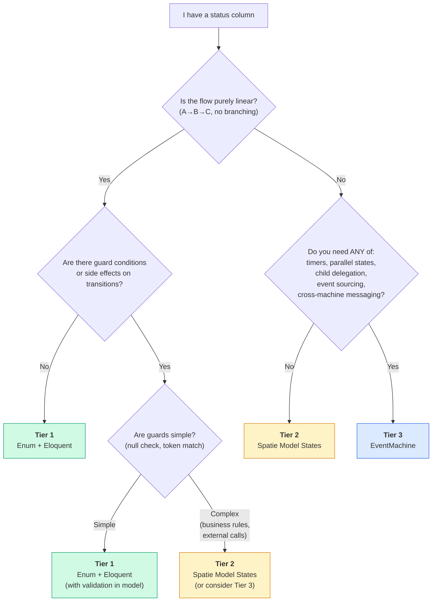

# When Not to Use a State Machine

Not every status column needs a state machine.

Consider a blog post with three statuses: `draft`, `published`, and `archived`. The flow is linear — a post moves forward through these stages, one at a time, with no branching, no conditions, and no side effects. An enum and a `publish()` method on the model are perfectly fine for this.

EventMachine is a powerful tool, but powerful tools have a cost: configuration, persistence, event sourcing infrastructure. When the problem is simple, the solution should be too.

::: info
David Khourshid, the creator of [XState](https://stately.ai/docs/xstate) (the JavaScript library that inspired EventMachine), puts it well: _"You don't need a library for state machines."_ A simple `switch` statement or an enum with a few methods is already a state machine — just an informal one.
:::

## Three Tiers of State Management

State management isn't binary — it's a spectrum. Not every status column needs EventMachine, but not every status column should stay a bare enum forever either.

| Tier | Tool | Enforcement | History | Best For |
|------|------|-------------|---------|----------|
| 1 | Status enum + Eloquent | None | None | Linear progression, ≤4 states, informational status |
| 2 | [Spatie Model States](https://spatie.be/docs/laravel-model-states) | Transition rules | Optional | 4–10 states, transition validation, state-specific behavior |
| 3 | EventMachine | Full statechart | Built-in event sourcing | Branching, guards, timers, delegation, audit trail |

To see the difference in practice, here is the same invoice lifecycle (`draft → sent → paid`) at each tier.

### Tier 1: Enum + Eloquent

```php no_run
enum InvoiceStatus: string
{
    case Draft = 'draft';
    case Sent  = 'sent';
    case Paid  = 'paid';
}

class Invoice extends Model
{
    protected $casts = ['status' => InvoiceStatus::class];

    public function markAsSent(): void
    {
        if ($this->status !== InvoiceStatus::Draft) {
            throw new \LogicException('Only draft invoices can be sent.');
        }

        $this->update(['status' => InvoiceStatus::Sent]);
    }

    public function markAsPaid(): void
    {
        if ($this->status !== InvoiceStatus::Sent) {
            throw new \LogicException('Only sent invoices can be marked as paid.');
        }

        $this->update(['status' => InvoiceStatus::Paid]);
    }
}
```

Simple, readable, no dependencies. For a three-state linear flow, this is the right choice.

### Tier 2: Spatie Model States

```php no_run
use Spatie\ModelStates\State;
use Spatie\ModelStates\StateConfig;

abstract class InvoiceState extends State
{
    public static function config(): StateConfig
    {
        return parent::config()
            ->default(DraftState::class)
            ->allowTransition(DraftState::class, SentState::class)
            ->allowTransition(SentState::class, PaidState::class);
    }
}

// Usage:
$invoice->status->transitionTo(SentState::class);
```

Adds transition enforcement and state-specific behavior. Useful when you have more states or need polymorphic methods per state.

### Tier 3: EventMachine

```php no_run
use Tarfinlabs\EventMachine\Actor\Machine;
use Tarfinlabs\EventMachine\Definition\MachineDefinition;

class InvoiceMachine extends Machine
{
    public static function definition(): MachineDefinition
    {
        return MachineDefinition::define(
            config: [
                'id'      => 'invoice',
                'initial' => 'draft',
                'context' => ['invoice_id' => null],
                'states'  => [
                    'draft' => [
                        'on' => [
                            'SEND' => 'sent',
                        ],
                    ],
                    'sent' => [
                        'on' => [
                            'PAY' => 'paid',
                        ],
                    ],
                    'paid' => [
                        'type' => 'final',
                    ],
                ],
            ],
        );
    }
}
```

This works, but it's overkill for a three-state linear flow. You get event sourcing, persistence, and a full state graph — none of which this invoice needs. The Tier 1 enum does the same job in fewer lines with no infrastructure.

**Use the lowest tier that meets your needs.** Each tier adds power _and_ complexity.

## Do I Need a State Machine?

Use this flowchart when you see a status column and wonder whether it deserves a state machine.



### Quick Reference

If you already know what you need, this table gives you the minimum tier:

| If you need... | You need at least... |
|----------------|---------------------|
| Track current status | Tier 1 — Enum |
| Enforce allowed transitions | Tier 2 — Spatie |
| State-specific behavior (polymorphic methods) | Tier 2 — Spatie |
| Complete transition history / audit trail | Tier 3 — EventMachine |
| Time-based automation (expiry, reminders) | Tier 3 — EventMachine |
| Parallel regions (concurrent flows) | Tier 3 — EventMachine |
| Child machine delegation / orchestration | Tier 3 — EventMachine |
| Cross-machine communication | Tier 3 — EventMachine |
| Rebuild state from any point in time | Tier 3 — EventMachine |

## The Implicit State Machine

There is a strong counter-argument to everything above, and it deserves a fair hearing:

> _"Every system with a status column already HAS a state machine. The question is whether it's explicit (well-defined, enforced) or implicit (scattered if/else, bug-prone)."_
>
> — [Finite State Machines: The Developer's Bug Spray](https://blog.scottlogic.com/2020/12/08/finite-state-machines.html), Scott Logic

This is true. Even the Tier 1 enum example above is a state machine — it just happens to be implemented with `if` statements instead of a formal definition. The question is: at what point does the informal version become a liability?

Here is how it typically plays out, using the blog post example:

1. **Day 1:** `$post->status = 'published'` — anyone can set any value, no validation.
2. **First bug:** Someone publishes an archived post. Users see a "new" post that was archived months ago.
3. **Quick fix:** Add `if ($this->status !== PostStatus::Draft) throw ...` in the `publish()` method.
4. **Second bug:** A scheduled job also publishes posts but bypasses the model method — it runs a direct query.
5. **More fixes:** The same if/else appears in the controller, the job, the observer, and the API resource.
6. **Breaking point:** Five files now contain status validation logic. A new developer joins and asks: _"Can an archived post go back to draft?"_ Nobody is sure.

The implicit state machine was fine at step 1. It became a liability somewhere around step 5 — when the validation logic was scattered across multiple files and no single place defined the complete set of allowed transitions.

**That is the moment to formalize.** Whether you reach for Tier 2 (Spatie) or Tier 3 (EventMachine) depends on what else you need — see the flowchart above.
