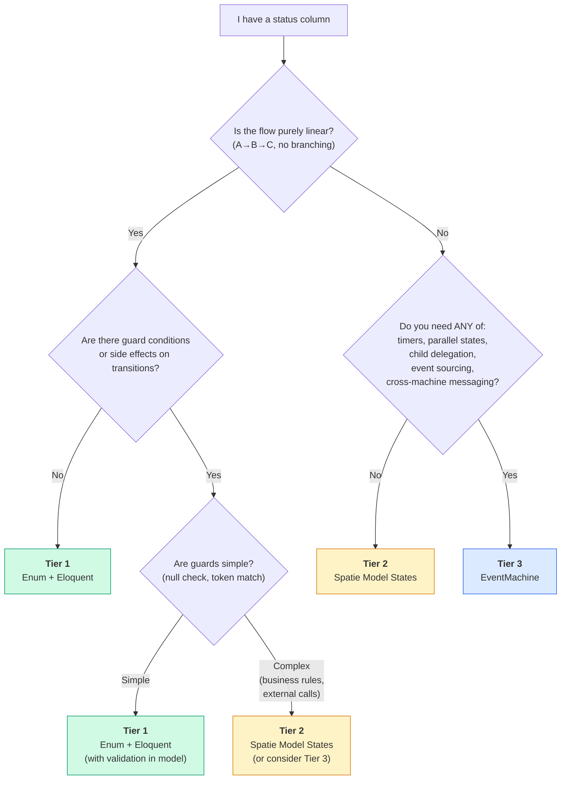

# When Not to Use a State Machine

Not every status column needs a state machine.

Consider a blog post with three statuses: `draft`, `published`, and `archived`. The flow is linear — a post moves forward through these stages, one at a time, with no branching, no conditions, and no side effects. An enum and a `publish()` method on the model are perfectly fine for this.

EventMachine is a powerful tool, but powerful tools have a cost: configuration, persistence, event sourcing infrastructure. When the problem is simple, the solution should be too.

::: info
David Khourshid, the creator of [XState](https://stately.ai/docs/xstate) (the JavaScript library that inspired EventMachine), puts it well: _"You don't need a library for state machines."_ A simple `switch` statement or an enum with a few methods is already a state machine — just an informal one.
:::

## Three Tiers of State Management

State management isn't binary — it's a spectrum. Not every status column needs EventMachine, but not every status column should stay a bare enum forever either.

| Tier | Tool | Enforcement | History | Best For |
|------|------|-------------|---------|----------|
| 1 | Status enum + Eloquent | None | None | Linear progression, ≤4 states, informational status |
| 2 | [Spatie Model States](https://spatie.be/docs/laravel-model-states) | Transition rules | Optional | 4–10 states, transition validation, state-specific behavior |
| 3 | EventMachine | Full statechart | Built-in event sourcing | Branching, guards, timers, delegation, audit trail |

To see the difference in practice, here is the same invoice lifecycle (`draft → sent → paid`) at each tier.

### Tier 1: Enum + Eloquent

```php no_run
enum InvoiceStatus: string
{
    case Draft = 'draft';
    case Sent  = 'sent';
    case Paid  = 'paid';
}

class Invoice extends Model
{
    protected $casts = ['status' => InvoiceStatus::class];

    public function markAsSent(): void
    {
        if ($this->status !== InvoiceStatus::Draft) {
            throw new \LogicException('Only draft invoices can be sent.');
        }

        $this->update(['status' => InvoiceStatus::Sent]);
    }

    public function markAsPaid(): void
    {
        if ($this->status !== InvoiceStatus::Sent) {
            throw new \LogicException('Only sent invoices can be marked as paid.');
        }

        $this->update(['status' => InvoiceStatus::Paid]);
    }
}
```

Simple, readable, no dependencies. For a three-state linear flow, this is the right choice.

### Tier 2: Spatie Model States

```php no_run
use Spatie\ModelStates\State;
use Spatie\ModelStates\StateConfig;

abstract class InvoiceState extends State
{
    public static function config(): StateConfig
    {
        return parent::config()
            ->default(DraftState::class)
            ->allowTransition(DraftState::class, SentState::class)
            ->allowTransition(SentState::class, PaidState::class);
    }
}

// Usage:
$invoice->status->transitionTo(SentState::class);
```

Adds transition enforcement and state-specific behavior. Useful when you have more states or need polymorphic methods per state.

### Tier 3: EventMachine

```php no_run
use Tarfinlabs\EventMachine\Actor\Machine;
use Tarfinlabs\EventMachine\Definition\MachineDefinition;

class InvoiceMachine extends Machine
{
    public static function definition(): MachineDefinition
    {
        return MachineDefinition::define(
            config: [
                'id'      => 'invoice',
                'initial' => 'draft',
                'context' => ['invoiceId' => null],
                'states'  => [
                    'draft' => [
                        'on' => [
                            'SEND' => 'sent',
                        ],
                    ],
                    'sent' => [
                        'on' => [
                            'PAY' => 'paid',
                        ],
                    ],
                    'paid' => [
                        'type' => 'final',
                    ],
                ],
            ],
        );
    }
}
```

This works, but it's overkill for a three-state linear flow. You get event sourcing, persistence, and a full state graph — none of which this invoice needs. The Tier 1 enum does the same job in fewer lines with no infrastructure.

**Use the lowest tier that meets your needs.** Each tier adds power _and_ complexity.

## Do I Need a State Machine?

Use this flowchart when you see a status column and wonder whether it deserves a state machine.



### Quick Reference

If you already know what you need, this table gives you the minimum tier:

| If you need... | You need at least... |
|----------------|---------------------|
| Track current status | Tier 1 — Enum |
| Enforce allowed transitions | Tier 2 — Spatie |
| State-specific behavior (polymorphic methods) | Tier 2 — Spatie |
| Complete transition history / audit trail | Tier 3 — EventMachine |
| Time-based automation (expiry, reminders) | Tier 3 — EventMachine |
| Parallel regions (concurrent flows) | Tier 3 — EventMachine |
| Child machine delegation / orchestration | Tier 3 — EventMachine |
| Cross-machine communication | Tier 3 — EventMachine |
| Rebuild state from any point in time | Tier 3 — EventMachine |

## The Implicit State Machine

There is a strong counter-argument to everything above, and it deserves a fair hearing:

> _"Every system with a status column already HAS a state machine. The question is whether it's explicit (well-defined, enforced) or implicit (scattered if/else, bug-prone)."_
>
> — [Finite State Machines: The Developer's Bug Spray](https://blog.scottlogic.com/2020/12/08/finite-state-machines.html), Scott Logic

This is true. Even the Tier 1 enum example above is a state machine — it just happens to be implemented with `if` statements instead of a formal definition. The question is: at what point does the informal version become a liability?

Here is how it typically plays out, using the blog post example:

1. **Day 1:** `$post->status = 'published'` — anyone can set any value, no validation.
2. **First bug:** Someone publishes an archived post. Users see a "new" post that was archived months ago.
3. **Quick fix:** Add `if ($this->status !== PostStatus::Draft) throw ...` in the `publish()` method.
4. **Second bug:** A scheduled job also publishes posts but bypasses the model method — it runs a direct query.
5. **More fixes:** The same if/else appears in the controller, the job, the observer, and the API resource.
6. **Breaking point:** Five files now contain status validation logic. A new developer joins and asks: _"Can an archived post go back to draft?"_ Nobody is sure.

The implicit state machine was fine at step 1. It became a liability somewhere around step 5 — when the validation logic was scattered across multiple files and no single place defined the complete set of allowed transitions.

**That is the moment to formalize.** Whether you reach for Tier 2 (Spatie) or Tier 3 (EventMachine) depends on what else you need — see the flowchart above.

## Overkill Signals

If you recognize any of these patterns, a state machine is probably adding ceremony without value.

### The Linear Pipeline

```
draft → published → archived
```

Three states, one direction, no branching. An enum and a method per transition is clearer than a full machine definition.

### The CRUD Wrapper

The "machine" just wraps `$model->update(['status' => 'x'])` with no guards, no actions, no side effects. All you have added is indirection — the machine definition is longer than the code it replaces.

### The External-Only Machine

Every transition is triggered by an HTTP request or a simple method call. The machine never self-progresses, never fires timers, never spawns children. A controller with a `match` statement does the same job with less ceremony.

### The Two-State Toggle

`active ↔ inactive`, `enabled ↔ disabled`, `published ↔ unpublished`. This is a boolean in disguise. A state machine for a two-state toggle is like using a crane to lift a coffee cup.

### The Copy-Paste Machine

A developer sees an EventMachine in the project and creates one for every new status column "for consistency." Consistency has merit — if you already use state machines elsewhere, the marginal cost of adding another is lower. But only when the new flow genuinely benefits from machine features. Consistency of tooling does not justify complexity where none is needed.

## Graduation Signals

The overkill signals above tell you when NOT to use a state machine. These graduation signals tell you when it is time to START using one. If you observe **three or more** of these in a single model, formalize the state machine.

1. You have `if ($status === 'X')` checks scattered across **3+ files**
2. You have had a **production bug** caused by an invalid state transition
3. You have **2+ boolean flags** that interact with the status field
4. You need to answer **"who changed the status, when, and why?"** (audit trail)
5. Different **API responses or UI elements** depend on the current status
6. You have written **`// only valid when status is X`** comments in multiple places
7. A new team member asked **"can it go from X to Y directly?"**
8. **Side effects** (email, webhook, notification) must fire exactly once on specific transitions
9. **Multiple processes** (queue workers, cron jobs, API calls) can update status concurrently
10. Your status field has **grown from 3 to 7+ values** over the project's lifetime
11. You need a **timer**: "expire after 30 days", "send reminder after 24 hours"
12. The same **flow pattern appears in multiple models** — reuse opportunity

### Boolean Explosion

One particularly measurable graduation trigger is **boolean explosion**. If you have `n` boolean flags alongside your status column, you have up to `2^n × status_count` implicit states.

Consider a support ticket with 4 statuses (`open`, `in_progress`, `resolved`, `closed`) and 3 boolean flags (`is_urgent`, `has_attachment`, `is_escalated`). That is 2³ × 4 = **32 implicit states**. A state machine with hierarchical states might model this as 6–8 explicit states — each with a clear name, clear transitions, and clear behavior.

When your implicit state count exceeds your explicit state count by 2× or more, it is time to formalize.

## Real-World Examples

Theory is useful, but decisions happen in context. Here are four scenarios you will likely encounter, with the verdict and reasoning for each.

### Blog Post Lifecycle — Enum

| Aspect | Detail |
|--------|--------|
| States | `draft → published → archived` |
| Triggers | Author clicks "Publish" or "Archive" |
| Guards | None — any draft can be published, any published post can be archived |
| Timers | None |
| Side effects | None beyond the status change itself |

**Verdict: Tier 1 (Enum).** Linear, three states, no branching, no guards, no side effects. A `PostStatus` enum and two model methods (`publish()`, `archive()`) is the simplest correct solution.

```php ignore
enum PostStatus: string
{
    case Draft     = 'draft';
    case Published = 'published';
    case Archived  = 'archived';
}
```

---

### User Invitation — Enum

| Aspect | Detail |
|--------|--------|
| States | `pending → accepted` or `pending → expired` |
| Triggers | User clicks invite link (accept) or cron job (expire) |
| Guards | Token must match, invitation must not be expired |
| Timers | Expiry after 7 days — handled by a scheduled command, not a state timer |

**Verdict: Tier 1 (Enum).** Only three states. The branching is minimal (accepted vs expired). The "guard" is a token + timestamp comparison, not a complex business rule. The cron-based expiry is simpler than a state machine timer for this scale. If you later add "resend invitation", "revoke invitation", or "multi-step approval", re-evaluate.

---

### E-Commerce Order — EventMachine

| Aspect | Detail |
|--------|--------|
| States | `pending`, `paid`, `shipped`, `delivered`, `cancelled`, `refunded` |
| Triggers | User actions, payment webhooks, shipping API callbacks, timers |
| Guards | "Can only refund within 30 days", "Can only ship if stock available" |
| Timers | "Auto-cancel if unpaid after 24 hours" |
| Audit | "Show me the complete order history" — compliance, customer support |
| Side effects | Confirmation email on payment, warehouse notification on ship, inventory update |

**Verdict: Tier 3 (EventMachine).** Non-linear flow (branching to `cancelled` from multiple states), real business-rule guards, timer-driven auto-cancellation, mandatory audit trail, side effects that must fire exactly once. This is what state machines are designed for.

---

### Support Ticket — EventMachine

| Aspect | Detail |
|--------|--------|
| States | `open`, `assigned`, `in_progress`, `waiting_on_customer`, `escalated`, `resolved`, `closed` |
| Triggers | Agent actions, customer replies, SLA timers, manager escalation |
| Guards | "Can only escalate if open > 4 hours", "Can only close if customer confirmed resolution" |
| Timers | "Auto-escalate if no response in 4 hours", "Auto-close 7 days after resolution" |
| Backward flow | `waiting_on_customer → in_progress` (customer replies), `resolved → open` (customer reopens) |

**Verdict: Tier 3 (EventMachine).** Seven states with non-trivial branching, backward transitions (reopen, reassign), SLA-driven timers, and guards based on time elapsed and customer interaction. The timer and guard logic alone justify EventMachine.

## Start Simple, Graduate When It Hurts

Start with Tier 1 (enum). It is the simplest correct solution for most status columns.

When the [implicit state machine](#the-implicit-state-machine) starts causing pain — scattered validation, transition bugs, audit trail needs — evaluate Tier 2 or Tier 3:

- **Tier 2 (Spatie)** if you need transition enforcement and state-specific behavior but nothing more.
- **Tier 3 (EventMachine)** if you need timers, event sourcing, delegation, parallel states, or cross-machine communication.

The migration path from enum to EventMachine is natural: status values become states, allowed transitions become `on` keys, if/else validation becomes guards, side effects become actions.

For a detailed comparison of EventMachine with other libraries, see [Comparison](/getting-started/comparison).

The best state machine is the one you don't build until you need it — and the one you _do_ build when the alternative is a bug factory.

## Further Reading

- [David Khourshid — You don't need a library for state machines](https://dev.to/davidkpiano/you-don-t-need-a-library-for-state-machines-k7h) — The XState creator on when a `switch` statement is enough
- [Scott Logic — Finite State Machines: The Developer's Bug Spray](https://blog.scottlogic.com/2020/12/08/finite-state-machines.html) — The implicit vs explicit state machine argument
- [Kevin Burke — State Machines](https://kevin.burke.dev/kevin/state-machines/) — The case for using state machines everywhere
- [Statecharts.dev — State Explosion](https://statecharts.dev/state-machine-state-explosion.html) — The boolean explosion problem
- [Martin Fowler — YAGNI](https://martinfowler.com/bliki/Yagni.html) — "You Aren't Gonna Need It"
- [Edward Radau — State Machine Design Pattern](https://edwardradau.com/blog/state-machine-design-pattern) — When state machines are overkill
- [Lawrence Jones — Database-powered state machines](https://blog.lawrencejones.dev/state-machines/) — GoCardless's approach to persistence

## Related

- [What is EventMachine?](/getting-started/what-is-event-machine) — When to use EventMachine
- [Comparison](/getting-started/comparison) — Detailed feature comparison with Spatie, XState, Temporal, and more
- [Machine Decomposition](/best-practices/machine-decomposition) — When to split a machine, when to keep it together
- [Naming & Style](/building/conventions) — Naming conventions for states, events, and behaviors
