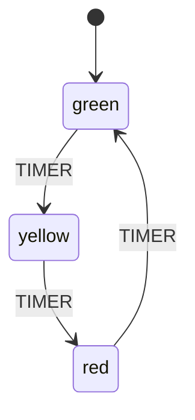

# Quick Start

This guide will walk you through creating your first state machine with EventMachine.

## Creating Your First Machine

### Step 1: Define the Machine Class

Create a new class extending `Machine`:

```php
<?php

namespace App\Machines;

use Tarfinlabs\EventMachine\Actor\Machine;
use Tarfinlabs\EventMachine\Definition\MachineDefinition;

class TrafficLightMachine extends Machine
{
    public static function definition(): MachineDefinition
    {
        return MachineDefinition::define(
            config: [
                'initial' => 'green',
                'states' => [
                    'green' => [
                        'on' => ['TIMER' => 'yellow'],
                    ],
                    'yellow' => [
                        'on' => ['TIMER' => 'red'],
                    ],
                    'red' => [
                        'on' => ['TIMER' => 'green'],
                    ],
                ],
            ],
        );
    }
}
```

### Step 2: Create and Use the Machine

```php
use App\Machines\TrafficLightMachine;

// Create a new machine instance
$light = TrafficLightMachine::create();

// Check initial state
echo $light->state->matches('green'); // true

// Send events to transition
$light->send(['type' => 'TIMER']);
echo $light->state->matches('yellow'); // true

$light->send(['type' => 'TIMER']);
echo $light->state->matches('red'); // true

$light->send(['type' => 'TIMER']);
echo $light->state->matches('green'); // true (back to green)
```

## State Diagram



## Adding Context

Context stores data that persists across state transitions:

```php
class CounterMachine extends Machine
{
    public static function definition(): MachineDefinition
    {
        return MachineDefinition::define(
            config: [
                'initial' => 'active',
                'context' => [
                    'count' => 0,
                ],
                'states' => [
                    'active' => [
                        'on' => [
                            'INCREMENT' => ['actions' => 'incrementCount'],
                            'DECREMENT' => ['actions' => 'decrementCount'],
                        ],
                    ],
                ],
            ],
            behavior: [
                'actions' => [
                    'incrementCount' => function ($context) {
                        $context->count++;
                    },
                    'decrementCount' => function ($context) {
                        $context->count--;
                    },
                ],
            ],
        );
    }
}

// Usage
$counter = CounterMachine::create();
echo $counter->state->context->count; // 0

$counter->send(['type' => 'INCREMENT']);
echo $counter->state->context->count; // 1

$counter->send(['type' => 'INCREMENT']);
echo $counter->state->context->count; // 2

$counter->send(['type' => 'DECREMENT']);
echo $counter->state->context->count; // 1
```

## Adding Guards

Guards control whether a transition can occur:

```php
class LimitedCounterMachine extends Machine
{
    public static function definition(): MachineDefinition
    {
        return MachineDefinition::define(
            config: [
                'initial' => 'active',
                'context' => ['count' => 0],
                'states' => [
                    'active' => [
                        'on' => [
                            'INCREMENT' => [
                                'guards' => 'canIncrement',
                                'actions' => 'incrementCount',
                            ],
                        ],
                    ],
                ],
            ],
            behavior: [
                'guards' => [
                    'canIncrement' => fn($context) => $context->count < 10,
                ],
                'actions' => [
                    'incrementCount' => fn($context) => $context->count++,
                ],
            ],
        );
    }
}

// Usage
$counter = LimitedCounterMachine::create();

// Increment works while count < 10
for ($i = 0; $i < 15; $i++) {
    $counter->send(['type' => 'INCREMENT']);
}

echo $counter->state->context->count; // 10 (stopped at limit)
```

## Using Event Payload

Pass data with events:

```php
class CalculatorMachine extends Machine
{
    public static function definition(): MachineDefinition
    {
        return MachineDefinition::define(
            config: [
                'initial' => 'ready',
                'context' => ['result' => 0],
                'states' => [
                    'ready' => [
                        'on' => [
                            'ADD' => ['actions' => 'addValue'],
                            'MULTIPLY' => ['actions' => 'multiplyValue'],
                        ],
                    ],
                ],
            ],
            behavior: [
                'actions' => [
                    'addValue' => function ($context, $event) {
                        $context->result += $event->payload['value'];
                    },
                    'multiplyValue' => function ($context, $event) {
                        $context->result *= $event->payload['value'];
                    },
                ],
            ],
        );
    }
}

// Usage
$calc = CalculatorMachine::create();

$calc->send(['type' => 'ADD', 'payload' => ['value' => 5]]);
echo $calc->state->context->result; // 5

$calc->send(['type' => 'MULTIPLY', 'payload' => ['value' => 3]]);
echo $calc->state->context->result; // 15
```

## State Persistence

EventMachine automatically persists events to the database:

```php
$machine = OrderMachine::create();

// Send some events
$machine->send(['type' => 'SUBMIT']);
$machine->send(['type' => 'APPROVE']);

// Get the root event ID for later restoration
$rootEventId = $machine->state->history->first()->root_event_id;

// Later, restore the machine state
$restored = OrderMachine::create(state: $rootEventId);

// The restored machine has the same state
echo $restored->state->matches('approved'); // true
```

## Attaching to Eloquent Models

Use the `HasMachines` trait to attach machines to models:

```php
use Tarfinlabs\EventMachine\Traits\HasMachines;

class Order extends Model
{
    use HasMachines;

    protected function machines(): array
    {
        return [
            'status' => OrderStatusMachine::class . ':order',
        ];
    }
}

// Usage
$order = Order::create(['name' => 'Order #1']);

// Access the machine
$order->status->send(['type' => 'SUBMIT']);

// The machine state is automatically persisted
$order->refresh();
echo $order->status->state->matches('submitted'); // true
```
