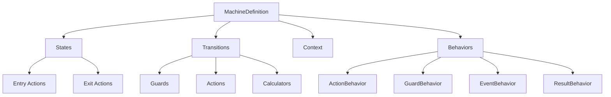

# What is EventMachine?

EventMachine is an event-driven state machine library for Laravel, heavily inspired by [XState](https://xstate.js.org/). It provides a declarative way to define state machines with full event sourcing capabilities, making it ideal for building complex workflows, order processing systems, and any application that requires predictable state management.

## Why State Machines?

State machines provide a structured approach to managing application state:

- **Predictable**: All possible states and transitions are defined upfront
- **Debuggable**: Easy to visualize and understand the flow
- **Testable**: Clear state boundaries make testing straightforward
- **Maintainable**: Self-documenting code that's easy to modify

## Key Features

### XState-Inspired Syntax

EventMachine uses a declarative configuration similar to XState:

```php
MachineDefinition::define(
    config: [
        'initial' => 'idle',
        'states' => [
            'idle' => [
                'on' => ['START' => 'running'],
            ],
            'running' => [
                'on' => ['STOP' => 'idle'],
            ],
        ],
    ],
);
```

### Full Event Sourcing

Every state change is recorded as an event in the database:

```php
$machine = OrderMachine::create();
$machine->send(['type' => 'SUBMIT']);
$machine->send(['type' => 'APPROVE']);

// Restore from any point in history
$restored = OrderMachine::create(state: $rootEventId);
```

### Behavior System

Modular behaviors for side effects and validation:

- **Actions**: Execute side effects during transitions
- **Guards**: Control whether transitions can occur
- **Calculators**: Compute values before guards run
- **Results**: Define outputs for final states

### Laravel Integration

Deep integration with Laravel ecosystem:

- Eloquent model casting
- Dependency injection in behaviors
- Artisan commands for visualization
- Database persistence with archival

## Core Concepts Overview



## When to Use EventMachine

EventMachine is ideal for:

- **Order Processing**: Track orders through pending, processing, shipped, delivered states
- **Workflow Automation**: Multi-step approval processes with complex rules
- **Game Logic**: Turn-based games, character states, level progression
- **UI State Management**: Complex form wizards, multi-step processes
- **IoT Device Control**: Device states, operational modes

## When NOT to Use EventMachine

Consider alternatives when:

- Simple boolean flags are sufficient
- No persistence or history is needed
- State changes are purely synchronous without side effects
- Performance is critical for millions of transitions per second

## Comparison with Other Libraries

| Feature | EventMachine | Laravel Workflow | XState (JS) |
|---------|--------------|------------------|-------------|
| Event Sourcing | ✅ Built-in | ❌ | ❌ |
| Laravel Native | ✅ | ✅ | ❌ |
| Type-safe Context | ✅ | ❌ | ✅ |
| Visual Editor | ❌ | ❌ | ✅ |
| Hierarchical States | ✅ | ❌ | ✅ |
| State Restoration | ✅ | ❌ | ❌ |
