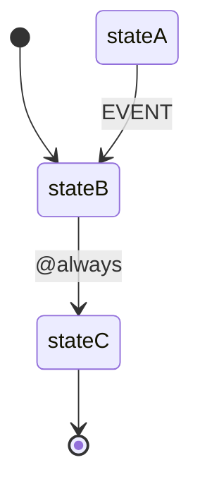

# Elevator Example

A concise example demonstrating `@always` (eventless) transitions.

## Overview

This example shows how machines can automatically transition without external events using the `@always` syntax.



## Machine Definition

```php
<?php

namespace App\Machines;

use Tarfinlabs\EventMachine\Actor\Machine;
use Tarfinlabs\EventMachine\Definition\MachineDefinition;

class ElevatorMachine extends Machine
{
    public static function definition(): MachineDefinition
    {
        return MachineDefinition::define(config: [
            'initial' => 'stateB',
            'context' => [
                'modelA' => null,
                'value'  => 4,
            ],
            'states' => [
                'stateA' => [
                    'on' => [
                        'EVENT' => 'stateB',
                    ],
                ],
                'stateB' => [
                    'on' => [
                        '@always' => 'stateC',
                    ],
                ],
                'stateC' => [],
            ],
        ]);
    }
}
```

## How It Works

1. Machine starts in `stateB` (initial state)
2. `stateB` has an `@always` transition to `stateC`
3. Immediately after entering `stateB`, the machine transitions to `stateC`
4. Machine ends up in `stateC` without any external events

```php
$machine = ElevatorMachine::create();

// Machine immediately transitions through stateB to stateC
expect($machine->state->matches('stateC'))->toBeTrue();
```

## Guarded @always Transitions

Add conditions to control automatic transitions:

```php
<?php

namespace App\Machines;

use Tarfinlabs\EventMachine\Actor\Machine;
use Tarfinlabs\EventMachine\ContextManager;
use Tarfinlabs\EventMachine\Definition\MachineDefinition;

class ElevatorWithGuardMachine extends Machine
{
    public static function definition(): MachineDefinition
    {
        return MachineDefinition::define(
            config: [
                'initial' => 'floor_1',
                'context' => [
                    'target_floor' => 3,
                    'current_floor' => 1,
                ],
                'states' => [
                    'floor_1' => [
                        'on' => [
                            '@always' => [
                                [
                                    'target' => 'floor_2',
                                    'guards' => 'shouldMoveUp',
                                ],
                            ],
                        ],
                    ],
                    'floor_2' => [
                        'on' => [
                            '@always' => [
                                [
                                    'target' => 'floor_3',
                                    'guards' => 'shouldMoveUp',
                                    'actions' => 'updateFloor',
                                ],
                            ],
                        ],
                    ],
                    'floor_3' => [
                        'on' => [
                            '@always' => [
                                [
                                    'target' => 'arrived',
                                    'guards' => 'atTargetFloor',
                                ],
                            ],
                        ],
                    ],
                    'arrived' => [
                        'type' => 'final',
                    ],
                ],
            ],
            behavior: [
                'guards' => [
                    'shouldMoveUp' => function (ContextManager $context): bool {
                        return $context->current_floor < $context->target_floor;
                    },
                    'atTargetFloor' => function (ContextManager $context): bool {
                        return $context->current_floor === $context->target_floor;
                    },
                ],
                'actions' => [
                    'updateFloor' => function (ContextManager $context): void {
                        $context->current_floor++;
                    },
                ],
            ],
        );
    }
}
```

## Multi-Path @always

Use arrays for conditional routing:

```php
<?php

namespace App\Machines;

use Tarfinlabs\EventMachine\Actor\Machine;
use Tarfinlabs\EventMachine\ContextManager;
use Tarfinlabs\EventMachine\Definition\MachineDefinition;

class DocumentProcessorMachine extends Machine
{
    public static function definition(): MachineDefinition
    {
        return MachineDefinition::define(
            config: [
                'initial' => 'checking',
                'context' => [
                    'document_type' => 'pdf',
                    'is_valid' => true,
                ],
                'states' => [
                    'checking' => [
                        'on' => [
                            '@always' => [
                                [
                                    'target' => 'invalid',
                                    'guards' => 'isInvalid',
                                ],
                                [
                                    'target' => 'process_pdf',
                                    'guards' => 'isPdf',
                                ],
                                [
                                    'target' => 'process_word',
                                    'guards' => 'isWord',
                                ],
                                [
                                    'target' => 'unsupported',
                                ],
                            ],
                        ],
                    ],
                    'invalid' => [
                        'type' => 'final',
                    ],
                    'process_pdf' => [],
                    'process_word' => [],
                    'unsupported' => [
                        'type' => 'final',
                    ],
                ],
            ],
            behavior: [
                'guards' => [
                    'isInvalid' => fn(ContextManager $c) => !$c->is_valid,
                    'isPdf' => fn(ContextManager $c) => $c->document_type === 'pdf',
                    'isWord' => fn(ContextManager $c) => $c->document_type === 'docx',
                ],
            ],
        );
    }
}
```

### Usage

```php
// PDF document
$machine = DocumentProcessorMachine::create();
expect($machine->state->matches('process_pdf'))->toBeTrue();

// Word document - using definition directly
$definition = MachineDefinition::define(
    config: [
        'initial' => 'checking',
        'context' => [
            'document_type' => 'docx',
            'is_valid' => true,
        ],
        // ... states config ...
    ],
    // ... behavior ...
);
$state = $definition->getInitialState();
expect($state->matches('process_word'))->toBeTrue();
```

## Real Elevator Example

A more realistic elevator simulation:

```php
<?php

namespace App\Machines;

use Tarfinlabs\EventMachine\Actor\Machine;
use Tarfinlabs\EventMachine\ContextManager;
use Tarfinlabs\EventMachine\Definition\MachineDefinition;

class RealElevatorMachine extends Machine
{
    public static function definition(): MachineDefinition
    {
        return MachineDefinition::define(
            config: [
                'initial' => 'idle',
                'context' => [
                    'current_floor' => 1,
                    'target_floor' => null,
                    'doors_open' => false,
                ],
                'states' => [
                    'idle' => [
                        'on' => [
                            'CALL' => [
                                'target' => 'moving',
                                'actions' => 'setTargetFloor',
                            ],
                        ],
                    ],
                    'moving' => [
                        'entry' => 'closeDoors',
                        'on' => [
                            '@always' => [
                                [
                                    'target' => 'arrived',
                                    'guards' => 'atTargetFloor',
                                ],
                                [
                                    'target' => 'moving_up',
                                    'guards' => 'shouldGoUp',
                                ],
                                [
                                    'target' => 'moving_down',
                                ],
                            ],
                        ],
                    ],
                    'moving_up' => [
                        'entry' => 'incrementFloor',
                        'on' => [
                            '@always' => [
                                [
                                    'target' => 'arrived',
                                    'guards' => 'atTargetFloor',
                                ],
                                [
                                    'target' => 'moving_up',
                                ],
                            ],
                        ],
                    ],
                    'moving_down' => [
                        'entry' => 'decrementFloor',
                        'on' => [
                            '@always' => [
                                [
                                    'target' => 'arrived',
                                    'guards' => 'atTargetFloor',
                                ],
                                [
                                    'target' => 'moving_down',
                                ],
                            ],
                        ],
                    ],
                    'arrived' => [
                        'entry' => 'openDoors',
                        'on' => [
                            'CLOSE_DOORS' => 'idle',
                        ],
                    ],
                ],
            ],
            behavior: [
                'guards' => [
                    'atTargetFloor' => fn(ContextManager $c) =>
                        $c->current_floor === $c->target_floor,
                    'shouldGoUp' => fn(ContextManager $c) =>
                        $c->current_floor < $c->target_floor,
                ],
                'actions' => [
                    'setTargetFloor' => function (ContextManager $c, $event): void {
                        $c->target_floor = $event->payload['floor'];
                    },
                    'incrementFloor' => function (ContextManager $c): void {
                        $c->current_floor++;
                    },
                    'decrementFloor' => function (ContextManager $c): void {
                        $c->current_floor--;
                    },
                    'openDoors' => function (ContextManager $c): void {
                        $c->doors_open = true;
                    },
                    'closeDoors' => function (ContextManager $c): void {
                        $c->doors_open = false;
                    },
                ],
            ],
        );
    }
}
```

### Usage

```php
$elevator = RealElevatorMachine::create();

expect($elevator->state->matches('idle'))->toBeTrue();
expect($elevator->state->context->current_floor)->toBe(1);

// Call elevator to floor 5
$elevator->send([
    'type' => 'CALL',
    'payload' => ['floor' => 5],
]);

// Elevator automatically moves through floors to arrive at 5
expect($elevator->state->matches('arrived'))->toBeTrue();
expect($elevator->state->context->current_floor)->toBe(5);
expect($elevator->state->context->doors_open)->toBeTrue();

// Close doors to return to idle
$elevator->send(['type' => 'CLOSE_DOORS']);
expect($elevator->state->matches('idle'))->toBeTrue();
```

## Testing

```php
it('transitions automatically on @always', function () {
    $machine = ElevatorMachine::create();

    // Initial state is stateB, but @always transitions to stateC
    expect($machine->state->matches('stateC'))->toBeTrue();
});

it('respects guards on @always', function () {
    // Create with target_floor = 1 (already there)
    $definition = MachineDefinition::define(
        config: [
            'initial' => 'floor_1',
            'context' => [
                'target_floor' => 1,
                'current_floor' => 1,
            ],
            'states' => [
                'floor_1' => [
                    'on' => [
                        '@always' => [
                            [
                                'target' => 'floor_2',
                                'guards' => 'shouldMoveUp',
                            ],
                        ],
                    ],
                ],
                'floor_2' => [],
            ],
        ],
        behavior: [
            'guards' => [
                'shouldMoveUp' => fn($c) => $c->current_floor < $c->target_floor,
            ],
        ],
    );

    $state = $definition->getInitialState();

    // Guard fails, stays in floor_1
    expect($state->matches('floor_1'))->toBeTrue();
});
```

## Key Concepts Demonstrated

1. **@always Transitions** - Automatic transitions without events
2. **Guarded @always** - Conditional automatic transitions
3. **Multi-Path @always** - Multiple conditions for routing
4. **Entry Actions with @always** - Actions execute before automatic transition
5. **Transient States** - States that immediately transition elsewhere

## Best Practices

### Avoid Infinite Loops

Always ensure @always transitions have terminating conditions:

```php
// BAD - Infinite loop
'stateA' => [
    'on' => [
        '@always' => 'stateB',
    ],
],
'stateB' => [
    'on' => [
        '@always' => 'stateA', // Loops forever!
    ],
],

// GOOD - Has terminating condition
'stateA' => [
    'on' => [
        '@always' => [
            [
                'target' => 'done',
                'guards' => 'isComplete',
            ],
            [
                'target' => 'stateB',
            ],
        ],
    ],
],
```
