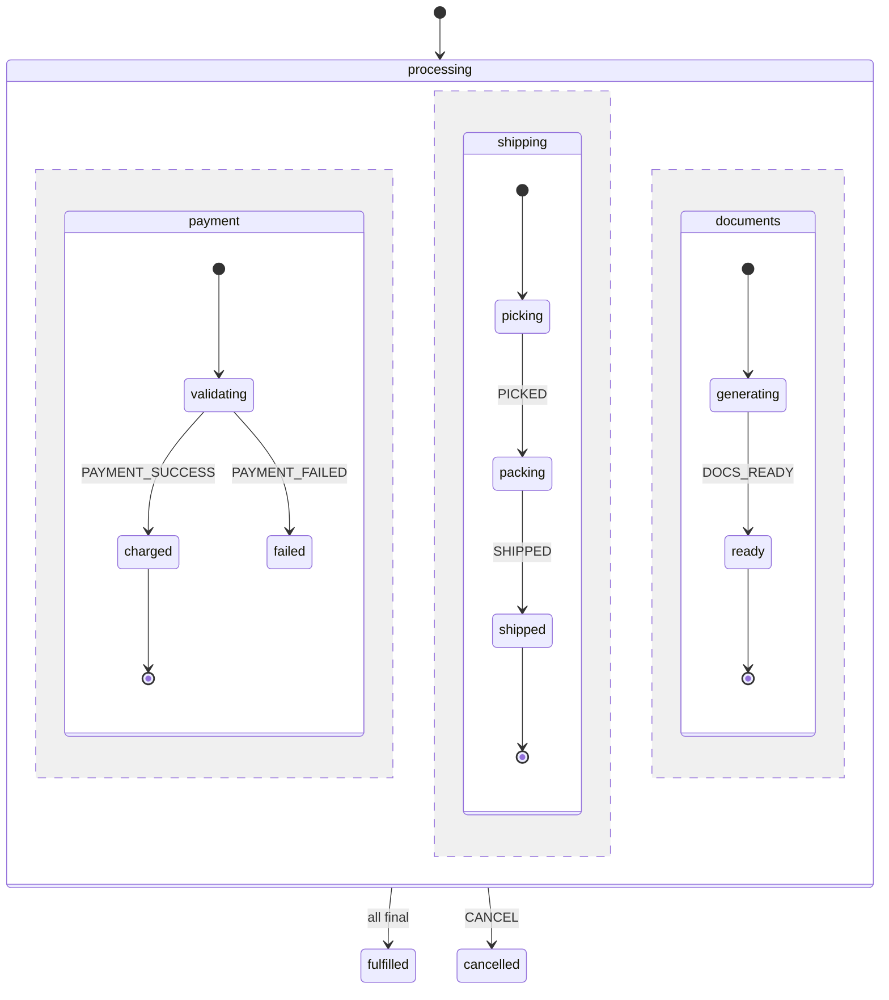

# Parallel Workflow Example

A practical example demonstrating parallel states for concurrent workflow processing where multiple independent tracks must all complete.

## Overview

This example models an order fulfillment workflow where three independent processes run concurrently:
- **Payment processing** - validate and charge payment
- **Shipping preparation** - pick, pack, and ship items
- **Document generation** - create invoice and shipping label

All three must complete before the order is considered fulfilled.



## Machine Definition

```php
<?php

namespace App\Machines;

use Tarfinlabs\EventMachine\Actor\Machine;
use Tarfinlabs\EventMachine\ContextManager;
use Tarfinlabs\EventMachine\Behavior\EventBehavior;
use Tarfinlabs\EventMachine\Definition\MachineDefinition;

class OrderFulfillmentMachine extends Machine
{
    public static function definition(): MachineDefinition
    {
        return MachineDefinition::define(
            config: [
                'id' => 'orderFulfillment',
                'initial' => 'processing',
                'context' => [
                    'order_id' => null,
                    'payment_id' => null,
                    'tracking_number' => null,
                    'invoice_url' => null,
                    'label_url' => null,
                ],
                'states' => [
                    'processing' => [
                        'type' => 'parallel',
                        'onDone' => [
                            'target' => 'fulfilled',
                            'actions' => 'sendFulfillmentNotification',
                        ],
                        'on' => [
                            // Global cancel available from any state
                            'CANCEL' => [
                                'target' => 'cancelled',
                                'actions' => 'handleCancellation',
                            ],
                        ],
                        'states' => [
                            'payment' => [
                                'initial' => 'validating',
                                'states' => [
                                    'validating' => [
                                        'entry' => 'initiatePaymentValidation',
                                        'on' => [
                                            'PAYMENT_SUCCESS' => [
                                                'target' => 'charged',
                                                'actions' => 'recordPayment',
                                            ],
                                            'PAYMENT_FAILED' => [
                                                'target' => 'failed',
                                                'actions' => 'recordPaymentFailure',
                                            ],
                                        ],
                                    ],
                                    'charged' => [
                                        'type' => 'final',
                                    ],
                                    'failed' => [
                                        // Not final - blocks fulfillment
                                        'on' => [
                                            'RETRY_PAYMENT' => 'validating',
                                        ],
                                    ],
                                ],
                            ],
                            'shipping' => [
                                'initial' => 'picking',
                                'states' => [
                                    'picking' => [
                                        'entry' => 'createPickList',
                                        'on' => [
                                            'PICKED' => 'packing',
                                        ],
                                    ],
                                    'packing' => [
                                        'entry' => 'createPackingSlip',
                                        'on' => [
                                            'PACKED' => 'readyToShip',
                                        ],
                                    ],
                                    'readyToShip' => [
                                        'on' => [
                                            'SHIPPED' => [
                                                'target' => 'shipped',
                                                'actions' => 'recordTrackingNumber',
                                            ],
                                        ],
                                    ],
                                    'shipped' => [
                                        'type' => 'final',
                                        'entry' => 'sendShippingNotification',
                                    ],
                                ],
                            ],
                            'documents' => [
                                'initial' => 'generating',
                                'states' => [
                                    'generating' => [
                                        'entry' => 'generateDocuments',
                                        'on' => [
                                            'DOCS_READY' => [
                                                'target' => 'ready',
                                                'actions' => 'storeDocumentUrls',
                                            ],
                                        ],
                                    ],
                                    'ready' => [
                                        'type' => 'final',
                                    ],
                                ],
                            ],
                        ],
                    ],
                    'fulfilled' => [
                        'type' => 'final',
                        'entry' => 'markOrderFulfilled',
                    ],
                    'cancelled' => [
                        'type' => 'final',
                        'entry' => 'markOrderCancelled',
                    ],
                ],
            ],
            behavior: [
                'actions' => [
                    'initiatePaymentValidation' => function (ContextManager $ctx): void {
                        // Start async payment validation
                        PaymentService::validateAsync($ctx->get('order_id'));
                    },
                    'recordPayment' => function (ContextManager $ctx, EventBehavior $event): void {
                        $ctx->set('payment_id', $event->payload['payment_id']);
                    },
                    'recordPaymentFailure' => function (ContextManager $ctx, EventBehavior $event): void {
                        $ctx->set('payment_error', $event->payload['error']);
                    },
                    'createPickList' => function (ContextManager $ctx): void {
                        WarehouseService::createPickList($ctx->get('order_id'));
                    },
                    'createPackingSlip' => function (ContextManager $ctx): void {
                        WarehouseService::createPackingSlip($ctx->get('order_id'));
                    },
                    'recordTrackingNumber' => function (ContextManager $ctx, EventBehavior $event): void {
                        $ctx->set('tracking_number', $event->payload['tracking_number']);
                    },
                    'sendShippingNotification' => function (ContextManager $ctx): void {
                        NotificationService::sendShippingUpdate(
                            $ctx->get('order_id'),
                            $ctx->get('tracking_number')
                        );
                    },
                    'generateDocuments' => function (ContextManager $ctx): void {
                        DocumentService::generateAsync($ctx->get('order_id'));
                    },
                    'storeDocumentUrls' => function (ContextManager $ctx, EventBehavior $event): void {
                        $ctx->set('invoice_url', $event->payload['invoice_url']);
                        $ctx->set('label_url', $event->payload['label_url']);
                    },
                    'sendFulfillmentNotification' => function (ContextManager $ctx): void {
                        NotificationService::sendFulfillmentComplete($ctx->get('order_id'));
                    },
                    'markOrderFulfilled' => function (ContextManager $ctx): void {
                        Order::find($ctx->get('order_id'))->markFulfilled();
                    },
                    'handleCancellation' => function (ContextManager $ctx): void {
                        // Refund payment if charged
                        if ($ctx->get('payment_id')) {
                            PaymentService::refund($ctx->get('payment_id'));
                        }
                    },
                    'markOrderCancelled' => function (ContextManager $ctx): void {
                        Order::find($ctx->get('order_id'))->markCancelled();
                    },
                ],
            ],
        );
    }
}
```

## Usage

### Creating an Order Fulfillment

```php
use App\Machines\OrderFulfillmentMachine;

// Create with order context
$machine = OrderFulfillmentMachine::create([
    'order_id' => $order->id,
]);

// Check initial state - all three regions are active
$state = $machine->state;
$state->matches('processing.payment.validating');   // true
$state->matches('processing.shipping.picking');     // true
$state->matches('processing.documents.generating'); // true
```

### Processing Events

Events can arrive in any order. Each region processes independently:

```php
// Documents ready first
$machine->send([
    'type' => 'DOCS_READY',
    'payload' => [
        'invoice_url' => 'https://...',
        'label_url' => 'https://...',
    ],
]);
// documents region is now final, others still processing

// Payment succeeds
$machine->send([
    'type' => 'PAYMENT_SUCCESS',
    'payload' => ['payment_id' => 'pay_123'],
]);
// payment region is now final

// Shipping progresses
$machine->send(['type' => 'PICKED']);
$machine->send(['type' => 'PACKED']);
$machine->send([
    'type' => 'SHIPPED',
    'payload' => ['tracking_number' => '1Z999...'],
]);
// All regions final - automatically transitions to 'fulfilled'

$machine->state->matches('fulfilled'); // true
```

### Handling Failures

Payment can fail without blocking other regions:

```php
$machine->send([
    'type' => 'PAYMENT_FAILED',
    'payload' => ['error' => 'Insufficient funds'],
]);

// Payment is in 'failed' state (not final)
// Shipping and documents can still progress
$state->matches('processing.payment.failed');  // true
$state->matches('processing.shipping.picking'); // true

// Retry payment when customer updates card
$machine->send(['type' => 'RETRY_PAYMENT']);
$state->matches('processing.payment.validating'); // true
```

### Cancellation

Cancel from any state:

```php
$machine->send(['type' => 'CANCEL']);

// All regions exit, transitions to cancelled
$machine->state->matches('cancelled'); // true
```

## Checking Region Status

Use guards to check cross-region status:

```php
MachineDefinition::define(
    config: [
        // ... same as above, but add a guard
        'states' => [
            'processing' => [
                'type' => 'parallel',
                'states' => [
                    'shipping' => [
                        'initial' => 'picking',
                        'states' => [
                            'readyToShip' => [
                                'on' => [
                                    'SHIPPED' => [
                                        'target' => 'shipped',
                                        'guards' => 'isPaymentCharged', // Only ship if paid
                                    ],
                                ],
                            ],
                            // ...
                        ],
                    ],
                    // ...
                ],
            ],
        ],
    ],
    behavior: [
        'guards' => [
            'isPaymentCharged' => function (
                ContextManager $ctx,
                EventBehavior $event,
                State $state
            ): bool {
                return $state->matches('processing.payment.charged');
            },
        ],
    ],
);
```

## Testing

```php
use App\Machines\OrderFulfillmentMachine;

test('order fulfillment completes when all regions are final', function () {
    $machine = OrderFulfillmentMachine::create(['order_id' => 1]);

    // Complete all three tracks
    $machine->send(['type' => 'PAYMENT_SUCCESS', 'payload' => ['payment_id' => 'pay_1']]);
    $machine->send(['type' => 'DOCS_READY', 'payload' => ['invoice_url' => '...', 'label_url' => '...']]);
    $machine->send(['type' => 'PICKED']);
    $machine->send(['type' => 'PACKED']);
    $machine->send(['type' => 'SHIPPED', 'payload' => ['tracking_number' => '1Z...']]);

    expect($machine->state->matches('fulfilled'))->toBeTrue();
});

test('cancellation works from any state', function () {
    $machine = OrderFulfillmentMachine::create(['order_id' => 1]);

    // Progress shipping
    $machine->send(['type' => 'PICKED']);

    // Cancel mid-process
    $machine->send(['type' => 'CANCEL']);

    expect($machine->state->matches('cancelled'))->toBeTrue();
});

test('payment failure does not block other regions', function () {
    $machine = OrderFulfillmentMachine::create(['order_id' => 1]);

    $machine->send(['type' => 'PAYMENT_FAILED', 'payload' => ['error' => 'Declined']]);

    // Payment failed but shipping can still progress
    expect($machine->state->matches('processing.payment.failed'))->toBeTrue();

    $machine->send(['type' => 'PICKED']);
    expect($machine->state->matches('processing.shipping.packing'))->toBeTrue();
});
```

## Key Patterns Demonstrated

1. **Concurrent Processing**: Three independent workflows run simultaneously
2. **Automatic Completion**: `onDone` triggers when all regions reach final states
3. **Global Events**: `CANCEL` is handled at the parallel level, affecting all regions
4. **Partial Failure Handling**: Payment can fail without blocking other regions
5. **Cross-Region Guards**: Shipping can check payment status before proceeding
6. **Shared Context**: All regions read and write to the same context
