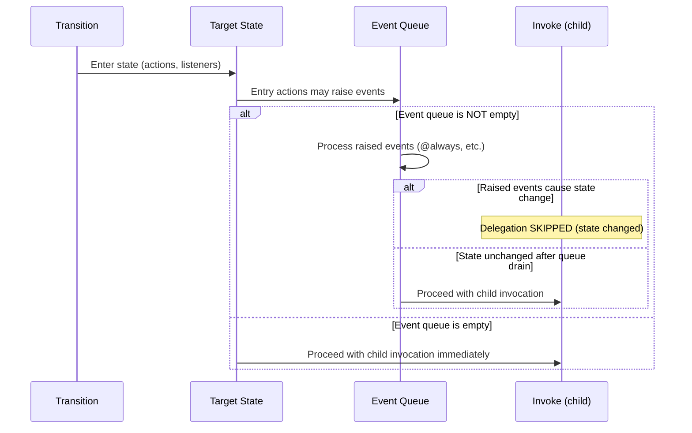

# Execution Model

This page documents the precise order in which EventMachine processes events, executes actions, and chains transitions. All details are verified against the source code.

## Event Processing Sequence

When `Machine::send()` is called:

```txt
1. Event arrives (via send() or HTTP endpoint)
2. Acquire distributed lock (if parallel_dispatch enabled)
3. Call transition():
   a. Look up event type in current state's transitions
   b. For multi-branch: run calculators, then evaluate guards in array order
   c. First branch with all guards passing wins
   d. If no match: try event bubbling to parent state
   e. If no match and no child forwarding: throw NoTransitionDefinitionFoundException
4. Execute selected transition (see Action Execution Order below)
5. If new state has @always transitions: repeat from step 3 (loop protection active)
6. If new state has machine delegation: create/dispatch child machine
7. Persist state to database (if should_persist is true)
8. Release lock
```

## Action Execution Order

The order of execution during a targeted transition follows SCXML W3C section 3.13 (exit, transition, entry):

| # | Phase | What Runs |
|---|-------|-----------|
| 1 | **Exit listeners** | State change listeners (skipped for transient states) |
| 2 | **Exit actions** | Actions defined via `exit` on the source state |
| 3 | **Transition actions** | Actions defined on the transition branch |
| 4 | **State change** | Current state is updated to the target |
| 5 | **Entry actions** | Actions defined via `entry` on the target state |
| 6 | **Entry listeners** | State change listeners (skipped for transient states) |
| 7 | **Transition listeners** | Transition listeners (skipped for transient states) |
| 8 | **Machine invocation** | Child machine launch (if `machine` key present) |

::: info Targetless Transitions
Targetless transitions (no `target` key) execute **only** transition actions. No exit actions, exit listeners, entry actions, or entry listeners fire. The machine stays in the current state. This follows SCXML semantics where targetless transitions are purely internal.
:::

## Guard and Calculator Order

When evaluating a multi-branch transition:

1. **Calculators** run first -- they update context values that guards may read
2. **Guards** evaluate in array order -- first branch with all guards passing wins
3. If no branch passes, no transition fires

```txt
'PAYMENT_RESULT' => [
    ['target' => 'failed',   'guards' => 'isDeclinedGuard'],    // checked first
    ['target' => 'captured', 'guards' => 'isCapturedGuard'],    // checked second
    ['target' => 'pending'],                                      // fallback (no guard)
],
```

See [Guard Priority: Errors First](/best-practices/transition-design#guard-priority-errors-first) for ordering best practices.

## Database Transactions

Transitions are **not** wrapped in a database transaction by default. Transaction wrapping is opt-in per-event:

<!-- doctest-attr: ignore -->
```php
class PaymentCapturedEvent extends EventBehavior
{
    public bool $isTransactional = true;  // wraps transition() in DB::transaction()
}
```

When `isTransactional` is true, phases 1-5 (transition actions through entry actions) are wrapped in a single transaction. Persist (step 7) happens **outside** the transaction.

When `isTransactional` is false (default), no transaction wrapping occurs.

## @always Chaining

When a state has `@always` transitions, EventMachine automatically re-evaluates transitions after entering the state:

- **Entry and exit actions fire** for all intermediate (transient) states
- **Listeners are skipped** for transient states -- they only fire on the final resting state
- The **original triggering event** is preserved across the chain (actions in intermediate states receive the original event, not the synthetic `@always` event)
- **Loop protection** limits chain depth (configurable via `max_transition_depth`, default: 100)

A state is considered "transient" if it has an `@always` transition defined.

## Unmatched Events

When an event has no matching transition in the current state:

1. **Event bubbling:** EventMachine checks parent states (leaf → root) for a handler
2. **Child forwarding:** If a child machine is running, the event is forwarded to it via `tryForwardEventToChild()`
3. **Exception:** If neither handles the event, `NoTransitionDefinitionFoundException` is thrown

Exception for `@always`: if no `@always` branch passes its guards, the machine stays in the current state silently (no exception).

## Hierarchical States

Exit and entry actions execute on **atomic (leaf) states only**:

- When transitioning, exit actions run on the source leaf state
- Entry actions run on the target leaf state
- Parent states are **not** exited or entered during transitions between their children
- Parent states participate in **guard lookup** (event bubbling) but not in action execution

## Macrostep and Invoke Timing

Child machine invocation (`machine` key) does **not** happen immediately when a state is entered. It happens after all entry actions, listeners, and raised events have been processed. Critically, if raised events cause a state change during the macrostep, delegation is **skipped entirely** -- the machine has already left the delegating state.

This follows SCXML invoker-05 macrostep semantics: the internal event queue must drain before any invocation starts.

### Sequence



### Why This Matters

1. **Entry actions run before invoke.** An entry action can `raise()` an event that transitions the machine out of the delegating state. The child machine is never started.
2. **Raised events are processed first.** All internal events queued during entry are resolved before delegation begins. This prevents orphaned child machines.
3. **Async dispatch is also deferred.** `ChildMachineJob` is dispatched to the queue only after the macrostep completes, not during entry action execution.

This ordering makes it safe to use `raise()` in entry actions to conditionally bypass delegation.

## Delegation Lifecycle

| Signal | Fires When | Use For |
|--------|-----------|---------|
| `@done` | Child reaches ANY final state | Business outcomes (catch-all) |
| `@done.{state}` | Child reaches SPECIFIC final state | Routing based on outcome |
| `@fail` | Exception thrown / job crashed | Infrastructure failures only |
| `@timeout` | Timeout seconds elapsed, child still running | Infrastructure protection |

**Resolution order:** `@done.{state}` (specific) → `@done` (catch-all) → no transition.

For detailed usage, see [Machine System Design: Guidelines](/best-practices/machine-system-design#guidelines).

## Propagation Retry Recovery

Child-to-parent `@done`/`@fail` notifications in deep delegation chains are dispatched as `ChildMachineCompletionJob`s via the queue. If one of these jobs is interrupted mid-handle (pod SIGTERM, worker crash, network blip between the state persist and the downstream Redis push), the Laravel queue will retry the job after `retry_after` seconds.

On retry, the job detects that the parent machine has already transitioned past the invoking state and enters a **recovery branch**: if the parent is in a `final` state AND its `MachineChild` row is still in `running` status, the propagation is considered lost and re-dispatched. The `propagateChainCompletion` routine is idempotent — it only dispatches while the `MachineChild` is still `running`, and marks the row terminal after the dispatch succeeds.

This recovery is transparent. Silent return paths now emit structured `logger()->info(...)` records with `parent_root_event_id`, `parent_state_id`, `current_state`, `child_machine_class`, and `success` — look for `ChildMachineCompletionJob: parent already transitioned, idempotent skip` or `ChildMachineCompletionJob: recovering lost propagation` in production logs when diagnosing delegation issues.

Not covered by this mechanism: Redis losing the job entirely (AOF corruption, manual `FLUSHALL`, very long `retry_after`). A durable outbox is tracked for v10.

## Lock Strategy

EventMachine uses a database-backed distributed lock (`machine_locks` table) to prevent concurrent state mutation:

- **Scope:** One lock per `root_event_id` (machine instance). Concurrent `send()` / `SendToMachineJob` calls on the same machine are serialized.
- **Acquisition:** `MachineLockManager::acquire()` attempts to insert/claim a row in `machine_locks`. If the lock is held, the caller retries with backoff until `lock_timeout` expires.
- **TTL:** Locks have an `expires_at` timestamp (`lock_ttl`). If a worker crashes without releasing, the lock becomes stale after TTL.
- **Stale cleanup:** On next `acquire()` attempt, `MachineLockManager` deletes all expired locks (across all machines, not just the target). This is a global sweep to prevent lock table bloat.
- **Parallel dispatch:** When `parallel_dispatch.enabled` is true, `ParallelRegionJob` acquires the lock before applying region results. The `failed()` handler also acquires the lock to fire `@fail` safely.
- **No cross-machine locking:** Locks are per-machine. Two different machines can process events concurrently without contention.

## Related

- [Transition Design](/best-practices/transition-design) -- guard priority, @always chains
- [Machine System Design](/best-practices/machine-system-design) -- delegation, hierarchy, timer placement
- [Time-Based Patterns](/best-practices/time-based-patterns) -- `after`/`every` timer mechanics
