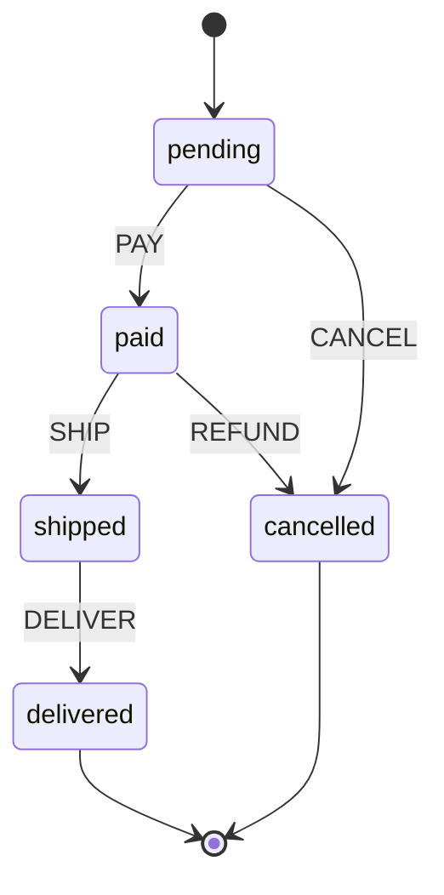

# States and Transitions

States and transitions are the foundation of every state machine. Understanding them deeply is essential to using EventMachine effectively.

## What is a State?

A **state** represents a distinct phase or condition in your system. At any given moment, your machine is in exactly one state.

Think of it like a traffic light:
- It's either **green**, **yellow**, or **red**
- Never two colors at once
- Never "kind of green" or "between yellow and red"

<!-- doctest-attr: ignore -->
```php
'states' => [
    'pending' => [...],    // Order is waiting
    'paid' => [...],       // Payment received
    'shipped' => [...],    // On the way
    'delivered' => [...],  // Arrived
]
```

### State Properties

Each state can have:

<!-- doctest-attr: ignore -->
```php
'pending' => [
    'on' => [                    // Transitions from this state
        'PAY' => 'paid',
    ],
    'entry' => ['logEntry'],     // Actions when entering
    'exit' => ['logExit'],       // Actions when leaving
    'meta' => [                  // Custom metadata
        'description' => 'Waiting for payment',
    ],
]
```

### Accessing Current State

The `State` object provides several ways to inspect the current state:

<!-- doctest-attr: ignore -->
```php
$machine = OrderMachine::create();
$state = $machine->state;

// Get the raw state value as array
$state->value;  // ['order.pending']

// Check if in a specific state
$state->matches('pending');  // true

// Access current state definition
$state->currentStateDefinition->id;  // 'order.pending'

// Access context
$state->context->get('total');

// Access event history
$state->history;  // EventCollection

// Check if the current state can handle an event
$machine->can('PAY');  // true if PAY transition exists
$machine->can(PaymentEvent::class);  // also works with event classes
```

### The `matches()` Method

Use `matches()` to check the current state:

<!-- doctest-attr: ignore -->
```php
// Simple state check
$state->matches('pending');  // Checks for 'order.pending'

// Full state path also works
$state->matches('order.pending');  // Same result

// For nested states, use dot notation
$state->matches('checkout.payment.processing');
```

::: tip State ID Conventions
EventMachine uses dot notation for state IDs: `{machineId}.{stateName}`. When you call `matches('pending')`, it automatically prepends the machine ID.
:::

### Final States

A **final state** is a terminal state - no transitions out:

<!-- doctest-attr: ignore -->
```php
'delivered' => [
    'type' => 'final',
    'result' => 'calculateDeliveryResult',  // Compute final output
]
```

When a machine reaches a final state:
- No more events can trigger transitions
- Optional result behavior computes the final output
- The machine is considered "done"

## What is a Transition?

A **transition** is the movement from one state to another, triggered by an event.

```
┌─────────┐    PAY    ┌─────────┐
│ pending │ ────────► │  paid   │
└─────────┘           └─────────┘
```

The simplest transition:

<!-- doctest-attr: ignore -->
```php
'pending' => [
    'on' => [
        'PAY' => 'paid',  // PAY event -> go to 'paid' state
    ],
]
```

### Transition with Actions

Execute code during transition:

<!-- doctest-attr: ignore -->
```php
'pending' => [
    'on' => [
        'PAY' => [
            'target' => 'paid',
            'actions' => 'processPayment',  // Run this action
        ],
    ],
]
```

Multiple actions:

<!-- doctest-attr: ignore -->
```php
'PAY' => [
    'target' => 'paid',
    'actions' => ['processPayment', 'sendReceipt', 'notifyWarehouse'],
]
```

### Guarded Transitions

Only transition if a condition is true:

<!-- doctest-attr: ignore -->
```php
'pending' => [
    'on' => [
        'PAY' => [
            'target' => 'paid',
            'guards' => 'hasValidPayment',
        ],
    ],
]
```

If the guard returns `false`, the transition doesn't happen. The machine stays in `pending`.

### Multiple Transition Branches

Different outcomes based on conditions:

<!-- doctest-attr: ignore -->
```php
'pending' => [
    'on' => [
        'PAY' => [
            [
                'target' => 'paid',
                'guards' => 'isFullPayment',
            ],
            [
                'target' => 'partial',
                'guards' => 'isPartialPayment',
            ],
            [
                'target' => 'failed',  // Default if no guards match
            ],
        ],
    ],
]
```

Guards are evaluated in order. First matching guard wins.

### Self Transitions

Stay in the same state but trigger actions:

<!-- doctest-attr: ignore -->
```php
'active' => [
    'on' => [
        'HEARTBEAT' => [
            'target' => 'active',  // Same state
            'actions' => 'updateLastSeen',
        ],
    ],
]
```

### Internal Transitions

Like self transitions, but don't trigger entry/exit actions:

<!-- doctest-attr: ignore -->
```php
'active' => [
    'on' => [
        'HEARTBEAT' => [
            'actions' => 'updateLastSeen',
            // No target = internal transition
        ],
    ],
]
```

## Transition Execution Order

When a transition happens, actions execute in this order:

```
1. Calculators run (prepare context data)
2. Guards check (can transition happen?)
3. Exit actions (leaving current state)
4. Transition actions (during transition)
5. Entry actions (entering new state)
6. Always transitions check (automatic follow-up)
7. Queued events process (events raised during actions)
```

Example:

<!-- doctest-attr: ignore -->
```php
'pending' => [
    'exit' => ['logLeavingPending'],
    'on' => [
        'PAY' => [
            'target' => 'paid',
            'actions' => 'processPayment',
        ],
    ],
],
'paid' => [
    'entry' => ['sendConfirmation'],
],
```

When `PAY` event fires:
1. `logLeavingPending` (exit from pending)
2. `processPayment` (transition action)
3. `sendConfirmation` (entry to paid)

## Visualizing State Machines

Use Mermaid diagrams in your documentation:



## Common Patterns

### Sequential States

<!-- doctest-attr: ignore -->
```php
'states' => [
    'step1' => ['on' => ['NEXT' => 'step2']],
    'step2' => ['on' => ['NEXT' => 'step3', 'BACK' => 'step1']],
    'step3' => ['on' => ['NEXT' => 'complete', 'BACK' => 'step2']],
    'complete' => ['type' => 'final'],
]
```

### Parallel Approval

<!-- doctest-attr: ignore -->
```php
'states' => [
    'pending' => [
        'on' => [
            'APPROVE' => [
                ['target' => 'approved', 'guards' => 'allApproversApproved'],
                ['target' => 'pending'],  // Stay if not all approved
            ],
            'REJECT' => 'rejected',
        ],
    ],
    'approved' => ['type' => 'final'],
    'rejected' => ['type' => 'final'],
]
```

### Retry Pattern

<!-- doctest-attr: ignore -->
```php
'states' => [
    'processing' => [
        'on' => [
            'SUCCESS' => 'completed',
            'FAILURE' => [
                ['target' => 'processing', 'guards' => 'canRetry', 'actions' => 'incrementRetry'],
                ['target' => 'failed'],
            ],
        ],
    ],
    'completed' => ['type' => 'final'],
    'failed' => ['type' => 'final'],
]
```

## State Definition Reference

<!-- doctest-attr: ignore -->
```php
'stateName' => [
    // Transitions
    'on' => [
        'EVENT_NAME' => 'targetState',          // Simple
        'EVENT_NAME' => [                       // With options
            'target' => 'targetState',
            'guards' => 'guardName',
            'actions' => ['action1', 'action2'],
        ],
        'EVENT_NAME' => [                       // Multiple branches
            ['target' => 'state1', 'guards' => 'guard1'],
            ['target' => 'state2', 'guards' => 'guard2'],
            ['target' => 'default'],
        ],
    ],

    // Lifecycle
    'entry' => ['entryAction1', 'entryAction2'],
    'exit' => ['exitAction1'],

    // State type
    'type' => 'final',              // Terminal state

    // Final state output
    'result' => 'computeResult',

    // Metadata
    'meta' => [
        'description' => 'Human readable description',
        'timeout' => 3600,
    ],

    // Child states (hierarchical)
    'initial' => 'childState',
    'states' => [...],
]
```
